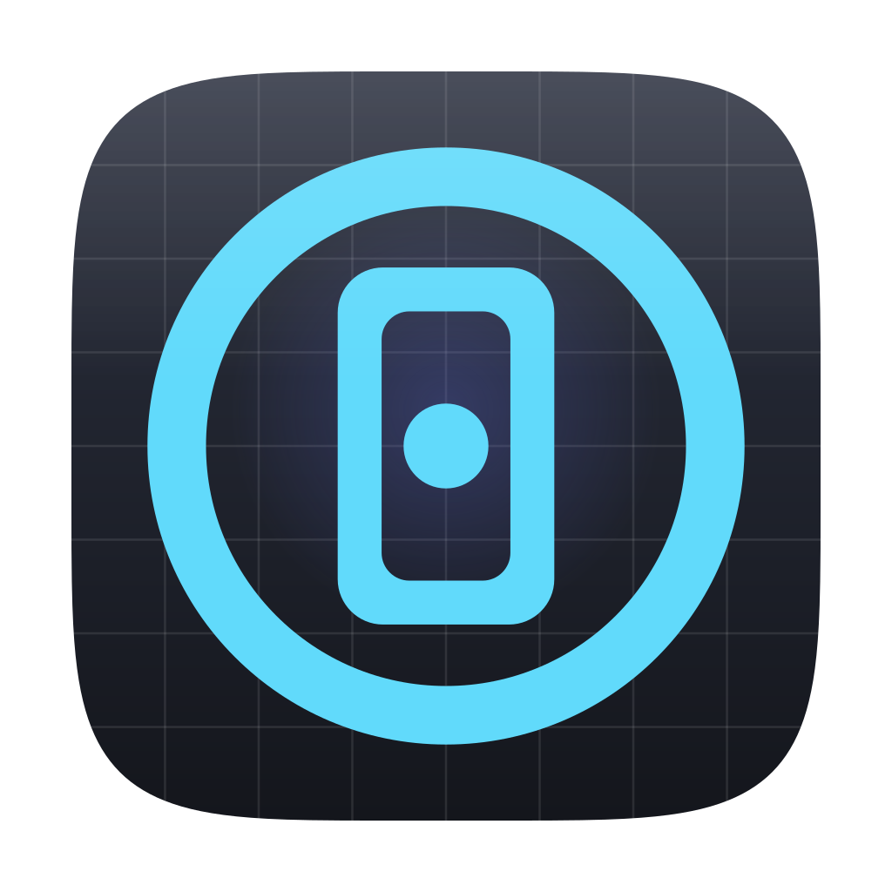
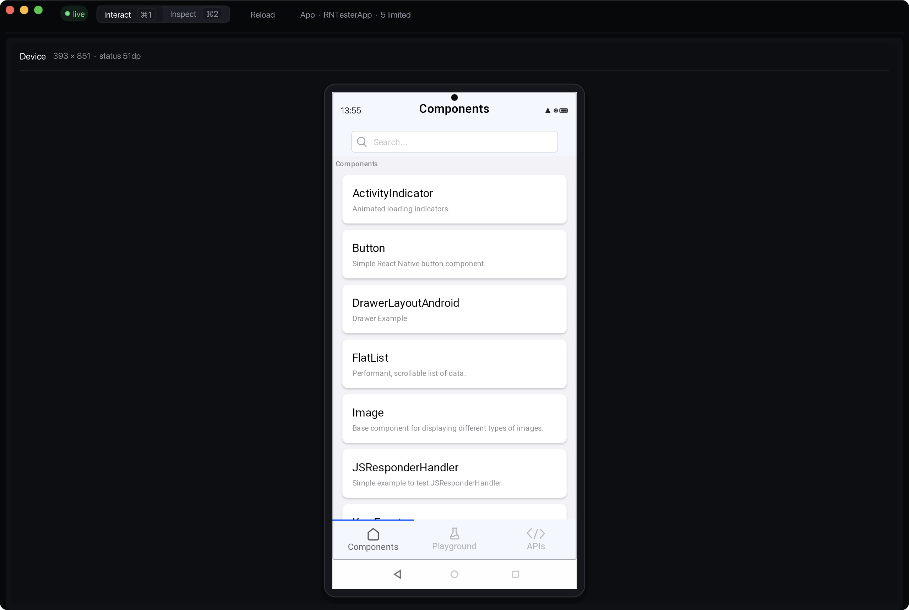

<p align="center">
  
</p>

# React Native Simulator

**Run your React Native app natively on macOS, no Android Emulator required.**

React Native Simulator hosts Hermes, Fabric, Yoga, and Skia in a single macOS
process, giving developers and AI agents a fast edit, run, inspect, and diagnose
loop for React Native 0.87 Android apps. It is not an Android OS emulator: work
outside the documented [capability baseline](docs/baselines/RN087_CAPABILITY_BASELINE.md)
still needs an explicit addon or a real device.

_This project is implemented entirely by AI._



## Status

**Android-first experimental preview, shipped on the Nightly channel.** The
project is in Phase 4 of the accepted architecture plan: engine, retained scene,
Skia renderer, and same-process interactive frontend are connected, and Android
RN 0.87 behavior is being certified against RN Tester. This is not a claim of
complete Android or iOS equivalence, and there is no numbered release contract
yet. Public conformance verdicts stay disabled until the canonical profile,
font, and oracle manifests are complete. See the
[Nightly versioning policy](docs/design/VERSIONING.md).

Pinned runtime:

- React Native 0.87.0 (`4bc2473f5d0233ea5384c1ef24f6a55615de2220`)
- Hermes v1 `260318099.0.1`
- Apple Silicon (`arm64`), macOS 15 or newer

What works, what is approximated, and what is unavailable is recorded in the
[capability baseline](docs/baselines/RN087_CAPABILITY_BASELINE.md); the
[RN Tester baseline](docs/baselines/RNTESTER_BASELINE.md) marks the Android
demo and visual certification boundary. Check the capability baseline before
running an app that depends on platform or third-party native modules:
unsupported native contracts require an explicit addon and never become silent
mocks.

## Quick start

Supported path: Apple Silicon, macOS 15 or newer, React Native 0.87.0, Android
profile.

### Install Nightly

Install the rolling Nightly with the repository-hosted installer:

```sh
curl -fsSL https://raw.githubusercontent.com/aneryu/react-native-simulator/main/install.sh | sh
export PATH="$HOME/.local/bin:$PATH"
rnsim --version
```

The installer downloads the DMG and adjacent SHA-256 file from the
[Nightly GitHub Release](https://github.com/aneryu/react-native-simulator/releases/tag/nightly),
validates its Developer ID signature, notarization ticket, and one-file layout,
then atomically installs `rnsim` into `~/.local/bin`. It does not use sudo,
remove quarantine, or edit shell configuration. The executable is self-contained
and does not require a React Native checkout, Node.js, npm, or Homebrew.

### Run your React Native app

From the root of an RN 0.87 app, keep Metro in one terminal:

```sh
npm start
# or: yarn start
```

Then open another terminal in the same app directory:

```sh
rnsim
```

`rnsim` targets Android by default. It opens the host window immediately and
connects to Metro on `localhost:8081`; closing the window cancels the wait. The
Metro source owns the bundle regardless of where `rnsim` was launched, and
`rnsim doctor` reports a project-root mismatch or probe failure as diagnostic
evidence without blocking launch.

What you get in the window:

- **Application-first workspace.** Device is the default view. The standard
  project entry and `app.json` are discovered, and the configured (or only
  registered) AppRegistry application starts automatically. Several
  application keys or a blocking error open the App panel; a newly observed
  compatibility warning opens it once and stays dismissible. You can also open
  it from the toolbar.
- **Inspect** (`⌘2`, or `Ctrl+2` on Linux) opens the ShadowTree element picker.
  It cancels any active application pointer and isolates normal pointer,
  keyboard, and TextInput dispatch while active. Host chords `⌘1`/`Ctrl+1`,
  `⌘2`/`Ctrl+2`, `⌘R`/`Ctrl+R`, and Escape keep working.
- **Fast Refresh and Reload.** Save a component to Fast Refresh. Metro's `r`,
  the **Reload** button, or `⌘R`/`Ctrl+R` reloads in-process while the window
  stays open, whether the Engine is running, paused after an error, or waiting
  for an application choice. If JavaScript evaluation fails after the initial
  bundle loads, fix the source and reload.
- **Retry.** If preparation fails before a bundle reaches the Engine, fix the
  reported Metro or bundle problem and use **Retry** or `⌘R`/`Ctrl+R`. Repeat
  Retries
  are ignored while an attempt is in flight. Remote preparation is
  transactional: nothing fetched is queued until every remote source succeeds,
  and the window never closes.

`rnsim` deliberately does not launch Metro or own your Babel, TypeScript, or
bundle configuration. See [running your own app](docs/guides/GETTING_STARTED.md)
for non-standard Metro ports, offline bundles, local configuration, addons, and
troubleshooting.

### RN Tester verification

RN Tester is a caller-built repository fixture for local conformance and visual
verification. It is not a Nightly download, and its application addon is never
embedded in the public `rnsim` binary. Nightly identity, installation,
Gatekeeper details, DevTools usage, and dependency provenance are covered by the
[getting-started guide](docs/guides/GETTING_STARTED.md),
[Nightly versioning policy](docs/design/VERSIONING.md),
[Nightly release notes](docs/releases/nightly.md), and
[security policy](SECURITY.md).

## Build from source

### macOS

Requirements:

- Apple Silicon Mac running macOS 15 or newer, with current Xcode Command Line Tools
- CMake 3.22+, Ninja, Python 3, Git, and Git LFS
- Homebrew packages: `boost`, `double-conversion`, `fmt`, and `folly`

Use the repository's GitHub **Code** menu to copy its clone URL, then:

```sh
git clone --recurse-submodules REPOSITORY_URL react-native-simulator
cd react-native-simulator
git lfs pull

brew install cmake ninja boost double-conversion fmt folly
cmake/bootstrap-skia-macos.sh
cmake --preset release
cmake --build --preset release
ctest --preset release
```

The Skia bootstrap on macOS supports Apple Silicon only.

### Linux

Linux is a source-build host for the same engine, including the SDL/ImGui
interactive frontend and Skia device painter. The Nightly binary remains
macOS arm64.

Requirements:

- Ubuntu 24.04 or equivalent, x86_64 or aarch64
- CMake 3.22+, Ninja, Python 3, Git, Git LFS, and `xxd`
- Engine packages: `g++`, `libstdc++-14-dev`, `libboost-all-dev`, `libfmt-dev`,
  `libdouble-conversion-dev`, `libssl-dev`, `libcurl4-openssl-dev`,
  `libpng-dev`, `zlib1g-dev`, `uuid-dev`, `libevent-dev`, `libicu-dev`,
  `pkg-config`
- Interactive packages: `libfontconfig-dev`, `fonts-dejavu-core`, X11/Wayland
  SDL3 headers (`libx11-dev`, `libxext-dev`, `libxrandr-dev`, `libxcursor-dev`,
  `libxi-dev`, `libxtst-dev`, `libxkbcommon-dev`, `libwayland-dev`, `libgl1-mesa-dev`,
  `libvulkan-dev`), and a display (`xvfb` is enough for tests)

CMake fetches RN's pinned Folly `2024.11.18.00` subset during configure. There
is no Ubuntu `libfolly-dev` package on 24.04. Host chords in the interactive
shell are `Ctrl+1` / `Ctrl+2` / `Ctrl+R`.

```sh
git clone --recurse-submodules REPOSITORY_URL react-native-simulator
cd react-native-simulator
git lfs pull

sudo apt-get install -y ninja-build g++ libstdc++-14-dev libboost-all-dev \
  libfmt-dev libdouble-conversion-dev libssl-dev libcurl4-openssl-dev \
  libpng-dev zlib1g-dev uuid-dev libevent-dev libicu-dev pkg-config python3 \
  xxd libfontconfig-dev fonts-dejavu-core libx11-dev libxext-dev \
  libxrandr-dev libxcursor-dev libxfixes-dev libxi-dev libxtst-dev \
  libxkbcommon-dev \
  libwayland-dev libgl1-mesa-dev libegl1-mesa-dev libvulkan-dev xvfb

git submodule update --init third_party/skia third_party/imgui third_party/sdl
cmake/bootstrap-skia-linux.sh
cmake --preset release
cmake --build --preset release
xvfb-run --auto-servernum ctest --test-dir build/release --output-on-failure
```

Headless core tests can omit Skia, SDL, and a display:

```sh
cmake -S . -B build/ci-release -G Ninja \
  -DCMAKE_BUILD_TYPE=Release \
  -DRNS_ENABLE_SKIA=OFF \
  -DRNS_ENABLE_IMGUI=OFF
cmake --build build/ci-release
ctest --test-dir build/ci-release --output-on-failure
```

Notes:

- A complete checkout and build needs about 16 GB for the pinned RN/Skia
  dependency trees. The Release tree measures about 0.4 GB; the instrumented
  sanitizer tree about 4.9 GB.
- Core configure/build/test/runtime paths never invoke Node.js. Node is used
  only by the optional RN Tester, diagnostics, and benchmark tooling.
- Without Git LFS the visual-baseline PNGs stay as pointer files. The core build
  still succeeds, but visual galleries and comparison evidence will be
  incomplete.

The production executable is `build/release/runtime/rnsim`. Install a local
source-built CLI with:

```sh
cmake --install build/release \
  --prefix /absolute/install/prefix \
  --component react-native-simulator
```

The Nightly DMG is not an embedding or addon SDK. Embedding and native addon
authoring both require the source checkout with its pinned RN/Hermes headers.
Source-tree embedders link `ReactNativeSimulator::Engine` and can query
`Engine::runtimeStatus()` for the runtime generation and phase, HMR state,
structured JavaScript/application diagnostics, and observed native-module and
mounted official, addon, or fallback-component usage. The interactive UI is
built on the same status: the toolbar shows lifecycle and HMR state, and the
App panel shows structured errors, JavaScript stack frames, and the
capabilities or degradations actually observed by the current generation.

## Advanced runtime usage

The examples below use an installed `rnsim`; source builds can substitute
`build/release/runtime/rnsim`. Offline, supply a caller-built bundle explicitly:

```sh
rnsim interactive \
  --platform android \
  --app-key MyApp \
  --bundle /absolute/path/to/application.jsbundle
```

`rnsim` also reads `rnsim.json`. Paths are resolved relative to the config file,
and unknown fields are rejected:

```json
{
    "schemaVersion": 1,
    "reactNative": "0.87.0",
    "platform": "android",
    "appKey": "MyApp",
    "bundle": "./dist/application.hbc",
    "viewport": {
        "width": 392.7273,
        "height": 753.4545,
        "pointScaleFactor": 2.75
    },
    "addons": []
}
```

Interactive and headless modes use the same semantic engine. Headless
workloads are strict and finite:

```sh
rnsim headless \
  --bundle /absolute/path/to/workload.hbc \
  --timeout-ms 5000 \
  --require-react-fabric true \
  --require-no-pending-work true \
  --fail-on-component-fallback true
```

These requirements validate one runtime execution; they are not a platform
conformance certificate. `rnsim test`/`rnsim conformance` fail closed throughout
the Nightly phase instead of producing a misleading pass.

Multiple `--bundle` options load sequentially on one ReactInstance,
RuntimeScheduler, and Hermes VM. JavaScript may also call the Promise-based
`RN$Simulator.loadBundle(path)` API. See
[multi-bundle loading](docs/guides/MULTI_BUNDLE.md) and the
[workload protocol](docs/guides/WORKLOAD_PROTOCOL.md).

## Architecture

```text
caller bundle
    |
Hermes / JSI / ReactInstance / RuntimeScheduler
    |
TurboModules + Fabric ShadowTree + Yoga + EventDispatcher
    |
typed retained scene + cached Skia prepared paragraphs
    |
interactive frontend | headless screenshots | future conformance oracle
```

One semantic engine serves every mode; the frontend never re-implements React
Native semantics. SDL3 and Dear ImGui host the macOS shell, Skia paints the
retained RN device scene, and pointer, scroll, key, and committed-text actions
cross a bounded typed queue before being dispatched through RN's own event
contracts.

Versioned RN profiles own upstream framework contracts; application and
third-party contracts live in isolated addons. See
[profiles and addon implementation guidance](docs/guides/ADDONS.md).

## Verification and release assets

```sh
ctest --preset release
ctest --preset sanitized

node tools/diagnostics/verify-runtime.mjs
node tools/diagnostics/verify-addons.mjs

node tools/rntester/bundle.mjs \
  --dev false --out-dir build/release-rntester --build-dir build/release
tools/release/package-macos.sh build/release dist
tools/release/verify-release.sh dist
```

Local release packaging creates `rnsim-nightly-macos-arm64.dmg` and its SHA-256
file. The DMG contains exactly one self-contained `rnsim` executable. The binary
is Developer ID signed with Hardened Runtime; the DMG is signed, notarized, and
stapled. Packaging rejects dirty source trees, mismatched build commits,
non-system dynamic dependencies, and author-checkout paths. GitHub Actions does
not build or publish release assets; a maintainer publishes the locally verified
DMG with `tools/release/publish-nightly.sh`.

## Non-goals

- owning Metro, Babel, TypeScript, or an application bundle pipeline;
- replacing the caller's application with a repository sample;
- replacing Android Emulator or real-device workflows outside the documented
  capability baseline, including OEM behavior and release validation;
- claiming mocks, placeholders, or macOS adapters are Android/iOS equivalent;
- maintaining separate semantic engines for GUI, headless, and conformance;
- becoming a standalone Hermes runner or benchmark-only product.

The product boundary is defined in
[SIMULATOR_DESIGN.md](docs/design/SIMULATOR_DESIGN.md); future certification
work is tracked in [ROADMAP.md](ROADMAP.md).

## Community

Read [CONTRIBUTING.md](CONTRIBUTING.md) before proposing a change. Usage help is
covered by [SUPPORT.md](SUPPORT.md), vulnerabilities by
[SECURITY.md](SECURITY.md), and participation by
[CODE_OF_CONDUCT.md](CODE_OF_CONDUCT.md).

## License

React Native Simulator is available under the MIT License. See [LICENSE](LICENSE)
and [THIRD_PARTY_NOTICES.md](THIRD_PARTY_NOTICES.md) for upstream attribution.
Documentation starts at [docs/README.md](docs/README.md); common failures are
covered by [Troubleshooting](docs/guides/TROUBLESHOOTING.md).
