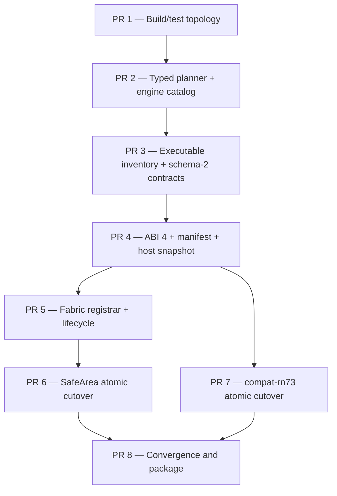

# Addon Host Architecture

| Field | Value |
| --- | --- |
| Status | Final design — architecture GO; implementation gated per PR |
| Date | 2026-09-03 |
| Reviewed tree | Clean HEAD `42e4c2d696bdcaed8a16faf5b260a57911afff97` |
| Review scope | Source review; `third_party` submodules were uninitialized and no build was executed |
| Product | React Native Simulator (`rnsim` / `ReactNativeSimulator::Engine`) |
| Native runtime | React Native 0.87.0, Hermes v1 260318099.0.1 |
| Replaces | Addon ABI 3 (`react_native_simulator_addon_v2`) as a TurboModule stub loader; `android-rn73` as a second framework-provider profile |
| Related | [SIMULATOR_DESIGN.md](SIMULATOR_DESIGN.md), [VERSIONING.md](VERSIONING.md), [ADDONS.md](../guides/ADDONS.md) |

## Executive decision

The architecture is approved. The simulator will have one native semantic
engine, built from this checkout's pinned React Native and Hermes revisions.
Profiles will continue to own the current upstream React Native contract for a
platform. Application, company, community-library, and older-JavaScript
compatibility contracts will live in isolated addons.

The current plugin surface is not an addon host. It can vend TurboModules,
evaluate a JSI bootstrap, and declare component names, but every declared
component is registered as `UnimplementedViewComponentDescriptor`. It cannot
register a real Fabric descriptor, receive an owner-scoped command, or safely
emit a generation-scoped Fabric event. This forced `RNCSafeArea*` into the
framework profile and encouraged `android-rn73` to become a second framework
provider.

ABI 4 replaces that surface with:

- a single-open, transactional addon planner;
- one executable `FrameworkSurfaceInventory` for ownership and availability;
- a frozen, session-lifetime `AddonHostSnapshot`;
- an immutable manifest and complete addon lifecycle;
- owner- and generation-scoped Fabric registration, commands, and events;
- a closed capability class plus host-derived evidence;
- a host-owned, narrowly allowlisted compatibility overlay;
- schema-2-safe additive metrics; and
- an eight-PR rollout whose behavioral cutovers are atomic.

Architecture approval is not blanket implementation approval. Each PR has an
independent merge gate. In particular, the `android-rn73` profile must not be
deleted until a real caller-built React Native 0.73.2 source/Metro fixture runs
successfully in an independent CI lane.

## Product invariants

The following constraints are normative throughout the rollout:

1. `rnsim` remains the production executable and
   `ReactNativeSimulator::Engine` remains the embedding API.
2. The process contains one `ReactInstance`, one RuntimeScheduler, and one
   Hermes VM per runtime generation. It never loads a second React Native C++
   implementation or a second Hermes engine to match a caller bundle.
3. Caller JavaScript remains external. The repository does not acquire a
   production Metro, Babel, TypeScript, or application-bundling pipeline.
4. Core configure, build, test, and runtime paths remain Node.js/npm-free.
   Existing optional diagnostics may continue to use Node built-ins.
5. Profiles own only the current pinned React Native platform contract.
   Application, company, community, and compatibility names never leak into
   the generic framework provider.
6. Unknown TurboModules remain unavailable. Unknown components remain
   observable fallbacks and cannot become certified merely because a bundle
   requested them.
7. Every capability claim identifies both its behavioral class and the source
   of its evidence. Compatibility, registration, and execution evidence are
   separate concepts.
8. Reload reuses one sealed launch plan. It creates a new runtime generation;
   it does not re-open, re-plan, add, disable, or reorder addons.
9. Nightly remains one self-contained macOS arm64 file named `rnsim`. It is not
   an addon SDK. Linux remains a source-build host for the same engine.
10. `.dylib` and `.so` MODULE behavior must be exercised by real dynamic loads,
    not inferred from static or in-process tests.

## Background and current state

### Runtime ownership

React Native 0.87 `ReactInstance` owns Hermes/JSI, RuntimeScheduler, bundle
loading, error handling, and shutdown. Fabric commits real ShadowTrees, Yoga
computes layout, and the host consumes MountingTransactions into a typed
retained scene that Skia paints. Interactive, headless, and conformance modes
must drive this same semantic engine rather than reimplementing it.

### ABI 3 limitations

The current surface in
`runtime/include/react-native-simulator/SimulatorAddon.h` has these properties:

- `kSimulatorAddonAbiVersion == 3`, while the entry symbol is named
  `react_native_simulator_addon_v2`;
- virtual capability APIs return free-form fidelity strings;
- `SimulatorAddonRegistry::load` calls `dlopen`, checks ABI/RN/Hermes, and then
  constructs a C++ object;
- TurboModule lookup is first-wins across addons;
- every addon component name becomes an `UnimplementedViewComponentDescriptor`;
- `viewManagerConfigs()` exposes legacy constants, but Fabric command names do
  not route to the addon;
- addons do not receive a viewport, event target, or EventDispatcher-mediated
  event path; and
- capability classification is inferred from substrings such as `host-`,
  `adapter`, `mock`, and `tester-stub`.

The loader's ABI/RN/Hermes checks happen after the library is mapped. They are
compatibility checks, not a pre-`dlopen` safety boundary.

### Relevant current call order

The implementation details below constrain the migration:

- addon paths are loaded in `SimulatorEngine.cpp` before the full runtime
  profile is constructed;
- `rnsim.json` addon strings are currently resolved unconditionally as paths
  relative to the config file;
- `installJSI` currently runs before legacy UIManager globals and the Fabric
  binding exist;
- `__nativeComponentRegistry__hasComponent` currently checks only addon names;
- final and reload teardown reset the Fabric host before the `ReactInstance`;
- `hostEnvironment()` is reset and configured inside each generation;
- the Fabric command delegate has early returns that can swallow an addon
  command such as `setNativeValue`;
- interactive preparation currently treats every exception as retryable;
- `include(CTest)` currently follows `add_subdirectory(runtime)`;
- `verify-runtime.mjs` requires exact legacy values such as
  `NativeMicrotasksCxx === "real-headless"`; and
- `tools/release/generate-release-manifest.sh` hardcodes an obsolete addon ABI.

### Why the superseded rollout was not executable

The earlier seven-PR sequence is rejected for the following concrete reasons:

1. Peeking a MODULE name with `dlopen`/`dlsym`/`dlclose` and then loading it
   again runs static constructors twice and creates a path TOCTOU window.
2. A registry cannot validate against a "live profile" before the profile
   inventory exists.
3. Changing values in schema-2 flat capability maps is not additive and breaks
   existing consumers.
4. A closed capability enum alone does not prevent a path MODULE from declaring
   itself `Implemented`.
5. Reinterpreting every schema-1 config string as name-or-path silently changes
   the meaning of existing configuration.
6. Removing explicit names from the auto set and then appending explicit specs
   changes deterministic order, placing `expo` behind `safe-area`.
7. Binding to mutable generation state before it is initialized yields defaults
   or state from the previous generation.
8. Global mount listeners and `emitEvent(tag, ...)` are neither owner-scoped nor
   generation-safe.
9. React Native's provider registry silently ignores duplicate handles; it
   cannot be used as the collision oracle.
10. A real descriptor receives `ComponentDescriptorParameters`, including the
    context container and event dispatcher. The host cannot claim otherwise.
11. Existing command-control flow must be refactored into a handled chain;
    addon handlers cannot simply be appended to the function.
12. Destroying the Fabric host before the `ReactInstance` risks dangling
    provider-registry references.
13. Protected-global identity checks are impossible while addon `installJSI`
    runs before the host globals exist.
14. A virtual `overlayTurboModule` would let addon code replace a reserved
    framework module rather than request a narrow host-owned overlay.

## Goals

- Preserve the profile/addon ownership split.
- Open each MODULE exactly once and hold its handle through final addon
  destruction.
- Fail all plan-level collisions before bind, Fabric registration, addon JSI,
  or caller JavaScript.
- Build one executable framework inventory before addon validation.
- Preserve every existing schema-2 flat-map key/value semantic while adding
  structured contracts.
- Separate capability class from host-derived evidence.
- Keep addon source, selection origin, and manifest role as distinct concepts.
- Preserve schema-1 string addon entries as paths and add tagged objects for
  built-in names.
- Make interactive launch explicitly three-phase, with only network discovery
  retryable.
- Freeze host state only after bundles, assets, and initial URL are known.
- Stage and preflight all Fabric providers before publishing the registry.
- Scope Fabric callbacks, events, commands, and targets to one owner and one
  runtime generation.
- Move community SafeArea out of the profile in one atomic cutover.
- Retire `android-rn73` only with an evidence-backed `compat-rn73` cutover.
- Keep source builds first-class on macOS and Linux while retaining a one-file
  Nightly package.

## Non-goals

- A second compiled React Native ABI, second Hermes VM, or version-selected
  native engine MODULE.
- Claiming that RN 0.87 native behavior is RN 0.73 native behavior.
- Translating incompatible Hermes bytecode.
- Replacing Fabric with Paper or changing Bridgeless/TurboModule runtime mode.
- Conjuring Reanimated worklets, Screens, Gesture Handler, Expo Go, Expo Router,
  or `expo-image` compatibility through the 0.73 adapter.
- Out-of-process sandboxing. Addons remain trusted, same-process native code.
- A stable public C++ ABI across compilers, standard libraries, commits,
  sanitizer modes, or Nightly builds.
- A Nightly header/library SDK.
- Addon-defined Skia painters in ABI 4 v1.
- Dynamic viewport or environment updates during a session in v1.
- Mixing two caller-JavaScript React Native families in one VM.

## Architecture

```text
caller source/HBC bundle
        |
PreparedLaunchPlan (one selected profile, ordered addons, initial bundles)
        |
ReactInstance + RuntimeScheduler + Hermes (always this native pin)
        |
+-----------------------------+-------------------------------+
| FrameworkSurfaceInventory   | CommittedAddonRegistry        |
| host/base/profile/platform  | expo / safe-area / compat     |
| executable factories       | rntester / in-tree MODULEs    |
+-----------------------------+-------------------------------+
        |                                      |
        +---------------+----------------------+
                        |
             TurboModuleBinding + UIManagerBinding
                        |
                 Fabric ShadowTree + Yoga
                        |
          validated mounting transaction consumer
                        |
              typed retained scene + Skia
```

The plan, inventory, module-owner table, component ledger, metrics contracts,
and runtime generation all describe the same selected surface. Parallel lists
with different ownership or availability semantics are forbidden.

## Engine state and launch transaction

### Closed engine state machine

```cpp
enum class EngineState {
  Draft,
  Planned,
  Running,
  Finished,
};
```

| Current state | Operation | Result |
| --- | --- | --- |
| `Draft` | successful `applyLaunchPlan` | `Planned` |
| `Draft` | failed `applyLaunchPlan` | remains observably `Draft` |
| `Planned` | `run` starts generation 1 | `Running` |
| `Planned` | `run` fails while binding or opening generation 1 | full rollback, then `Finished` |
| `Running` | reload | remains `Running`; generation changes |
| `Running` | stop or fatal failure | full teardown, then `Finished` |
| `Planned`, `Running`, or `Finished` | apply another plan | rejected |
| `Finished` | call `run` again | rejected |

Existing fine-grained runtime phases remain subordinate status. They do not add
new ownership states to this lifecycle.

### Launch data types

```cpp
enum class AddonSource {
  BuiltIn,
  Module,
  InProcess,
};

enum class AddonRequestOrigin {
  Auto,
  Config,
  Cli,
  Embedder,
  Test,
};

struct BuiltInAddonSpec {
  std::string catalogKey;
};

struct ModuleAddonSpec {
  std::filesystem::path path;
};

struct InProcessAddonSpec {
  std::unique_ptr<class SimulatorAddon> addon;
  std::string diagnosticLabel;
};

using AddonSpec = std::variant<
    BuiltInAddonSpec,
    ModuleAddonSpec,
    InProcessAddonSpec>;

struct AddonRequest {
  AddonSpec spec;
  std::vector<AddonRequestOrigin> requestedBy;
};

struct AddonOrigin {
  AddonSource source;
  std::string locator;
  std::optional<std::string> catalogKey;
  std::vector<AddonRequestOrigin> requestedBy;
};

class LaunchDraft {
 public:
  explicit LaunchDraft(EngineConfig config);

  void addBuiltInAddon(
      std::string_view catalogKey,
      AddonRequestOrigin origin = AddonRequestOrigin::Embedder);
  void addAddonPath(
      const std::filesystem::path& path,
      AddonRequestOrigin origin = AddonRequestOrigin::Embedder);
  void addAddon(
      std::unique_ptr<SimulatorAddon> addon,
      std::string diagnosticLabel,
      AddonRequestOrigin origin = AddonRequestOrigin::Embedder);
  void addBundle(InitialBundleSpec bundle);
};
```

`AddonSource` states how implementation code entered the process.
`AddonRequestOrigin` states why it was selected. `AddonRole` in the immutable
manifest describes its intended product role but grants no privilege.

`PreparedLaunchPlan` is move-only and immutable. It owns prepared addon
instances, MODULE handles, frozen manifests, resolved origins, the selected
profile inventory, the sealed expected module/component ledgers, compatibility
requests, and all initial bundle inputs needed by `run()`.

### Preparation and application

```cpp
PreparedAddonCandidates prepareExplicitAddons(LaunchDraft& draft);

PreparedLaunchPlan finalizeLaunchPlan(
    LaunchDraft&& draft,
    PreparedAddonCandidates&& candidates,
    const LaunchDiscoveryResult& discovery);

class Engine final {
 public:
  Engine();
  EngineState state() const noexcept;

  // Valid only in Draft. It moves a fully prepared plan into the engine.
  void applyLaunchPlan(PreparedLaunchPlan&& plan);

  // Valid only in Planned; returns after teardown has reached Finished.
  EngineResult run();
};
```

`LaunchDraft` is the only mutable launch-input owner. `Engine` does not keep a
second internal draft. The ABI 3 embedding calls
`Engine::addAddon(std::string)` and `Engine::addAddon(unique_ptr)` are replaced
by the corresponding typed `LaunchDraft` methods; the class name and production
embedding boundary remain `ReactNativeSimulator::Engine`, but callers must seal
a plan before running it.

Typical embedding is therefore:

```cpp
ReactNativeSimulator::LaunchDraft draft(config);
draft.addBuiltInAddon("expo");
draft.addAddonPath("build/runtime/rns-addon-rntester.dylib");
draft.addBundle(bundle);

auto candidates = prepareExplicitAddons(draft);
auto plan = finalizeLaunchPlan(
    std::move(draft), std::move(candidates), discovery);

ReactNativeSimulator::Engine engine;
engine.applyLaunchPlan(std::move(plan));
engine.run();
```

Preparation performs every fallible operation that does not require a live
runtime generation:

- normalize CLI/config/embedder inputs and config-relative paths;
- identify all initial bundle paths or fetched bodies;
- resolve exact catalog names;
- canonicalize MODULE paths and `dlopen` each explicit MODULE once;
- validate the ABI descriptor before `create()`;
- construct each addon and copy `manifest()` exactly once;
- build the framework inventory for the selected profile;
- validate names, source collisions, ownership, overlay policy, legacy
  projections, events, commands, and view-manager references;
- derive host-owned evidence;
- merge auto and explicit selections deterministically; and
- seal module owners and expected component/provider rows.

Preparation does not create Hermes, `ReactInstance`, RuntimeScheduler, JSI,
Fabric, a ShadowTree, or a surface. Addon construction and `manifest()` happen
during preparation, so they must not perform activation work or external side
effects. Activation begins at `bind()`.

This paragraph describes the ABI 4 end state. During PR 2 and PR 3, while the
runtime still accepts ABI 3, a transitional adapter calls each legacy
`name`/module-capability/component-capability/view-manager getter once, copies
those results into one frozen declaration, and never calls the getter set again.
PR 4 replaces that adapter with the single `manifest()` call and removes ABI 3.

`Engine::applyLaunchPlan` invokes no addon code. It stages the entire move and
publishes it atomically, with the strong exception guarantee for `Engine`: on
failure the engine remains `Draft` with no partially installed plan. Binding
occurs at `run()` start after the final host snapshot exists.

The host records a bind as entered before making the virtual call. `unbind()`
must safely roll back a partially completed bind. If `bind()` throws, the host
calls `unbind()` first on the throwing addon and then on previously bound addons
in reverse order, captures a host-owned copy of the original diagnostic while
the MODULE remains mapped, destroys all plan resources, and transitions through
full teardown to `Finished` without evaluating caller JavaScript. Addons whose
`bind()` was never entered receive no `unbind()` call.

### Single-open MODULE lifecycle

```text
ParsedRequest
  -> PreparedCandidate       MODULE dlopen once; RAII handle retained
  -> FrozenManifest          create once; manifest copied once
  -> ValidatedPlan           all names and policy checked
  -> PlannedEngine           ownership moved atomically
  -> BoundSession            frozen AddonHostSnapshot available
  -> RuntimeGeneration N     per-generation JSI/Fabric state
  -> QuiescedGeneration N
  -> RuntimeGeneration N+1
  -> UnboundSession
  -> destroy addon
  -> dlclose MODULE
```

No `peekModuleAddonName` operation exists. Collision failure is guaranteed
before bind, Fabric registration, addon JSI, or caller JavaScript, but not before
`dlopen`, static constructors, `create()`, or `manifest()`.

## CLI, configuration, and deterministic selection

### CLI token classification

| Token form | Interpretation |
| --- | --- |
| Exact compiled catalog key, for example `expo` | `BuiltInAddonSpec` |
| Contains `/`, starts with `.` or `..`, or has `.so`/`.dylib` suffix | `ModuleAddonSpec` |
| Any other bare token | terminal `unknown addon name` error |

A bare unknown token is never passed to `dlopen` as an accidental relative
path. A path whose descriptor name happens to match a catalog key remains a
MODULE source with `AddonDeclared` evidence.

CLI selection controls are:

| Flag | Meaning |
| --- | --- |
| `--addon NAME_OR_PATH` | Append one explicit typed request |
| `--no-addon NAME` | Remove one known catalog name from auto selection |
| `--no-auto-addons` | Disable every automatic slot |

`--no-addon` accepts only a known catalog key. Repeating the same disable in
config and/or CLI is idempotent set-union. An unknown disabled name is terminal,
and an explicit request for a disabled name remains a contradiction.

### `rnsim.json` schema 1

Schema version remains 1. Existing strings preserve their current path-only
meaning. Names use tagged objects:

```json
{
  "schemaVersion": 1,
  "reactNative": "0.87.0",
  "platform": "android",
  "addons": [
    {"name": "compat-rn73"},
    {"path": "../local-addons/rns-addon-company.so"},
    "../legacy-addon-path/rns-addon-rntester.so"
  ],
  "disabledAddons": ["expo"],
  "autoAddons": true
}
```

- String and `{ "path": ... }` entries resolve relative to the config file.
- `{ "name": ... }` is an exact built-in catalog key and is not path-resolved.
- `disabledAddons` contains catalog names and controls planner-owned auto
  selection.
- `autoAddons` defaults to `true`.
- Unknown fields and malformed tagged objects fail closed.
- An explicit request intersecting `disabledAddons` is a terminal
  contradiction.
- CLI `--addon` entries append after config explicit order. CLI
  `--no-addon` values union with config disables, and `--no-auto-addons`
  overrides `autoAddons: true`, after config merge.

`disableAddon` is deliberately absent from `Engine`: disabling is selection
policy, not a runtime mutation.

### Deterministic auto/explicit merge

Expo detection remains caller-owned. The engine does not inspect cwd, Metro,
package files, or bundle URLs. The catalog auto order is `expo`, then
`safe-area` after that addon exists. `compat-rn73` is never automatic.

The planner performs this exact algorithm:

1. Resolve each explicit MODULE to a stable file identity. Reject a repeated
   canonical path, symlink target, or platform file ID before a second
   `dlopen`.
2. Prepare every remaining explicit MODULE exactly once and freeze every
   explicit name.
3. Reject duplicate explicit names, including built-in/MODULE collisions.
4. Create auto slots in catalog order for the detected project type.
5. If one explicit request has the same name as an auto slot, that explicit
   implementation occupies the slot and records both origins.
6. Append remaining explicit requests in caller order.
7. Drop disabled auto-only slots; reject every explicit/disabled intersection.
8. Apply a stable topological dependency sort if dependencies are introduced in
   a future ABI. ABI 4 v1 declares no dependencies.

Thus an Expo cwd plus explicit `--addon expo` keeps `expo` first and loads it
once. An explicit MODULE whose manifest is `expo` may occupy the `expo` auto
slot, but it remains a MODULE and never gains built-in evidence.

### Interactive and headless launch

Interactive startup has three explicit phases:

```text
1. prepare explicit addon candidates once
2. fetch/probe every Metro input without mutating Engine
3. finalize the complete plan and apply it once
```

Only phase 2 is retryable:

| Failure | Error class | Retry |
| --- | --- | --- |
| Metro unavailable, HTTP failure, cancelled wait | `RetryableNetworkError` | yes |
| Unknown token, ABI/fingerprint mismatch, duplicate, disabled contradiction, invalid manifest, collision | `TerminalLaunchPlanError` | no |

An interactive retry reuses the already prepared explicit candidates and their
open MODULE handles. It does not call `dlopen`, `create()`, `manifest()`, or
`applyLaunchPlan()` again. Headless fetches Metro first, finalizes one plan,
applies it once, and calls `run()`.

Reload never runs selection or preparation again.

## Framework surface inventory

### Executable single source of truth

The framework inventory is not a metadata-only reserved-name list. Every
available framework module or component carries its executable binding:

```cpp
enum class RuntimeCapabilityClass {
  Implemented,
  HostAdapted,
  Mocked,
  LayoutOnly,
  Unavailable,
};

enum class CapabilityEvidence {
  EngineVerified,
  InTreeVerified,
  AddonDeclared,
};

struct LegacyMetricProjection {
  std::string metricsName;
  std::string fidelity;
};

struct RuntimeProfileDescriptor {
  std::string name;
  std::string platform;
  std::string nativeReactNativeVersion;
  std::string compatibilityLevel;
};

struct ResolvedBundleCompatibility {
  std::string nativeReactNativeVersion;
  std::string targetFamily;
  std::string jsVisibleReactNativeVersion;
  std::string level;
  std::optional<std::string> compatAddon;
  bool hbcTranslation;
};

struct ModuleContract {
  std::string name;
  RuntimeCapabilityClass classification;
  std::string owner;
  CapabilityEvidence evidence;
  std::string note;
  std::vector<LegacyMetricProjection> legacyMetrics;
};

struct ComponentContract {
  std::string name;
  RuntimeCapabilityClass classification;
  std::string owner;
  CapabilityEvidence evidence;
  AddonComponentKind kind;
  std::string note;
  std::vector<LegacyMetricProjection> legacyMetrics;
};

struct FrameworkModuleEntry {
  ModuleContract contract;
  TurboModuleFactory factory;
};

struct FrameworkComponentEntry {
  ComponentContract contract;
  facebook::react::ComponentDescriptorProvider provider;
};

struct FrameworkComponentRequest {
  // Raw name presented by React Native/JS before RN normalization.
  std::string requestedName;
  // Expected canonical provider after exactly one normalization pass.
  std::string canonicalProviderName;
};

struct FrameworkSurfaceInventory {
  RuntimeProfileDescriptor profile;
  std::vector<FrameworkModuleEntry> hostModules;
  std::vector<FrameworkModuleEntry> profileModules;
  std::vector<FrameworkComponentEntry> baseComponents;
  std::vector<FrameworkComponentEntry> officialComponents;
  std::vector<FrameworkComponentEntry> platformComponents;
  std::vector<FrameworkComponentRequest> componentRequests;
};
```

`PreparedLaunchPlan` seals exactly one `ResolvedBundleCompatibility` after the
profile and any allowed compatibility request are resolved. The host snapshot,
TurboModule wrapper, doctor output, final metrics, and live Inspector all read
that record. The profile descriptor never changes its native RN identity to
represent an older caller bundle.

Every framework factory, provider name, classification, legacy projection, and
owner is declared once. A null factory/provider makes the inventory invalid.
The same inventory feeds:

- reserved-name validation;
- the O(1) TurboModule owner map;
- framework provider staging;
- the `hasComponent` availability ledger;
- final and live metrics;
- interactive capability chrome; and
- isolation checks.

String branches in module lookup, capability arrays, provider arrays, and
metrics initializer tables must not retain independent ownership lists. Helper
functions may implement factories, but their routing rows originate in the
inventory.

### Legacy projection is per surface

Schema-2 fidelity strings are not derivable from the closed enum. Each surface
has explicit zero-or-more `LegacyMetricProjection` values. This preserves
historic aliases and values byte-for-byte while allowing a canonical contract.

For example, the canonical root provider is `Root`, while the existing flat
component map uses `RootView`:

```cpp
FrameworkComponentEntry{
    .contract = {
        .name = "Root",
        .classification = RuntimeCapabilityClass::Implemented,
        .owner = "host",
        .evidence = CapabilityEvidence::EngineVerified,
        .legacyMetrics = {{"RootView", "real-fabric-root"}},
    },
    .provider = rootComponentDescriptorProvider,
};
```

`RootView` is a serialization alias only. It does not register another
provider, add another handle, or make `hasComponent("RootView")` true unless a
separate host-owned request alias is deliberately defined.

Two final surfaces projecting the same flat-map key are a planning error. ABI 3
addons use a temporary exact migration table during PR 3; PR 4 deletes that
table with ABI 3 loading.

### Capability evidence

Evidence is computed by the engine and cannot be supplied by a manifest:

| Resolved surface | Evidence |
| --- | --- |
| Host/profile executable inventory entry | `EngineVerified` |
| Built-in resolved through the compiled catalog and matching catalog policy | `InTreeVerified` |
| Path MODULE | `AddonDeclared` |
| In-process addon | `AddonDeclared` |

Evidence and class are orthogonal. A built-in descriptor-only component may be
`LayoutOnly` with `InTreeVerified` evidence. A path MODULE may declare an
`Implemented` class, but its evidence remains `AddonDeclared`, and chrome must
not present it as simulator-certified. A path under the source tree, a matching
name, a signature, an ABI fingerprint, or `AddonRole::VersionCompat` cannot
elevate evidence.

Actual execution observations and route counters remain separate from both
class and evidence.

A catalog may mark a built-in `Implemented` or `HostAdapted` only when the
catalog policy names its required routing test and that gate is mandatory for
the introducing PR. `InTreeVerified` means the implementation and claimed
boundary are maintained and tested in this tree; it still does not assert that
the route executed in a particular run. Per-run counters provide that separate
observation.

## ABI 4 addon contract

### Immutable manifest

```cpp
enum class AddonRole {
  Application,
  Community,
  VersionCompat,
};

enum class AddonComponentKind {
  DescriptorOnlyMock,
  FabricDescriptor,
};

enum class ModuleOverlayKind {
  PlatformConstantsReactNativeVersion,
};

struct AddonModuleDeclaration {
  std::string name;
  RuntimeCapabilityClass classification;
  std::vector<LegacyMetricProjection> legacyMetrics;
  std::string note;
};

struct AddonModuleOverlayDeclaration {
  std::string moduleName;
  ModuleOverlayKind kind;
  std::string targetFamily;
};

struct AddonComponentDeclaration {
  std::string name;
  RuntimeCapabilityClass classification;
  AddonComponentKind kind;
  std::vector<std::string> events;
  std::vector<std::string> fabricCommands;
  std::vector<LegacyMetricProjection> legacyMetrics;
  std::string note;
};

struct AddonManifest {
  std::string name;
  std::string addonVersion;
  AddonRole role;
  std::vector<AddonModuleDeclaration> modules;
  std::vector<AddonModuleOverlayDeclaration> moduleOverlays;
  std::vector<AddonComponentDeclaration> components;
  std::vector<SimulatorAddonViewManagerConfig> legacyViewManagerConfigs;
};
```

The host calls `manifest()` once and copies the result. The copy is the only
manifest consulted by planning, routing, generation setup, metrics, and chrome.
`legacyMetrics` exists solely to preserve schema-2 flat maps. It can explicitly
rename a legacy key or be empty to omit the surface from a flat map; it does not
influence class, evidence, availability, or certification.

Manifest validation is fail-closed:

1. The addon name is non-empty, matches `[a-z][a-z0-9-]*`, and equals the ABI
   descriptor name for a MODULE.
2. Module names, component names, events, commands, legacy command names, and
   numeric constant names are non-empty and unique in their applicable scope;
   legacy command IDs are unique in their numeric scope.
3. A served module cannot also be an overlay target in the same addon.
4. `Unavailable` cannot describe a served manifest surface.
5. A descriptor-only component is `LayoutOnly` or `Mocked` and must not provide
   a real provider.
6. Every real component must provide exactly one provider in every generation.
7. Every view-manager config references a component owned by that addon.
8. Non-compat addons cannot request an overlay.
9. `VersionCompat` role is accepted only for the exact built-in catalog source
   authorized by engine policy; a MODULE or in-process addon cannot self-assign
   that role. At most one compat policy may be active for the engine.
10. Application/community modules and all addon components are disjoint from
    framework-owned names.
11. Overlay requests are accepted only when an engine-owned catalog policy
    grants that exact built-in addon, profile, module, overlay kind, and target
    family.
12. Every legacy projection has a non-empty name and fidelity, and no two final
    surfaces project to the same key in the same flat map.

Self-reported `AddonRole` is descriptive. It never grants reserved-name or
overlay privilege.

### Complete virtual interface

```cpp
class AddonFabricRegistrar;

class SimulatorAddon {
 public:
  virtual ~SimulatorAddon() noexcept = default;

  virtual AddonManifest manifest() const = 0;

  // Entered at most once per run session, before generation 1. If it throws,
  // unbind() is still called on this addon to roll back partial activation.
  virtual void bind(const AddonHost& host) = 0;

  // Runtime thread; only the final owner is called for an owned module.
  virtual std::shared_ptr<facebook::react::TurboModule> getTurboModule(
      facebook::jsi::Runtime& runtime,
      const std::string& moduleName,
      const std::shared_ptr<facebook::react::CallInvoker>& jsInvoker) = 0;

  // At most once for an opened generation. The host stops the configure pass
  // at the first failure.
  virtual void configureFabric(AddonFabricRegistrar& registrar) = 0;

  // At most once per generation, only after every addon configured and the
  // complete provider ledger passed preflight.
  virtual void installJSI(
      facebook::jsi::Runtime& runtime,
      const std::shared_ptr<facebook::react::CallInvoker>& jsInvoker) = 0;

  // Mandatory for every opened generation, even when setup failed partway.
  virtual void quiesceGeneration(std::uint64_t generation) noexcept = 0;

  // Exactly once after an entered bind, including a bind that threw, and only
  // after all opened generations are closed. Must tolerate partial bind state.
  virtual void unbind() noexcept = 0;
};
```

All slots are part of ABI 4, including no-op lifecycle implementations. An
addon may not omit a slot by relying on a future base-class default.

`create`, `manifest`, `bind`, `getTurboModule`, `configureFabric`, and
`installJSI` may throw. The host catches each boundary while all implementing
code is still mapped and records addon, operation, surface, and generation.
Destructors, `quiesceGeneration`, `unbind`, `destroy`, and the descriptor
accessor are non-throwing. A violation of a non-throwing boundary is fatal
process corruption, not a recoverable addon diagnostic.

`CallInvoker` is generation-local and appears only in runtime-thread methods.
It is never part of `AddonHost` and must not be cached across reload.

A generation becomes `Opening` immediately before the first addon
`configureFabric` call. Configure runs in plan order and stops at the first
failure. Only after every configure call and mandatory provider preflight
succeed does `installJSI` run in plan order; that pass also stops at the first
failure. The generation becomes `Open` only after all install calls and
protected-global verification succeed. Therefore configure/install are each
**at most once** per addon per opened generation. Every bound addon receives
exactly one `quiesceGeneration(generation)`, including addons whose configure or
install hook was never reached. Successful generations assert one configure and
one install call for every addon; failed generations assert the attempted
prefix and one quiesce call for every bound addon.

Rollout note: PR 4 freezes the ABI-facing `AddonFabricRegistrar` type and calls
`configureFabric` with a generation-scoped rejecting backend. Descriptor-only
mocks continue through the host-owned manifest path, while any attempt to
register a real provider, mount handler, or command handler fails explicitly as
"Fabric addon registration is not available until the registrar backend is
enabled." This makes the complete vtable and generation counts testable in PR 4
without pretending the backend exists. PR 5 replaces only that rejecting
backend with the staged provider/event/command implementation; it does not
change ABI 4.

### ABI descriptor and fingerprint

```cpp
inline constexpr std::uint32_t kSimulatorAddonAbiVersion = 4;
inline constexpr const char* kSimulatorAddonEntryPoint =
    "react_native_simulator_addon_v4";

struct SimulatorAddonDescriptor {
  std::uint32_t descriptorSize;
  std::uint32_t abiVersion;
  const char* addonApiFingerprint;
  const char* name;
  const char* reactNativeVersion;
  const char* hermesVersion;
  SimulatorAddon* (*create)();
  void (*destroy)(SimulatorAddon*) noexcept;
};

using GetSimulatorAddonDescriptorV4 =
    const SimulatorAddonDescriptor* (*)() noexcept;
```

Entry symbol:

```cpp
extern "C" RNS_EXPORT
const ReactNativeSimulator::SimulatorAddonDescriptor*
react_native_simulator_addon_v4() noexcept;
```

The validation order is fixed:

1. Resolve the v4 symbol.
2. Call the non-throwing v4 accessor and reject a null descriptor pointer.
3. Check that `descriptorSize` covers every required v4 field before reading
   fields beyond the size prefix.
4. Require `abiVersion == 4`.
5. Require a non-null, exact fingerprint.
6. Require exact non-null React Native and Hermes strings.
7. Require non-empty descriptor name and non-null `create`/`destroy` callbacks.
8. Call `create()` and reject a null instance.
9. Call `manifest()` once, copy it, and require its name to equal the descriptor
   name.

No addon virtual call other than `manifest()` occurs before full plan
validation. A failure after construction invokes `destroy()` while the MODULE
handle is still mapped.

`create()` may throw. The loader catches it inside a scope that still owns the
mapped MODULE, copies only host-owned diagnostic data (operation, path, addon
name when known, and exception text), destroys the caught exception object by
leaving that catch scope, and only then releases the RAII handle. It must not
store a MODULE-defined `exception_ptr` in `TerminalLaunchPlanError`. A null
return is the non-throwing construction-failure form. Both paths are tested.

The same ownership rule applies to `manifest`, `bind`, TurboModule, Fabric, and
JSI exceptions. A host-owned error record may survive cleanup; a native
exception object, `exception_ptr`, RTTI reference, or `what()` pointer from a
MODULE may not survive its handle. Generation errors may retain an
`exception_ptr` only while the MODULE registry is guaranteed mapped, and
teardown converts and clears it before `unbind`, destruction, and `dlclose`.

If v4 is absent, the loader may call `dlsym` for
`react_native_simulator_addon_v2` only to identify an ABI 3 binary and emit a
directed rebuild diagnostic. It must not call the old accessor or construct the
old addon.

The fingerprint includes the public-header hash, exact RN/Hermes source pins,
compiler and version, standard-library ABI, C++ language mode, sanitizer mode,
and relevant ABI-affecting flags. It is a compatibility identifier, not a
signature, trust signal, or capability-evidence source.

### Frozen host snapshot

```cpp
struct AddonViewport {
  float width;
  float height;
  float pointScaleFactor;
  float insetTop;
  float insetRight;   // v1: 0; EngineConfig has no right-inset field
  float insetBottom;
  float insetLeft;    // v1: 0; EngineConfig has no left-inset field
};

struct AddonHostSnapshot {
  std::string profileName;
  std::string platform;

  // Native source/ABI identity; always the compiled pin.
  std::string reactNativeVersion;
  std::string hermesVersion;

  // Compatibility identity. See the compat section.
  std::string bundleTargetFamily;
  std::string jsVisibleReactNativeVersion;

  SimulatorMode mode;
  AddonViewport viewport;
  std::optional<std::filesystem::path> assetDirectory;
  std::optional<std::filesystem::path> fontDirectory;
  std::optional<std::string> initialUrl;
  std::string colorScheme;
  std::string appState;
  bool reduceMotion;
};

class AddonHost {
 public:
  virtual ~AddonHost() = default;
  virtual const AddonHostSnapshot& snapshot() const noexcept = 0;
};
```

The snapshot owns every string and path and is immutable from successful bind
through `unbind`. It is constructed at `run()` start after the selected bundles
determine the final asset directory. `RNSIM_INITIAL_URL` is copied once at that
point. Addons must not re-read process environment or mutable
`hostEnvironment()` state.

The snapshot's native version, target family, and JS-visible version are copied
from the plan's single `ResolvedBundleCompatibility`; they are not independently
recomputed from profile or addon names.

The snapshot is session-constant in v1. Dynamic viewport, color-scheme,
app-state, and reduced-motion updates require a future versioned API.

ExpoLinking copies `initialUrl` into generation-local state and clears it during
generation quiescence. No JSI value or generation object enters the snapshot.

## TurboModules, overlays, and JSI

### Owner-directed lookup

The final plan contains one owner for every served module. Lookup is O(1) and
calls only that owner:

1. Ignore known `$$typeof` and `__esModule` probes.
2. Resolve the selected framework factory or addon owner from the sealed map.
3. Construct the current profile module when the name is a framework module.
4. Apply an engine-owned structured wrapper if the plan contains an approved
   overlay for that module.
5. Return the result and record usage from the resolved contract.
6. Return `nullptr` and record unavailable for an unknown name.

The registry never walks addons and never falls through to a different addon.
If an addon owns a manifest module but returns null, the host records
`AddonContractViolation`, marks that surface unavailable, and does not ask
another addon. The host does not inspect `TurboModule::name_`, which is protected
in the pinned React Native API.

Framework factories remain framework-owned. A compatibility addon cannot
receive or replace the inner module object.

### Host-owned overlays

ABI 4 v1 has one structured overlay kind:

```cpp
ModuleOverlayKind::PlatformConstantsReactNativeVersion
```

An addon requests this kind in its frozen manifest. The engine-owned built-in
catalog decides whether the exact request is privileged. The engine constructs
the current profile's `PlatformConstants` and wraps it with host code that
rewrites only the nested `reactNativeVersion` constant (and equivalent property
access paths backed by the same constant). Every other constant, method, and
platform-shaped field forwards to the current RN 0.87 module.

There is no virtual `overlayTurboModule` hook.

### JSI installation order and protected globals

Each generation installs in this order:

```text
TurboModuleBinding
  -> legacy UIManager globals
  -> unified __nativeComponentRegistry__hasComponent
  -> Fabric / UIManagerBinding
  -> snapshot protected-global identities and descriptors
  -> addon installJSI in deterministic plan order
  -> verify protected globals are unchanged
  -> evaluate caller bundles
```

Protected globals include at least:

- `RN$Simulator`;
- `nativeModuleProxy`;
- `__turboModuleProxy`;
- `nativeRuntimeScheduler`;
- all `RN$LegacyInterop_UIManager_*` globals;
- `__nativeComponentRegistry__hasComponent`;
- `__fbBatchedBridgeConfig`; and
- host-installed `console` methods.

The host snapshots identity and relevant property descriptors, not merely the
truthiness of each value. A mutation is `AddonContractViolation` and aborts
initialization before caller JavaScript.

An addon may create only documented globals it owns. If an owned global already
exists with an incompatible type, installation fails rather than overwriting it
silently.

Expo builds `globalThis.expo.modules[name]` from the already-installed
`nativeModuleProxy[name]`. It must not call `getTurboModule` again to create a
second HostObject. A required identity assertion is:

```js
globalThis.expo.modules.ExpoAsset === nativeModuleProxy.ExpoAsset
```

## Fabric addon host

### Registration surface

Every addon receives a distinct owner-scoped registrar for one runtime
generation:

```cpp
class AddonEventSink;

// Copyable weak facade. It never keeps a generation or MODULE alive.
class MountedTargetToken {
 public:
  MountedTargetToken(const MountedTargetToken&) = default;
  MountedTargetToken& operator=(const MountedTargetToken&) = default;

 private:
  struct State;
  explicit MountedTargetToken(std::weak_ptr<const State> state) noexcept
      : state_(std::move(state)) {}
  std::weak_ptr<const State> state_;
  friend class AddonFabricSessionState;
};

enum class AddonMountKind {
  Mounted,
  Updated,
  Unmounted,
};

struct AddonMountedTargetSnapshot {
  std::uint64_t generation;
  facebook::react::SurfaceId surfaceId;
  facebook::react::Tag tag;
  std::string componentName;
  facebook::react::LayoutMetrics layoutMetrics;
};

struct AddonMountEvent {
  AddonMountKind kind;
  AddonMountedTargetSnapshot target;
  MountedTargetToken token;
};

struct AddonCommandContext {
  AddonMountedTargetSnapshot target;
  MountedTargetToken token;
  std::string commandName;
};

using AddonMountHandler = std::function<void(
    const AddonMountEvent& event,
    AddonEventSink& events)>;

using AddonCommandHandler = std::function<void(
    const AddonCommandContext& context,
    const folly::dynamic& args,
    AddonEventSink& events)>;

class AddonFabricRegistrar {
 public:
  void registerDescriptor(
      facebook::react::ComponentDescriptorProvider provider);

  void onMount(
      std::string_view ownedComponent,
      AddonMountHandler handler);

  void onCommand(
      std::string_view ownedComponent,
      std::string_view declaredCommand,
      AddonCommandHandler handler);
};
```

The registrar is valid only during `configureFabric`. It cannot be retained.
Registration is staged; it never mutates an already-live RN registry.

`MountedTargetToken` and `AddonEventSink` have no public default constructor.
Only the generation session state can construct them from weak backing state;
addons can copy the resulting facades but cannot forge an owner, generation,
mount serial, or callback epoch.

Descriptor-only mocks are registered by the host directly from the frozen
manifest. They use `UnimplementedViewComponentDescriptor` with a stable flavor.
The addon does not also register them. Every `FabricDescriptor` declaration
must contribute exactly one provider in every generation, and every provider
must correspond to exactly one declaration.

At most one mount handler may be registered for an owned component. Duplicate
registration is an initialization error. Every command declared by a manifest
component must have exactly one handler, and no undeclared or duplicate command
handler may be registered. Components that need no mount observation register
no mount handler. These bijections are checked before provider preflight.

### Canonical provider ledger

React Native's `ComponentDescriptorProviderRegistry` silently returns on a
duplicate handle, so the engine must construct one immutable ledger before
calling `providers.add()`.

Each row records at least:

```text
requested React view name
RN-normalized name
canonical provider name
ComponentHandle
owner kind and owner name
implementation kind
capability contract
runtime generation
provider/flavor lifetime owner
```

Framework and addon providers pass through the same ledger builder. Validation
rejects:

- empty names, null constructors, or zero handles;
- a missing, extra, or duplicate provider;
- duplicate canonical names;
- duplicate handles, even when the names differ;
- a provider registered for another owner;
- descriptor-only declarations that also contribute providers;
- a duplicate raw request row;
- one normalized request key resolving to different canonical providers;
- a request row whose safe one-pass normalization does not equal its declared
  `canonicalProviderName`;
- a request row whose canonical target does not exist exactly once; and
- re-entrant registration from a provider constructor.

The request resolver reproduces pinned RN normalization exactly once. It strips
one optional `RCT` prefix and then applies the following mappings. The wrapper
first checks `name.size() >= 3` before comparing the prefix; it does not copy the
pinned implementation's unbounded second-range `std::mismatch` expression for
one- or two-character inputs.

| Name after optional `RCT` removal | Canonical provider name |
| --- | --- |
| `Text` | `Paragraph` |
| `SelectableText` | `SelectableParagraph` |
| `VirtualText` | `Text` |
| `ImageView` | `Image` |
| `AndroidHorizontalScrollView` | `ScrollView` |
| `RKShimmeringView` | `ShimmeringView` |
| `RefreshControl` | `PullToRefreshView` |
| `ScrollContentView` | `View` |
| `MultilineTextInputView` | `TextInput` |
| `SinglelineTextInputView` | `TextInput` |
| any other name | unchanged |

Framework inventory may deliberately declare request rows that normalize to a
different canonical provider. This is required for upstream pairs such as
`VirtualText -> Text` and `Text -> Paragraph`. The engine never normalizes the
result a second time. Every raw request name is unique. Multiple raw names may
collapse to one normalized key only when they select the same existing
canonical provider; a normalized key can never select two providers.

Addon manifest and provider names, by contrast, must be canonical fixed points
under this normalization. An addon cannot claim `RCTView`, `Text`,
`VirtualText`, `ImageView`, or another mapped request name as its canonical
identity. Each committed addon component contributes exactly one implicit
request row `{name, name}` after passing that fixed-point check. ABI 4 v1
exposes no addon-defined alias facility. Host-owned request rows live only in
`FrameworkSurfaceInventory::componentRequests` and do not create another
provider, handle, or capability contract. `RootView` remains a legacy metrics
projection, not a request alias, in v1.

### Mandatory provider preflight

After the final `EventDispatcher`, `ContextContainer`, and provider flavors
exist, but before the RN registry is published, the host constructs every real
descriptor with the exact final `ComponentDescriptorParameters`.

Preflight verifies:

- construction returns non-null;
- the live descriptor name equals the provider name;
- the live descriptor handle equals the provider handle;
- both match the sealed ledger;
- construction/destruction completes without exception; and
- all name, flavor, constructor, RTTI, and vtable storage outlives the
  generation.

Preflight is mandatory in release and sanitizer configurations. Providers may
be constructed again by RN, so constructors must be deterministic,
side-effect-free, and safe to invoke more than once.

The host API does not directly expose `ContextContainer` or `EventDispatcher`.
A real upstream descriptor necessarily receives and retains the corresponding
objects in `ComponentDescriptorParameters`. Addons are trusted in-process code;
the host cannot technically prevent descriptor code from accessing them.

All providers are preflighted before the engine creates and publishes the final
`ComponentDescriptorRegistry`. A failure produces no partially published
registry and prevents caller bundle evaluation.

### Component availability

`__nativeComponentRegistry__hasComponent(name)` resolves the requested name
through the same one-pass request-resolution ledger and then queries sealed
availability. It is true for:

- framework components from the executable inventory;
- preflighted real addon descriptors; and
- explicitly committed descriptor-only addon components.

A lazily requested `UnimplementedView`, interop descriptor, or other fallback
does not enter the ledger and never changes `hasComponent` from false to true.
Fallback use remains separately observable in `fallbackComponents`.

### Mount notifications

Addon handlers observe validated committed component state, not raw mutations:

```text
pull complete MountingTransaction
  -> apply all mutations to staged retained state
  -> validate all retained-tree invariants
  -> compare validated before/after trees
  -> derive value-owned notifications and tokens
  -> atomically publish the validated scene snapshot
  -> release every host lock and iterator
  -> invoke addon callbacks
```

No callback receives `ShadowNode`, `EventEmitter`, `ContextContainer`, a JSI
value, or a reference into the retained scene.

Notifications are derived from before/after mounted trees. A remove followed by
an insert in the same transaction is a move, not a false unmount/remount.
Unmount ordering is child-before-parent; mount ordering is parent-before-child;
updates preserve deterministic transaction order and multiple updates to one
tag are coalesced to the final state. Scene publication always completes before
the first addon observer runs, so a callback failure cannot leave the internal
mounted tree and public retained scene at different revisions.

The opaque token additionally binds the addon owner and an internal mount
serial. A tag alone is never an event identity.

- `Mounted` receives a newly live token.
- `Updated` receives the same live mount-incarnation token.
- `Unmounted` is cleanup-only: the token is invalidated before callback.
- Delete performs host cleanup and does not create an emittable token.
- Tag reuse creates a new mount serial, so an old token cannot address the new
  node.
- Generation shutdown invalidates every token before stopping the surface.

### Event sink

Fabric events are synchronous-callback-only in ABI 4 v1. `AddonEventSink` is a
small copyable weak facade backed by generation-owned state plus a tombstone. It
never keeps a generation or MODULE alive. The host supplies a facade while
invoking the owning addon's mount or command callback.

An addon may retain a copy without causing UAF, but emission is accepted only
during the dynamic extent of that owner's active callback. A retained copy
returns `OutsideCallback` while its generation remains alive and
`SessionClosed` after the tombstone is closed. It must not be used as an
asynchronous delivery mechanism from a background thread, timer, destructor,
TurboModule callback, or later task.

```cpp
enum class EmitResult : std::uint8_t {
  Delivered,
  SessionClosed,
  OutsideCallback,
  WrongThread,
  StaleGeneration,
  WrongOwner,
  TargetUnmounted,
  EmptyEventType,
  UndeclaredEvent,
  InvalidPayload,
};

class AddonEventSink {
 public:
  AddonEventSink(const AddonEventSink&) = default;
  AddonEventSink& operator=(const AddonEventSink&) = default;

  EmitResult emit(
      const MountedTargetToken& target,
      std::string_view declaredEvent,
      folly::dynamic payload) noexcept;

 private:
  struct State;
  AddonEventSink(
      std::weak_ptr<State> state,
      std::uint64_t callbackEpoch) noexcept
      : state_(std::move(state)), callbackEpoch_(callbackEpoch) {}
  std::weak_ptr<State> state_;
  std::uint64_t callbackEpoch_{};
  friend class AddonFabricSessionState;
};
```

Validation follows the enum order after `Delivered`, giving deterministic
results for multiply invalid calls:

1. generation/session remains open;
2. call is within the active callback extent;
3. call is on the recorded generation callback thread;
4. target generation matches;
5. target owner matches;
6. mount incarnation is live;
7. event type is non-empty;
8. event is declared for that component; and
9. payload is an object.

The empty-name and object-payload checks are mandatory because pinned RN assumes
both and may otherwise inspect `type[0]` or assert. `Delivered` means RN's
`EventDispatcher` accepted the event. It does not mean a JS listener existed or
executed, and the sink must not synchronously re-enter JS or mounting.

Asynchronous Fabric event emission is deliberately absent from v1. An addon
that later needs it requires a separately designed generation executor and
owned cancellation contract.

### Command routing

Commands are declared and registered by exact `(owner, canonical component,
command name)`. Legacy numeric IDs resolve to the canonical string before this
route.

```cpp
auto target = resolveCurrentMountedTarget(
    generation, surfaceId, shadowNodeFamily, tag, componentName);
if (!target) {
  recordStaleOrUnknownCommandAndNoop(...);
  return;
}
if (dispatchFrameworkCommand(*target, commandName, args)) {
  return;
}
if (auto* handler = addonHandlers.findExact(
        target->owner, target->componentName, commandName)) {
  invokeAddonCommand(*handler, makeCommandContext(*target), copy(args));
  return;
}
recordUnknownCommandAndNoop(...);
```

A framework handler returns true only for its owned component and valid
arguments. A generic `setNativeValue` branch must not swallow an addon command.

Before either route, the host resolves the incoming node against the current
mounted record using generation, surface, tag, canonical component, and the
host-held ShadowNode-family identity. That record supplies the current mount
serial and token. A stale wrapper or a tag reused for a new mount incarnation
cannot route to the new target.

Addon handlers receive the complete `AddonCommandContext` defined above,
including the live token, a copied `folly::dynamic` argument value, and an event
sink facade scoped to that callback epoch. They do not receive the JS wrapper's
`ShadowNode`, which may be an old clone and would expose unrestricted Fabric
internals.

### Thread and exception boundaries

The host records the actual Fabric callback thread per generation and enforces
it. An unexpected delegate callback thread is recorded in `pendingAddonFatal`,
addon callbacks are disabled, and the delegate returns normally; it is not an
undocumented assumption. An addon that calls a retained event facade from the
wrong thread receives `WrongThread` without entering RN.

No addon exception may unwind through `UIManagerDelegate`, EventDispatcher, or
another RN callback frame. Each generation initializes two explicit channels:

```cpp
std::exception_ptr initializationError{};
std::exception_ptr pendingAddonFatal{};
```

- `initializationError` preserves the first configure/preflight/install error
  with addon, surface, operation, and generation context. The engine reports it
  directly instead of degrading it into an initialization timeout.
- `pendingAddonFatal` captures the first mount/command callback exception. The
  catch is around each individual addon callback. It disables the remaining
  addon callbacks for that transaction and generation, completes all host
  bookkeeping (the validated scene is already published), returns normally to
  RN, and the engine surfaces the original exception at its next owned
  boundary.

Mount callbacks run only after the entire retained transaction validates, so a
throw cannot expose a half-applied tree. Event policy failures return
`EmitResult` and never throw.

## Exact generation teardown

`quiesceGeneration(generation)` is a synchronous, idempotent barrier. When it
returns, no addon-owned thread, task, CallInvoker closure, device adapter, or
callback may enter that generation.

Reload, normal shutdown, and initialization-failure cleanup use the same order:

1. Mark the generation `Quiescing`; reject new actions, commands, bundle loads,
   and callback intake.
2. Invalidate external event sinks and every mounted target token.
3. Call addon `quiesceGeneration` in reverse plan order.
4. Disable addon mount/command invocation while preserving the host delegate,
   provider registry, context, and runtime.
5. Call `stopSurface()` while both `ReactInstance` and the Fabric host remain
   alive. Consume cleanup transactions without addon callbacks.
6. Drain only runtime/event-loop work permitted by the shutdown contract.
7. Call idempotent `HeadlessReactFabricHost::shutdown()` to detach animation and
   UIManager delegates and clear generation-scoped host globals, weak accessors,
   and callback registries. After detach it also releases the Fabric host's
   strong `UIManager` and `ComponentDescriptorRegistry` references, leaving the
   runtime's `UIManagerBinding` as the last descriptor-registry owner. Provider
   registry, context, and addon provider storage remain owned by the Fabric
   host. The normal path assumes the surface is already stopped; the destructor
   guard stops it first only if an earlier failure skipped step 5.
8. Clear TurboModule JS representations/caches, reset the external TimerManager
   owner, and unregister Inspector.
9. Call `instance.reset()`. JSI, UIManagerBinding, the component descriptor
   registry (whose last strong owner is the binding), and runtime references die
   while the provider registry and addon code remain loaded.
10. Call `fabricHost.reset()`. Providers, context, event infrastructure,
    handlers, flavors, and preflight objects may now die.
11. Synchronously quit and clear the generation event loop.
12. Convert retained errors to host-owned diagnostics, destroy any
    `exception_ptr` whose dynamic object may live in addon code, clear the
    generation record, and mark it `Closed`.

`HeadlessReactFabricHost::shutdown()` is idempotent, and its destructor invokes
it as a final guard.

The lifecycle gate instruments both registries and asserts that the
`ComponentDescriptorRegistry` is destroyed before the
`ComponentDescriptorProviderRegistry`; merely asserting
`ReactInstance`-before-Fabric-host is insufficient.

`quiesceGeneration` is `noexcept`. If native code actually throws through that
boundary, C++ calls `std::terminate`; the host cannot catch and continue. The
host continues teardown only for a separately detectable postcondition or
diagnostic violation that did not escape the non-throwing call.

After the final generation closes, the engine calls addon `unbind()` in reverse
bind order, destroys each addon instance with its correct deleter, and only then
releases the MODULE handle. No descriptor, flavor, handler, token, exception,
RTTI object, or function pointer implemented by the MODULE may survive
`dlclose()`.

## Community SafeArea cutover

### Ownership

Official React Native `SafeAreaView` remains in the current-RN profile.
`RNCSafeAreaContext`, `RNCSafeAreaProvider`, and `RNCSafeAreaView` belong to
`react-native-safe-area-context` and move to the built-in `safe-area` addon.

The cutover is atomic in one PR:

- add the addon implementation, engine catalog entry, and MODULE test shim;
- move `RNCSafeAreaContext` constants to the addon;
- register real Provider and View descriptors;
- declare and emit `topInsetsChange` through the scoped event sink;
- remove all RNC names from framework inventory/provider/module tables;
- remove the hardcoded SafeArea event function;
- add `safe-area` after `expo` in the Expo auto slots; and
- update all tests, metrics contracts, isolation checks, and behavioral docs.

Dual registration and a profile fallback are forbidden. Without the addon, the
module is unavailable, component requests become observable fallbacks, and
strict conformance fails.

### Snapshot and event semantics

`RNCSafeAreaContext.initialWindowMetrics` and Provider events use the same
frozen viewport snapshot. Insets are window-relative. Simulator chrome sits
outside the React Native window, so v1 root values are zero on all four sides;
the frame comes from the validated provider layout.

The Provider emits `topInsetsChange` once on `Mounted`, then only when validated
frame/insets change on `Updated`. It emits nothing during `Unmounted` or
teardown. A representative payload is:

```json
{
  "insets": {"top": 0, "right": 0, "bottom": 0, "left": 0},
  "frame": {"x": 0, "y": 0, "width": 390, "height": 844}
}
```

`RNCSafeAreaView` remains `LayoutOnly` until it parses `edges`/`mode` and applies
native inset padding. Provider event routing is `HostAdapted`; it is not Android
edge-to-edge or iOS device safe-area certification.

The native host-route test proves descriptor registration, layout, event
delivery, count, and payload without npm. A separate CI lane with a pinned,
caller-built `react-native-safe-area-context` bundle must prove that real
Provider children render before documentation claims library integration.

## Older-JavaScript compatibility

### One native engine

`compat-rn73` adapts a caller JavaScript family to the current native engine. It
does not make the native runtime React Native 0.73. The following three values
remain distinct:

| Meaning | Example with `compat-rn73` |
| --- | --- |
| Native engine/source ABI | `reactNativeVersion = "0.87.0"` |
| Compatibility family claim | `bundleTargetFamily = "0.73.x"` |
| Exact value visible to JS version check | `jsVisibleReactNativeVersion = "0.73.0"` |

`ResolvedBundleCompatibility` has this closed resolution matrix across the
rollout:

| Configuration | Native | Target family | JS-visible exact | Level | Compat owner | Legacy `bundleTargetReactNativeVersion` |
| --- | --- | --- | --- | --- | --- | --- |
| `macos-rn87`, no compat | `0.87.0` | `0.87.x` | `0.87.0` | `native-headless` | `null` | `0.87.0` |
| `android-rn87`, no compat | `0.87.0` | `0.87.x` | `0.87.0` | `native-headless-platform-adapter` | `null` | `0.87.0` |
| `ios-rn87`, no compat | `0.87.0` | `0.87.x` | `0.87.0` | `native-headless-platform-adapter` | `null` | `0.87.0` |
| Transitional `android-rn73` before PR 7 | `0.87.0` | `0.73.x` | `0.73.10` | `partial-compatibility-adapter` | `null` | `0.73.10` |
| `android-rn87` + built-in `compat-rn73` after PR 7 | `0.87.0` | `0.73.x` | `0.73.0` | `best-effort-source-js` | `compat-rn73` | `0.73.0` |

`hbcTranslation` is `false` in every row. Unsupported profile/addon
combinations fail planning and produce no resolved record. PR 3 introduces the
record while preserving the transitional profile row; PR 7 removes that row
atomically with the old profile.

For backward-compatible schema-2 output,
`bundleTargetReactNativeVersion` is the exact JS-visible value (`0.73.0`). The
new structured compatibility object carries the family claim (`0.73.x`). This
avoids presenting an exact 0.73.0 native implementation while satisfying the
0.73 major/minor JS check.

The sealed `ResolvedBundleCompatibility` in `PreparedLaunchPlan` is the sole
source for all three values, compatibility level, compat owner, and HBC
translation flag. `AddonHostSnapshot`, the PlatformConstants wrapper, doctor,
stderr diagnostics, final JSON, and live Inspector serialize or project this
same record. `RuntimeProfileDescriptor` always retains the profile's native RN
identity and never becomes a second compatibility source.

### `compat-rn73` policy

The production policy is engine-owned and exact:

```text
catalog key: compat-rn73
required source: built-in
allowed profile: android-rn87
allowed overlay: PlatformConstantsReactNativeVersion
target family: 0.73.x
JS-visible tuple: 0.73.0
auto-load: never
```

A path MODULE or in-process object named `compat-rn73` does not receive overlay
privilege. `ios-rn87` or `macos-rn87` plus this addon fails during planning,
before bind or JavaScript.

The host wraps the Android RN 0.87 `PlatformConstants`, rewriting only nested
`reactNativeVersion`. Non-version constants and methods must be proven identical
to the unwrapped RN 0.87 module. The overlay applies to the whole Engine/VM, so
every sequentially loaded bundle must use the same JS RN family.

Additional modules are allowed only when a real 0.73.2 source/Metro fixture is
observed requesting a name that RN 0.87 does not serve. Each such surface needs
an explicit implementation/class/test. No speculative 0.73 module inventory is
accepted.

The addon does not own official Fabric components, `UIManager`, DOM,
`NativeAnimatedModule`, feature flags, RuntimeScheduler, Hermes, Expo modules,
or community SafeArea.

### HBC boundary

Compatibility does not translate Hermes bytecode. Caller source/Metro bundles
may run on the pinned Hermes. HBC must match this binary's bytecode contract or
fail clearly during bundle load. A bad-HBC failure is not a compat-addon defect.

### Retiring `android-rn73`

The profile is removed only in the same PR that meets all `compat-rn73` hard
gates. After cutover:

```text
--profile android-rn73
```

fails with a narrow migration tombstone:

```text
profile android-rn73 was removed; the native engine is RN 0.87.0.
Use --profile android-rn87 --addon compat-rn73 for the 0.73.x JS adapter.
```

There is no alias and no dual-profile window. Active engine/profile code cannot
contain an `android-rn73` branch after the cutover; the string is permitted only
in migration diagnostics and negative tests.

If the real 0.73.2 CI lane is not available or not green, PR 7 does not merge.
Overlay infrastructure may be developed on its branch, but the repository must
not land a partially completed PR 7, delete the profile, or claim migration is
complete.

## Built-in catalog

| Name | Product role | Engine catalog | MODULE copy | Nightly | Auto-load |
| --- | --- | --- | --- | --- | --- |
| `expo` | application/third-party boot adapter | yes | source-build/test only | linked factory | Expo projects |
| `safe-area` | community library | added atomically in its PR | source-build/test only | linked factory | Expo projects |
| `compat-rn73` | version compatibility | added atomically in its PR | source-build/test only, no privilege | linked factory | never |
| `rntester` | RN Tester application | no | `rntester-demo` component | no | never |

The catalog belongs to the engine beginning with the typed planner PR. Generated
`BuiltinAddonCatalog.cpp` holds strong references to every factory so static
archive linking cannot dead-strip them. Each addon PR adds its own row; there is
no intermediate era in which CLI factories work but `Engine` catalog names do
not.

Built-in catalog policy contains the expected addon identity, allowed manifest
surface, evidence source, and any compatibility privilege. A mismatch is a
terminal plan error, not a downgrade to MODULE behavior.

## CMake, dynamic linking, and packaging

### Build topology

- Move `include(CTest)` before `add_subdirectory(runtime)`.
- Discover sorted `runtime/addons/*/CMakeLists.txt` entries with
  `CONFIGURE_DEPENDS`.
- Create/migrate per-addon `CMakeLists.txt` files for every currently supported
  addon, including Expo and RN Tester. If an addon directory contains source
  files but no `CMakeLists.txt`, configuration fails instead of silently
  dropping a legacy/private addon.
- Compile each addon's implementation once as PIC OBJECT/static code.
- Link a small MODULE entry shim against the same implementation object; do not
  compile implementation sources twice under drifting defines.
- Compile addon implementation/factory symbols with hidden visibility. A
  MODULE exports only its C ABI descriptor entry point; built-in catalog
  references are resolved statically inside the engine.
- Use global properties for addon/test/install target collection.
- Keep company names out of core CMake and CTest. Company-specific optional
  logic lives only in that addon's directory.
- Treat `BUILTIN`, catalog privilege, evidence, and install class as root-owned
  policy. An addon directory cannot self-promote itself through CMake metadata.
  Catalog keys are unique and checked against an engine-owned allowlist.
- Mark the Fabric probe addon `TEST_ONLY`; it is neither catalogued nor
  installable. Company addons and RN Tester cannot request built-in or
  `InTreeVerified` status from their own CMake files.
- Pass MODULE paths to tests with `$<TARGET_FILE:...>`; suffix inference is a
  manual fallback only.
- Generate the built-in catalog from declared addon metadata and retain strong
  factory references.

### Host symbol model

macOS MODULEs continue to use dynamic lookup against an explicit executable
export list. Linux source builds use the executable symbol export mechanism
already selected by the project. The Fabric PR derives the macOS list from the
actual undefined-symbol closure of a real descriptor MODULE; it does not rely on
a hand-written guess.

Linux `-rdynamic` must not preempt a MODULE's addon implementation with the
same built-in symbols already present in the executable. Hidden implementation
visibility (and local binding where required by the toolchain) leaves only the
C descriptor entry externally visible. A `dladdr`-based provenance test proves
that the MODULE accessor, `create` function, object vtable/function addresses,
and destructor route originate in the loaded MODULE, while RN/Hermes host
symbols resolve from the executable.

At minimum, the real gate must cover descriptor/props/state/event-emitter RTTI,
constructors/destructors, Yoga/View base classes, `convertRawProp`, and
`folly::dynamic` paths actually referenced by the test addon.

Source embedders that want path MODULEs must opt into the executable export
contract with `rns_enable_addon_module_host(target)`. Built-in and in-process
addons do not require that helper.

The helper has its own minimal source-tree embedder gate. The executable links
only `ReactNativeSimulator::Engine` plus the helper, then actually loads the
real Fabric test MODULE and commits a tree. This proves that link options,
undefined-symbol/export closure, and otherwise-unreferenced RN static-archive
members are retained for embedders—not merely for `rnsim`.

Sanitizer builds are necessary but insufficient: the macOS non-sanitized
Release executable uses a different export path and must load a real `.dylib`.
Linux must load the corresponding `.so`.

### Installation and Nightly

PR 1 preserves current source-install behavior while normalizing targets. PR 8
moves every MODULE target—including built-in copies and discovered optional
company addons—into an explicit non-default component such as
`addon-development` or `rntester-demo`, and marks each corresponding
`install(TARGETS ...)` rule `EXCLUDE_FROM_ALL` (or a verified equivalent).
Assigning only `COMPONENT` is insufficient because a bare `cmake --install`
otherwise installs every component. Explicit `cmake --install <build>
--component addon-development` or `--component rntester-demo` remains
supported. A bare/default install and the Nightly install exclude all MODULE
files, headers, RN trees, Hermes trees, and addon SDK artifacts.

The DMG contains exactly one self-contained `rnsim`. Expo, SafeArea, and compat
factories are linked into that executable. RN Tester and company addons are not.

`rnsim --version --json` reports RN, Hermes, and `addonAbi: 4`. Release tooling
captures that command once and derives every repeated identity field from that
single JSON object; none is hardcoded. `verify-release.sh` reads the generated
manifest and compares all repeated fields back to the packaged binary. Signing,
notarization, dependency closure, export-list closure, and the one-file DMG
verifier all operate on the same production executable.

The packaged catalog is machine-readable (`rnsim --list-addons --json` or an
equivalent field in version metadata). PR 8 asserts its exact production set is
`expo`, `safe-area`, and `compat-rn73`; test-only, RN Tester, company, and MODULE
entries are absent.

## Metrics and observability

### Schema-2 compatibility

Metrics `schemaVersion` remains 2. Every existing flat-map key and fidelity
value keeps its current meaning. In particular, exact consumers such as
`NativeMicrotasksCxx === "real-headless"` continue to pass unchanged.

New structured fields are additive:

```json
{
  "schemaVersion": 2,
  "addonAbi": 4,
  "reactNativeVersion": "0.87.0",
  "bundleTargetReactNativeVersion": "0.73.0",
  "compatAddon": "compat-rn73",
  "bundleCompatibility": {
    "targetFamily": "0.73.x",
    "jsVisibleReactNativeVersion": "0.73.0",
    "level": "best-effort-source-js",
    "nativeEngine": "0.87.0",
    "hbcTranslation": false
  },
  "addonRecords": [
    {
      "name": "expo",
      "source": "built-in",
      "origins": ["auto", "cli"],
      "role": "application"
    }
  ],
  "nativeCapabilities": {
    "modules": {
      "NativeMicrotasksCxx": "real-headless",
      "PlatformConstants": "<unchanged-current-value>"
    },
    "components": {
      "RootView": "real-fabric-root"
    },
    "moduleContracts": [
      {
        "name": "NativeMicrotasksCxx",
        "class": "implemented",
        "legacyMetrics": [
          {"name": "NativeMicrotasksCxx", "fidelity": "real-headless"}
        ],
        "owner": "host",
        "evidence": "engine-verified"
      }
    ],
    "componentContracts": [
      {
        "name": "Root",
        "class": "implemented",
        "legacyMetrics": [
          {"name": "RootView", "fidelity": "real-fabric-root"}
        ],
        "owner": "host",
        "evidence": "engine-verified",
        "kind": "fabric-descriptor"
      }
    ],
    "moduleOverlays": [
      {
        "module": "PlatformConstants",
        "kind": "platform-constants-react-native-version",
        "owner": "compat-rn73",
        "targetFamily": "0.73.x",
        "jsVisibleReactNativeVersion": "0.73.0"
      }
    ],
    "fallbackComponents": []
  },
  "rnFrameworkModules": ["PlatformConstants"],
  "addonModules": ["ExpoAsset"]
}
```

Rules:

- Flat `modules` and `components` are generated only from explicit legacy
  projections.
- Chrome reads structured contracts and evidence, never legacy substrings.
- `addonModules` contains modules introduced by addons. An overlayed
  `PlatformConstants` remains in `rnFrameworkModules` and appears only in
  `moduleOverlays` for addon attribution.
- No last-write-wins exists. Duplicate canonical contracts or legacy
  projections fail planning.
- A shared runtime-contract serializer feeds final headless metrics and
  `makeLiveInspectorSnapshot`, so live and final addon/compat identity cannot
  drift.
- Schema 3, including any removal of flat maps, is a separate future design and
  coordinated consumer migration.

### Diagnostics

Plan/load failures print a precise terminal diagnostic and prevent caller JS:

```text
Addon collision: module "UIManager" declared by addon "app" is owned by host

Addon collision: component "View" declared by addon "app" is owned by profile android-rn87

Addon collision: duplicate addon name "expo"
  first: built-in (auto)
  second: /opt/rns-addon-expo.dylib (cli)

Addon policy: compat-rn73 may overlay PlatformConstants only as the built-in catalog addon on android-rn87
```

Runtime contract violations retain addon, operation, canonical surface,
generation, surface ID, and tag when applicable. Rare rejection paths—stale
token, cross-owner event, undeclared event/command, callback outside its extent,
or teardown after reload—have explicit counters asserted in tests. A normal
workload's incidental execution is not accepted as route evidence.

Loading `compat-rn73` always emits an honest native-versus-target diagnostic:

```text
rnsim: native RN 0.87.0 + Hermes 260318099.0.1 is running JavaScript targeting
the RN 0.73.x family via compat-rn73. This is a best-effort source-JS adapter,
not an RN 0.73 native engine. Hermes bytecode is not translated.
```

Doctor classifies:

- RN 0.73 without the addon as `needs-compat-addon`;
- RN 0.73 with the explicit built-in as `compatible-via-addon`;
- unknown/unsupported families, including 0.76 before a corresponding addon,
  as unsupported; and
- no family as automatically compatible merely because Expo was detected.

## Security and trust boundary

React Native Simulator is not a sandbox. A MODULE executes with the process's
filesystem, network, memory, and user permissions. macOS Nightly entitlements
disable library validation so caller-built native addons are not rejected by
Developer ID library validation.

Accurate claims are:

- ABI, fingerprint, RN, and Hermes checks are compatibility checks.
- Collision/ledger checks are correctness checks.
- Host-derived evidence controls product presentation; it is not native-code
  isolation.
- Missing Nightly headers are a support and packaging boundary, not a security
  mitigation.
- `AddonHost` and the registrar do not directly expose UIManager,
  `ContextContainer`, EventDispatcher, retained-scene mutation, Skia, or ImGui.
- Real descriptors necessarily receive upstream RN contexts through
  `ComponentDescriptorParameters`; arbitrary trusted native code cannot be
  technically prevented from reaching process internals.
- Addons must not retain a JSI runtime, JSI values, or CallInvoker beyond its
  generation. Weak sink/token facades may be copied, but they must not be used
  to enter a closed generation or emit outside the active callback; those calls
  return the specified rejection result.
- DevTools remains loopback-only with per-session token and Host/Origin checks.

No addon path is accepted as a security boundary. Operators may disable
automatic built-ins, but explicit same-process native loading remains a trusted
operation.

## Verification strategy

### Universal gates

Every PR runs the narrow red/green tests first, followed by:

```sh
cmake --preset release
cmake --build --preset release --parallel
ctest --preset release
node tools/diagnostics/verify-runtime.mjs
node tools/diagnostics/verify-addons.mjs
```

ABI, JSI, Fabric, reload, SafeArea, and compatibility PRs also run:

```sh
cmake --preset sanitized
cmake --build --preset sanitized --parallel
ctest --preset sanitized
```

Each handoff records:

- native RN/Hermes identity;
- caller bundle source and format;
- exact command, exit status, signal status, stdout JSON, and relevant stderr;
- the narrowest route assertion;
- whether the test used a built-in, MODULE, or in-process addon; and
- skips as skips, never as passing evidence.

Node diagnostics are optional tooling gates and use Node built-ins only. Native
CTest remains the semantic gate.

### Required external-fixture lanes

Conditional test registration is not evidence. Behavioral PRs that require an
external caller bundle add dedicated CI workflows and fail configuration when
their fixture is absent:

- PR 6 runs the RN Tester lane with
  `-DRNS_REQUIRE_RNTESTER_BUNDLE=ON` and an existing
  `RNS_RNTESTER_BUNDLE` path.
- PR 7 adds `RNS_REQUIRE_RN0732_FIXTURE_BUNDLE=ON`, supplies
  `RNS_RN0732_FIXTURE_BUNDLE`, and fails configure if the file or required CTest
  label is missing.

Each lane records the caller repository, exact commit, bundle build command,
bundle format (`source`/Metro output rather than incompatible HBC where
required), and SHA-256. The workflow files and a checked-in fixture-provenance
record are part of the behavioral PR's scope. A missing secret, unavailable
artifact, skipped condition, or zero matching tests fails the required lane; it
does not count as a pass.

### Planner matrix

- auto-only;
- explicit built-in only;
- explicit MODULE only;
- auto plus explicit matching built-in;
- auto plus explicit same-name MODULE occupying the auto slot;
- two explicit requests with the same manifest name;
- disabled auto-only slot;
- explicit/disabled contradiction;
- unknown bare name;
- config string relative path;
- config tagged relative path;
- config tagged built-in name;
- duplicate canonical MODULE path and two symlink spellings fail before the
  second `dlopen`, with a static-constructor/open counter of one;
- unknown disabled name and repeated config/CLI disable (defined idempotently);
- CLI/config explicit-order and disable precedence;
- exact total order for every case;
- interactive Metro retry with one `dlopen`, one `create`, one frozen
  declaration snapshot (ABI 3 getter set in PR 2, `manifest()` from PR 4), and
  one engine plan application; and
- terminal planner failures never entering the retry loop.

### Inventory and metrics matrix

- every executable framework provider/factory has one contract and vice versa;
- old `verify-runtime.mjs` is unmodified and passes;
- golden pre-change flat maps compare exact keys and values;
- canonical `Root` projects the historic `RootView` metric only;
- final and live serializers produce the same addon/compat contracts;
- `hasComponent` agrees with the sealed component ledger;
- requesting a fallback does not change `hasComponent`; and
- `android-rn73` behavior stays unchanged through PR 4.

### ABI and lifecycle matrix

- directed ABI 3 rejection without calling its accessor;
- short `descriptorSize`, fingerprint mismatch, RN mismatch, Hermes mismatch,
  null callbacks, throwing create with exception destruction before `dlclose`,
  null create result, and descriptor/manifest name mismatch;
- all intra-addon and cross-owner collisions;
- invalid class/kind combinations and invalid legacy-view-manager references;
- path/in-process evidence cannot elevate;
- built-in/catalog manifest mismatch is terminal;
- `manifest == 1`; bind is entered at most once, and every entered bind gets
  exactly one rollback/final `unbind`, including the addon whose bind throws;
- every successful generation has `configureFabric == 1`, `installJSI == 1`,
  and `quiesceGeneration == 1` for every bound addon;
- a failed generation invokes only the configure/install prefix reached before
  failure, never retries a hook, and still quiesces every bound addon exactly
  once;
- reverse unbind and correct deleter before `dlclose`; and
- Expo proxy identity and protected-global mutation rejection; and
- `dladdr`/equivalent provenance proves MODULE create, vtable calls, unbind,
  destroy, and descriptor code are not preempted by a built-in copy.

### Fabric test-addon matrix

A real dynamically loaded test addon supplies a `ConcreteViewShadowNode` and
proves:

- Create/Insert/Update/Remove/Delete and expected Yoga width;
- props construction, state, event-emitter type, `BaseViewProps` retained-scene
  projection, RTTI, and destruction across the dylib/so boundary;
- mandatory preflight rejects null/throwing/mismatched/missing/extra/duplicate
  providers, duplicate handles, and re-entrancy;
- request-ledger validation covers every pinned RN special mapping, raw and
  normalized-key conflicts, missing canonical targets, guarded one-/two-byte
  names, and `RCT` prefix negative cases; addon fixed-point validation remains
  separate from valid framework mappings;
- callbacks see a fully validated transaction, with deterministic lifecycle
  order and no false unmount/remount during move/reparent;
- declared event delivery and exact object payload;
- every `EmitResult`, including empty type, scalar/array payload, wrong owner,
  wrong thread, outside callback, removed target, stale generation, and closed
  session;
- exact addon `setNativeValue` command routing is not swallowed by framework
  Switch/TextInput handlers;
- undeclared/unknown commands remain observable no-ops;
- throwing callbacks do not escape RN or expose half a transaction;
- reload invalidates old tokens even if surface/tag values are reused;
- a lifecycle trace proves descriptor-registry before provider-registry and
  instance-before-host-before-module destruction; and
- barrier-driven reload/shutdown stress under ASan, plus TSan when supported.

The macOS test includes a non-sanitized Release `.dylib`; Linux includes a real
`.so`. A second minimal executable links only
`ReactNativeSimulator::Engine`, opts in with
`rns_enable_addon_module_host`, loads that same MODULE, and commits the same
tree, proving the embedding export/retention contract independently of
`rnsim`.

### SafeArea matrix

- snapshot-derived `initialWindowMetrics`;
- Provider real descriptor mount and Yoga frame;
- exact `topInsetsChange` type, count, zero insets, and frame;
- unchanged Update does not duplicate the event;
- missing addon yields unavailable module, fallback components, and strict
  conformance failure;
- Expo auto/explicit/MODULE/disable/contradiction order matrix;
- RN Tester continues to use official `SafeAreaView`; and
- separate pinned library bundle proves children render before an integration
  claim.

### Compatibility matrix

- doctor without addon -> `needs-compat-addon`;
- explicit built-in -> `compatible-via-addon`;
- path or in-process impostor cannot receive overlay privilege;
- never auto-loaded, including an RN 0.73 package;
- iOS/macOS combination fails before bind/JS;
- JS sees 0.73.0 while metrics state 0.73.x family and native 0.87.0;
- every non-version `PlatformConstants` field/method equals RN 0.87;
- observed real 0.73.2 module-request inventory has no speculative names;
- real caller-built 0.73.2 source/Metro app commits expected Fabric operations;
- incompatible HBC fails explicitly; and
- removed profile has only the migration tombstone and negative test.

## Rollout DAG



PRs 1–4 are sequential. PR 5 and PR 7 may proceed in parallel after PR 4. PR 6
depends on PR 5. PR 8 depends on both PR 6 and PR 7.

Each behavioral PR updates the documentation it changes. PR 8 is a consistency
and production-package proof, not the first documentation update. Rollback is
revert-the-PR; there is no runtime fallback that reintroduces profile-owned
community names or the retired version profile.

## Detailed PR plan

### PR 1 — Normalize addon build and test topology

**Title:** Discover addons generically and stop hardcoding library suffixes

**Depends on:** none

**Scope:**

- move `include(CTest)` before `add_subdirectory(runtime)`;
- add sorted `CONFIGURE_DEPENDS` discovery of addon subdirectories;
- split addon implementation OBJECT/static targets from thin MODULE entry
  shims;
- set implementation objects PIC where MODULE linking requires it;
- hide implementation/factory C++ symbols and export only the MODULE C entry,
  preventing Linux executable-symbol preemption when the same addon is built
  in and dynamically loaded;
- collect addon, test, install, and catalog metadata through global properties;
- move company-specific conditions/tests into their own addon directory;
- pass test library paths via `$<TARGET_FILE:...>`;
- make `verify-addons.mjs` portable to `.dylib` and `.so`; and
- preserve ABI, CLI, runtime behavior, metrics, and current source-install
  semantics.

**Files/components:** root `CMakeLists.txt`, `runtime/CMakeLists.txt`, newly
created/migrated `runtime/addons/*/CMakeLists.txt` files for every current addon,
`tests/CMakeLists.txt`, `tools/diagnostics/verify-addons.mjs`, and affected
target-path consumers.

**Merge gate:** fresh macOS and Linux configure/build; complete release CTest;
actual existing addon MODULE load on both platforms; no company/addon target
names in core CMake/CTest; `dladdr`/equivalent proves the addon implementation
route comes from the MODULE; default install contents unchanged.

### PR 2 — Typed request planner and engine-owned catalog

**Title:** Plan addons transactionally with typed requests and a compiled catalog

**Depends on:** PR 1

**Scope:**

- introduce `LaunchDraft`, `AddonSpec`, source/origin types,
  `PreparedLaunchPlan`, and `EngineState`;
- move typed addon/bundle mutators onto the single `LaunchDraft` owner and
  migrate every in-tree embedder from the old Engine mutators;
- create the engine-owned catalog with `expo` as the first entry;
- generate strong factory references;
- implement single-open prepared candidates and deterministic slot merge;
- while ABI 3 still exists, freeze one transitional declaration by calling each
  old name/module/capability/component/view-manager getter once and copying the
  result; do not refer to ABI 4 `manifest()` until PR 4 replaces this adapter;
- preserve schema-1 strings as paths and add tagged name/path objects,
  `disabledAddons`, and `autoAddons`;
- remove Expo filename-prefix heuristics;
- split interactive launch into addon preparation, retryable Metro discovery,
  and one plan application; and
- distinguish `RetryableNetworkError` from `TerminalLaunchPlanError`.

**Do not:** peek MODULE names with a second load; keep a second mutable draft in
Engine; add `disableAddon` to Engine; bind an addon during plan application; or
mutate Engine during Metro retries.

**Merge gate:** full planner matrix, exact order assertions, one real MODULE
open across repeated Metro failures, one plan application, Expo boot unchanged,
and no caller JS after a terminal plan failure.

### PR 3 — Executable framework inventory and schema-2-safe contracts

**Title:** Make one executable framework inventory drive ownership and metrics

**Depends on:** PR 2

**Scope:**

- introduce shared capability, evidence, contract, legacy-projection, and
  profile-descriptor types;
- move every host/profile/base/official/platform surface into executable
  inventory rows with factories/providers;
- build reserved/module-owner/provider inputs from that inventory;
- make `hasComponent` use the unified availability data;
- preserve exact legacy metric rows with explicit per-surface projections;
- retain a temporary exact ABI 3 addon migration table;
- delete substring classification for framework surfaces;
- add structured contract/overlay/record/compatibility arrays without changing
  flat values;
- extract one serializer for final metrics and live Inspector; and
- make chrome consume class plus evidence.

**Merge gate:** unmodified `verify-runtime.mjs`; golden old-consumer flat maps;
new structured consumer; exact `Root`/`RootView` behavior; inventory executable
row/factory bijection; live/final parity; `android-rn73` behavior unchanged.

### PR 4 — ABI 4, frozen manifests, and bound host snapshot

**Title:** Load ABI 4 addons with immutable manifests and a frozen host session

**Depends on:** PR 3

**Scope:**

- land the complete ABI 4 vtable and descriptor, including lifecycle hooks;
- freeze the ABI-facing registrar types and invoke `configureFabric` with the
  explicit rejecting/no-registration backend described above;
- generate and validate the API fingerprint;
- migrate every in-tree addon found during configure, including optional
  company trees, in this same PR;
- reject ABI 3 with a directed diagnostic and delete the temporary migration
  table;
- freeze one manifest per candidate and perform all ownership/policy
  validation;
- derive evidence only from resolved source/catalog policy;
- build the final `AddonHostSnapshot` after assets and initial URL are known;
- bind once and unbind in reverse order;
- reorder host globals so addon JSI runs last;
- make Expo use `nativeModuleProxy` identities;
- reclassify Expo no-ops honestly; and
- make release-manifest generation capture binary metadata once and derive RN,
  Hermes, addon ABI, commit, and every repeated identity from it.

**Merge gate:** descriptor/fingerprint/RN/Hermes negative matrix; every
collision; optional in-tree addons all build ABI 4 or configure fails clearly;
Expo as both built-in and MODULE; RN Tester as MODULE; exact lifecycle counts
across reload; proxy identity; protected-global mutation rejection; release and
sanitized CTest.

### PR 5 — Owner-scoped Fabric registrar backend, commands, events, and lifecycle

**Title:** Stage Fabric providers and generation-scope addon callbacks

**Depends on:** PR 4

**Scope:**

- replace PR 4's rejecting registrar backend with owner-scoped registration,
  callback-scoped sinks, mounted-target tokens, and generation records without
  changing the ABI 4 vtable;
- stage all framework/addon providers in one canonical ledger;
- enforce fixed-point names, unique handles, exact declarations, and mandatory
  final-parameter preflight;
- host-register descriptor-only mocks;
- construct the unified `hasComponent` ledger;
- derive mount notifications from validated before/after trees;
- refactor commands into a framework/addon/no-op handled chain;
- add initialization and pending-fatal exception channels;
- make `HeadlessReactFabricHost::shutdown()` idempotent;
- reverse instance/Fabric-host destruction into the specified safe order;
- derive macOS exports from a real MODULE and add
  `rns_enable_addon_module_host`; and
- add the required real test-only Fabric addon; and
- add a minimal executable that links only `ReactNativeSimulator::Engine` plus
  the helper and loads that MODULE.

**Merge gate:** complete Fabric test-addon matrix, exact rejection counters,
two-generation stale-token and tag-reuse proof, lifecycle trace, ASan stress,
non-sanitized macOS Release `.dylib`, Linux `.so`, and the independent minimal
embedder export/retention test.

### PR 6 — Atomic SafeArea cutover

**Title:** Move `RNCSafeArea*` into the SafeArea addon

**Depends on:** PR 5

**Scope:**

- add `runtime/addons/safe-area/`, its built-in catalog row, and MODULE shim;
- implement snapshot constants and real Provider/View descriptors;
- emit deduplicated `topInsetsChange` through scoped mount callbacks;
- delete the RNC module, official-table components, and hardcoded event route
  from framework code in the same commit;
- add `safe-area` as the second Expo auto slot;
- keep official RN `SafeAreaView` unchanged;
- mark `RNCSafeAreaView` `LayoutOnly` until native padding exists; and
- update behavior docs, baselines, metrics expectations, and isolation checks.

**CI scope:** add/update a dedicated RN Tester workflow lane that configures
with `RNS_REQUIRE_RNTESTER_BUNDLE=ON`, supplies the caller-built bundle, records
its provenance/hash, and fails on a missing bundle or missing test label.

**Merge gate:** native host-route SafeArea matrix; missing-addon negative path;
Expo selection matrix and exact order; RN Tester startup; sanitizer gate. The
separate caller-built library lane controls only the stronger integration claim,
not whether host routing itself was exercised.

### PR 7 — `compat-rn73` and atomic `android-rn73` retirement

**Title:** Adapt RN 0.73 JavaScript on the 0.87 engine and retire the old profile

**Depends on:** PR 4; may run in parallel with PR 5/6

**Sequence inside the PR:**

1. Add a failing test for the host-owned `PlatformConstants` wrapper.
2. Capture the requested module inventory from a real caller-built RN 0.73.2
   source/Metro fixture.
3. Implement the one-key engine wrapper and prove all non-version behavior
   forwards to RN 0.87.
4. Add the exact built-in catalog policy, Android-only restriction, and never-
   auto rule.
5. Add compatibility metrics and honest runtime/doctor diagnostics.
6. Run the real fixture gate and all negative source/HBC/profile cases.
7. Delete `android-rn73`, `PlatformConstantsAndroidRN73`, and positive old-profile
   tests.
8. Add the narrow migration tombstone and tree-wide negative isolation tests.

**Hard merge gate:** the real 0.73.2 caller-built source/Metro bundle passes in
an independent CI lane; observed module inventory is checked in; non-version
constants/methods equal RN 0.87; invalid HBC still fails clearly; all platform,
auto-load, privilege, doctor, metrics, and migration tests pass. An unavailable
or skipped fixture is not a pass, and the PR must not merge partially. The lane
uses the new `RNS_REQUIRE_RN0732_FIXTURE_BUNDLE=ON` configure option, records
source commit/build format/SHA-256, and fails if the required CTest label is not
registered.

### PR 8 — Convergence, documentation, and production package

**Title:** Prove the combined addon contract and ship it in one-file Nightly

**Depends on:** PR 6 and PR 7

**Scope:**

- run Expo auto + SafeArea auto + explicit compat as one deterministic triple;
- run all three built-in smokes from the packaged production executable;
- perform a tree-wide active-code isolation audit;
- reconcile architecture, versioning, addon guide, RN87/RNTester baselines,
  Skia, troubleshooting, CLI help, and config schema;
- move every MODULE target—including built-in copies, RN Tester, and any
  discovered company addon—into explicit non-default install components such
  as `addon-development` or `rntester-demo`, with `EXCLUDE_FROM_ALL` on every
  MODULE install rule;
- verify the default DMG contains only `rnsim`;
- verify macOS export closure, dependency closure, signing/notarization inputs,
  binary version metadata, and release manifest; and
- remove obsolete ABI 3/profile/SafeArea migration text except deliberate
  tombstones.

**Merge gate:** exact addon order `expo`, `safe-area`, `compat-rn73`; all three
built-in behaviors run in the packaged binary; no active `android-rn73` branch;
no RNC framework ownership; no MODULE/header/library in the DMG; release and
sanitized suites green; machine-readable packaged catalog is exactly
`expo,safe-area,compat-rn73`; and the release verifier agrees with RN, Hermes,
addon ABI, commit, and other duplicated binary metadata. A bare
`cmake --install <build>` is inspected and contains no MODULE, while explicit
component installs still contain the requested development/demo MODULEs.

## Risks and mitigations

| Risk | Severity | Mitigation |
| --- | --- | --- |
| C++ vtable and dynamic lookup drift across commits/toolchains | High | In-tree-only contract, complete ABI vtable, exact fingerprint, RN/Hermes checks, real platform loads |
| MODULE static constructors have side effects before validation | High | Honest timing contract; constructors/manifest forbidden from activation; single open; bind defines activation boundary |
| RN registry silently accepts a duplicate handle | High | Engine-owned canonical ledger and mandatory preflight before any RN insertion |
| Reload or teardown uses stale token/callback/module code | High | Generation/mount serials, callback-scoped sink, synchronous quiescence, exact instance-before-host-before-dlclose order |
| Schema-2 additive work changes an old flat value | High | Explicit per-surface legacy projections, golden output, unchanged old consumers |
| MODULE self-declares `Implemented` | Medium | Evidence is host-derived; MODULE/InProcess always `AddonDeclared`; chrome uses both fields |
| Real descriptor can reach RN contexts | Medium | State trusted-code truth explicitly; no false isolation claim; no addon SDK promise |
| Export-list growth looks like a stable SDK | Medium | Explicit in-tree source-build scope; helper is opt-in; no Nightly headers/libraries |
| Interactive retry opens/commits twice | High | Three phases, typed terminal/network errors, prepared-handle reuse, exact counters |
| SafeArea cutover breaks Expo | High | Atomic ownership cutover, Expo auto slot, native route gate, separate library-integration gate |
| SafeArea host route is overstated as library/device certification | Medium | Split claims; `LayoutOnly` View until padding; pinned external bundle required for integration |
| Compat overlay is mistaken for native RN 0.73 | High | Three distinct version fields, load diagnostic, host-owned one-key wrapper, native version never changes |
| Old profile is deleted before older JS is proven | High | PR 7 hard fixture gate; no partial merge or skipped-fixture pass |
| A caller expects incompatible HBC to work | Medium | Independent bytecode contract; explicit failure and docs; source/Metro gate |
| Built-in archive objects are dead-stripped | Medium | Generated catalog with strong factory references and packaged-binary smokes |
| Release manifest reports the wrong ABI | Medium | Derive it from `rnsim --version --json`; compare in release verifier |

## Alternatives considered

| Alternative | Decision |
| --- | --- |
| Keep ABI 3 and improve only loading/docs | Rejected: cannot host real community Fabric contracts or SafeArea events |
| Keep community modules in profiles | Rejected: violates ownership and repeats for every library |
| Run addons out of process | Rejected: Fabric descriptors/JSI cannot cross IPC without a second architecture; product trust model is in-process |
| Load a versioned RN engine MODULE or two VMs | Rejected: contradicts one-current-engine product identity |
| Keep a thin `android-rn73` profile requiring the addon | Rejected: two mechanisms for one compatibility idea and an invitation to proliferate profiles |
| Auto-load `compat-rn73` from package metadata | Rejected: hides version mismatch and silently changes JS-visible behavior |
| Peek a MODULE name and reload it later | Rejected: double constructors and TOCTOU |
| Subtract explicit names and append them after auto names | Rejected: changes deterministic order |
| Let addons provide capability evidence | Rejected: self-certification |
| Map closed enum values onto old fidelity strings globally | Rejected: legacy values are surface-specific and include aliases |
| Let `SimulatorAddon` wrap a TurboModule | Rejected: arbitrary reserved-module replacement |
| Add `disableAddon` to `Engine` | Rejected: disable belongs to launch selection, not runtime state |
| Addon-defined Fabric aliases in v1 | Rejected: normalization and collision semantics are too easy to make ambiguous; canonical fixed points are sufficient |
| Add asynchronous event emission in v1 | Rejected: requires a separate executor, cancellation, and reload lifetime contract |
| Previous seven-PR catalog-later rollout | Rejected: consumers need the catalog at planner introduction and cannot span a factory/name split |

## Definition of done

The architecture is implemented only when all of the following are true:

- ABI 3 is rejected and no ABI 3 code path constructs an addon.
- All MODULEs are opened once, activated only after validation, and unloaded
  after every module-owned object dies.
- One executable framework inventory drives owners, providers, availability,
  metrics, chrome, and isolation.
- Existing schema-2 flat maps pass unchanged old consumers.
- Evidence is host-derived and path/in-process addons cannot become certified.
- Engine launch is one atomic prepared plan; interactive network retry never
  repeats addon preparation or application.
- Addon JSI runs after protected host globals and cannot replace them.
- Real addon descriptors pass mandatory final-parameter preflight on macOS and
  Linux dynamic MODULEs.
- Event and command routes are owner-, component-, mount-, thread-, and
  generation-scoped with asserted rare-path counters.
- Reload and shutdown pass sanitizer stress with the specified destruction
  order.
- `RNCSafeArea*` has no framework/profile registration and works through the
  addon host; official `SafeAreaView` remains framework-owned.
- `android-rn73` has no active implementation branch and its replacement is
  proven by a real caller-built RN 0.73.2 source/Metro lane.
- Native, compatibility-family, and JS-visible version identities remain
  distinct and honest.
- Expo + SafeArea + compat run together in deterministic order from the
  packaged `rnsim`.
- Nightly contains one file and exposes no implied addon SDK.
- Documentation, binary metadata, release manifest, and actual runtime behavior
  agree.

## References

- [React Native Simulator architecture](SIMULATOR_DESIGN.md)
- [Nightly versioning policy](VERSIONING.md)
- [Addon guide](../guides/ADDONS.md)
- [RN 0.87 capability baseline](../baselines/RN087_CAPABILITY_BASELINE.md)
- [RN Tester baseline](../baselines/RNTESTER_BASELINE.md)
- [Security policy](../../SECURITY.md)
- [Roadmap](../../ROADMAP.md)
- Pinned React Native source (`4bc2473f5d0233ea5384c1ef24f6a55615de2220`):
  - `ComponentDescriptorProvider.h`
  - `ComponentDescriptorProviderRegistry.cpp`
  - `ComponentDescriptorRegistry.cpp`
  - `componentNameByReactViewName.cpp`
  - `ComponentDescriptor.h`
  - `ContextContainer.h`
  - `EventEmitter.cpp`
  - `UIManagerDelegate.h`
  - `UIManager.h`
  - `TurboModule.h`
  - `RuntimeSchedulerCallInvoker.h`
- React Native 0.73.2 `Libraries/Core/ReactNativeVersionCheck.js`
