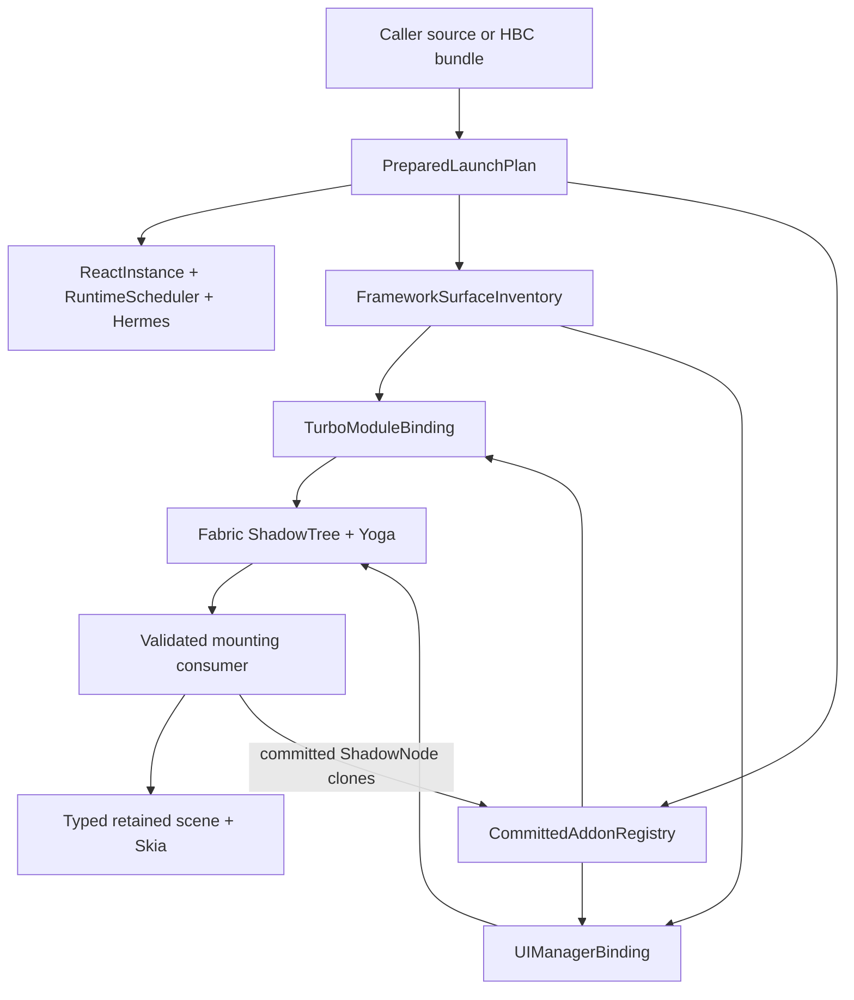
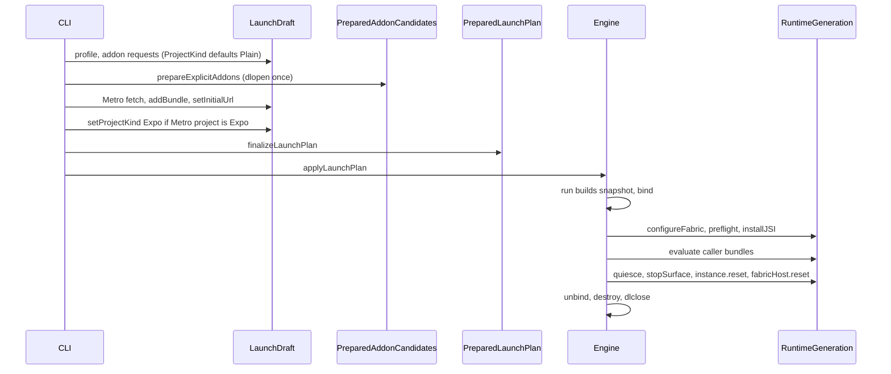
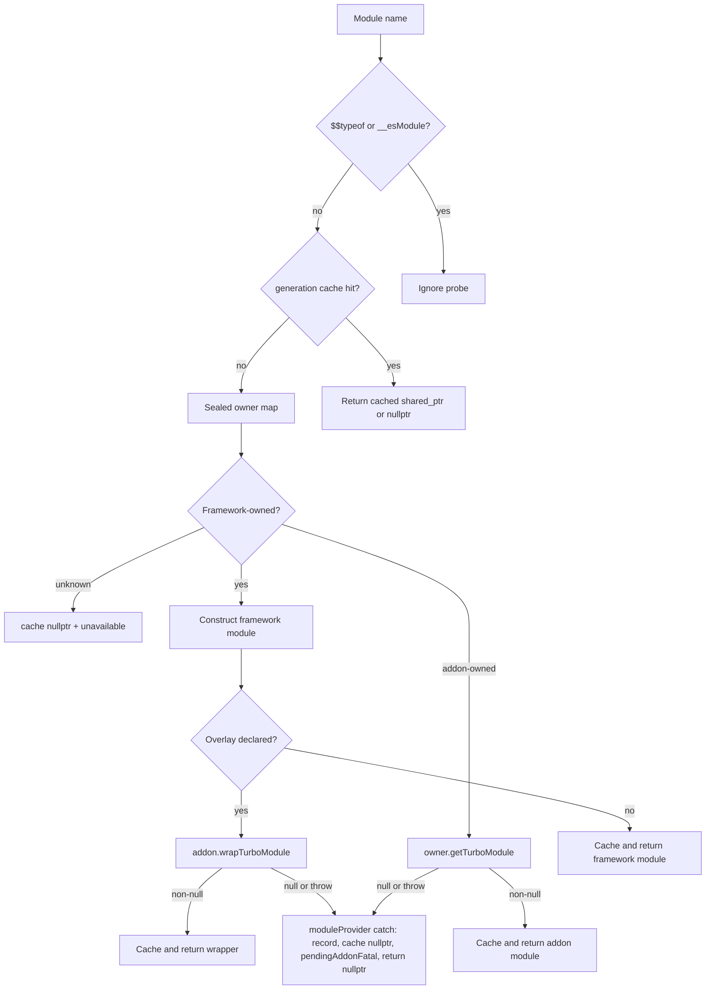
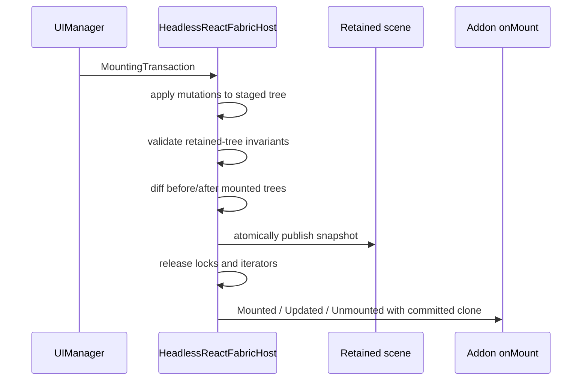

# Addon Host Architecture

| Field          | Value                                                                                                                                                          |
| -------------- | -------------------------------------------------------------------------------------------------------------------------------------------------------------- |
| Status         | As-built ABI 4 contract — implemented on this tree; deferred work listed; merge-to-`main` still gated by the Definition of Done                                 |
| Date           | 2026-09-04                                                                                                                                                     |
| Author         | React Native Simulator                                                                                                                                         |
| Reviewed tree  | `e23f2137b79b79b5d3ccf94775bfaeda20a0fddf`; every claim about current code and the pinned React Native source below was checked against this checkout           |
| Product        | React Native Simulator (`rnsim` / `ReactNativeSimulator::Engine`)                                                                                              |
| Native runtime | React Native 0.87.0, Hermes v1 260318099.0.1                                                                                                                   |
| Replaces       | Addon ABI 3 (`react_native_simulator_addon_v2`); the `android-rn73` profile; metrics schema 2; `rnsim.json` schema 1; `Engine::addAddon`; `Engine::loadBundle`  |
| Related        | [SIMULATOR_DESIGN.md](SIMULATOR_DESIGN.md), [VERSIONING.md](VERSIONING.md), [ADDONS.md](../guides/ADDONS.md)                                                   |

## Overview

How to read this document:

- [Product decisions](#product-decisions) and [Key Decisions](#key-decisions)
  are normative. They are not open for reinterpretation during follow-up work.
- The ABI, planner, inventory, Fabric, catalog, and observability sections are
  the as-built contract. They describe the engine on the reviewed tree, not a
  future proposal.
- [Delivery](#delivery) and [PR Plan](#pr-plan) are the landed implementation
  order on this branch. They are not a second rollout. The remaining merge
  gate to `main` is the [Definition of done](#definition-of-done).
- [Deferred](#deferred-not-in-this-delivery) is future work. It is not a
  license to reopen the closed decisions.

ABI 3 could vend TurboModules, evaluate a JSI bootstrap, and declare component
names, but every declared component was registered as
`UnimplementedViewComponentDescriptor`. It could not register a real Fabric
descriptor, observe a committed `ShadowNode`, emit a typed event, or wrap a
framework TurboModule. That gap forced `RNCSafeArea*` into the framework
profile and encouraged `android-rn73` to become a second framework provider.

ABI 4 replaces that surface: a single-open transactional planner, one
executable `FrameworkSurfaceInventory`, a frozen session snapshot, owner-directed
TurboModule lookup, real Fabric descriptors with a host ledger and mandatory
preflight, and generated catalog discovery. RN 0.73.10 JavaScript runs on the
pinned RN 0.87 native engine through `compat-rn73`. `safe-area` auto-loads for
every project. There is no legacy schema, no root-owned allowlist, and no
multi-PR cutover: one change set, one Definition of Done. That cutover has
landed on this tree.

## Product decisions

These decisions were made by the project lead after review and are normative.
They are not open for reinterpretation during follow-up work.

1. **RN 0.73.10 JavaScript is a supported business target.** It runs on the
   RN 0.87 native engine through the `compat-rn73` addon. The `android-rn73`
   profile is deleted in the same delivery. The acceptance gate is the real
   business bundle, not a synthetic fixture.
2. **`safe-area` is default-on for every project.** New RN 0.87 projects depend
   on `react-native-safe-area-context`; the host for it auto-loads regardless
   of Expo detection and can be disabled explicitly.
3. **Anyone can extend the engine.** Any addon directory — in-tree
   `runtime/addons/<name>/` or an out-of-tree directory passed through
   `RNS_ADDON_DIRS` — may declare itself built-in and/or MODULE. There is no
   root-owned allowlist. The catalog is generated from discovered declarations.
4. **ABI 4 is flexible.** Addons register real Fabric descriptors, observe
   committed `ShadowNode`s, emit events and update state through React
   Native's own APIs, run asynchronous work through a generation-bound runtime
   executor, wrap framework TurboModules, and declare bundle-compatibility
   claims in their manifest.
5. **No external consumers, no legacy.** Metrics move to schema 3 (structured
   only), `rnsim.json` moves to schema 2 (tagged entries only), the typed
   launch API replaces `Engine::addAddon`, and ABI 3 is removed without a
   migration path.
6. **Simple over policed.** No evidence tiers, no legacy metric projections,
   no transitional adapters. Honesty comes from owner attribution in every
   contract and from asserted route counters, not from certification
   bureaucracy.
7. **Single delivery.** One change set, one merge gate (the Definition of
   Done). The build order in this document is the landed dependency map, not
   a PR sequence.
8. **Zero insets and a session-constant viewport in v1.** The host snapshot is
   revisioned and the ABI carries the change hook so that real device insets
   and rotation can arrive later without redoing SafeArea.

## Key Decisions

Architectural choices that follow from the product decisions and from the
pinned engine. Implementers treat these as closed.

| Decision | Choice | Rationale |
| -------- | ------ | --------- |
| 1. RN 0.73.10 JS on RN 0.87 native | `compat-rn73` overlay on `android-rn87`; delete `android-rn73` in the same delivery | One native engine. The business bundle is the gate. |
| 2. `safe-area` default-on | CMake `AUTO always`; `LaunchDraft` defaults `autoAddons == true`, `ProjectKind::Plain`; disable with `--no-addon safe-area` | Embedders and CLI both get `safe-area` unless they opt out. RN 0.87 apps depend on `react-native-safe-area-context` regardless of Expo. |
| 3. Open catalog | Generated from `runtime/addons/*/CMakeLists.txt` and `RNS_ADDON_DIRS`; no root allowlist | Anyone can extend the engine; duplicate keys fail configure. |
| 4. Flexible ABI 4 | Real descriptors, committed `ShadowNode`s, RN emitters/state, generation-bound executor, TurboModule wrap, manifest compatibility claims | ABI 3 cannot host SafeArea events or a real 0.73 JS adapter. |
| 5. No legacy | Metrics schema 3, `rnsim.json` schema 2 tagged entries, typed launch API; ABI 3, `Engine::addAddon`, and `Engine::loadBundle` deleted | No external consumers; dual serializers and post-construction mutation are the bugs. |
| 6. Simple over policed | Owner strings and route counters; no evidence tiers or schema-2 projections | Certification bureaucracy does not make a MODULE safer. |
| 7. Single delivery | One independently mergeable PR; internal steps are a dependency order | Transitional adapters and dual-profile windows are out of scope. |
| 8. v1 insets and viewport | Snapshot insets `0,0,0,0`; viewport session-constant; `revision` + `hostSnapshotChanged` unused | SafeArea can grow real insets later without an ABI redo. |
| 9. Single-open MODULE lifecycle | `dlopen` once; RAII handle held through `destroy` then `dlclose`; never peek/close/reopen | Static constructors must not run twice; path TOCTOU is rejected. |
| 10. Owner-directed TurboModule lookup | Sealed O(1) owner map; generation-scoped name cache; only the owner is asked; overlays call `wrapTurboModule` once | First-wins walks and `TurboModule::name_` inspection are incorrect. RN attaches `jsRepresentation` to the cached `shared_ptr`. |
| 11. Host ledger + mandatory preflight | Host-owned component ledger; preflight every real descriptor before publishing the RN registry | RN silently ignores duplicate handles and strips name/handle asserts in release. |
| 12. Teardown order | `quiesce` → `stopSurface` → Fabric `shutdown` → `instance.reset()` → `fabricHost.reset()` → `unbind` → `destroy` → `dlclose` | `ComponentDescriptorRegistry` holds a reference to the provider registry; destroying the Fabric host first dangles. |
| 13. Generated catalog | `BuiltinAddonCatalog.cpp` from `rns_declare_addon`; strong factory refs | Archive linking must not dead-strip built-ins; Nightly catalog is exactly `expo`, `safe-area`, `compat-rn73`. |
| 14. Schema 3 structured only | Arrays of `{name, class, owner, …}`; no flat fidelity maps | `classifyRuntimeCapability` substring inference is deleted. |
| 15. Fingerprint is compatibility, not security | Exact string of public-header hash, pins, compiler, stdlib, language mode, sanitizer, ABI flags | The simulator is not a sandbox (`SECURITY.md`). Fingerprint mismatch is "rebuild", not "untrusted". |
| 16. ABI 4 vtable is complete and pure virtual | Every slot is `= 0`; no-ops are written by the addon | A future default in the base class would be an ABI change. |
| 17. `InProcess` skips MODULE validation | Tests inject `unique_ptr`; no `dlopen`, descriptor, or fingerprint | Invariant 10: MODULE behavior is proven by real `.dylib`/`.so` loads. |
| 18. `wrapTurboModule` identity no-op | Host calls it only for declared overlays; otherwise implement `return framework;` | The slot is part of ABI 4 even when `moduleOverlays` is empty. |
| 19. JSI after protected globals | Addon `installJSI` runs after host globals; identities are verified | Running Expo `installJSI` before `nativeModuleProxy` exists makes identity checks impossible. |
| 20. Expo via `nativeModuleProxy` | `globalThis.expo.modules[name]` aliases `nativeModuleProxy[name]` (the `jsRepresentation`); no second `getTurboModule` | Dual HostObjects break `===`. `nativeModuleProxy` does not return the C++ HostObject. |
| 21. `moduleProvider` is a catch boundary | Lookup-time null/throw becomes `nullptr` + `pendingAddonFatal`; never throws through `TurboModuleBinding` | RN's `TurboModuleBinding::getModule` is an RN frame. JSI must not see a C++ exception. |
| 22. `SimulatorMode` lives in `SimulatorAddon.h` | `Engine.h` includes `SimulatorAddon.h`; the reverse include is forbidden | Snapshot is addon-facing. A header cycle would make the ABI uncompilable. |
| 23. Sanitized ABI is `address,undefined,no-vptr` | Uniform `-fno-sanitize=vptr` on engine, addons, and fingerprint; string is `address,undefined,no-vptr` or `none` | AppleClang 17 reports false `std::stringbuf` vptrs across libc++. Linux GCC reports false `ConcreteShadowNode` vptrs on RN's `YogaLayoutableShadowNode::resolveErrata` path. A vptr-instrumented MODULE cannot load into a no-vptr engine. |
| 24. Snapshot insets ≠ chrome insets | `AddonHostSnapshot` insets are `0,0,0,0`; `EngineConfig.insetTop` / `insetBottom` remain shell chrome | SafeArea and Linking read the snapshot. Status/nav chrome around the RN window is not window-relative SafeArea inset. |

## Goals & Non-Goals

### Goals

- Preserve the profile/addon ownership split: profiles own the pinned RN
  platform contract; addons own application, company, community, and
  compatibility names.
- Open each MODULE exactly once and hold its handle until every
  module-owned object is destroyed.
- Fail plan-level collisions before bind, Fabric registration, addon JSI, or
  caller JavaScript.
- Drive owners, providers, `hasComponent`, metrics, chrome, and isolation
  from one executable framework inventory.
- Freeze host inputs (viewport, insets, color scheme, app state, reduce
  motion, initial URL, asset/font directories) into a revisioned snapshot
  before bind.
- Stage and preflight every Fabric provider before publishing a registry.
- Move `RNCSafeArea*` out of the profile in the same delivery that lands ABI 4.
- Retire `android-rn73` in the same delivery that lands `compat-rn73`, gated
  by the real RN 0.73.10 business bundle.
- Keep source builds first-class on macOS and Linux while Nightly remains one
  self-contained `rnsim` file that loads no external MODULE.

### Non-Goals

- A second compiled React Native ABI, second Hermes VM, or version-selected
  native engine.
- Claiming that RN 0.87 native behavior is RN 0.73 native behavior, or
  translating incompatible Hermes bytecode.
- Evidence tiers, schema-2 flat-map projections, schema-1 addon strings, ABI 3
  loading, `Engine::addAddon`, or `Engine::loadBundle`.
- A root-owned allowlist, token/epoch event sink, or overlay-only Fabric
  model.
- Eight independently mergeable PRs or transitional dual-profile windows.
- Replacing Fabric with Paper, or changing Bridgeless/TurboModule mode.
- Conjuring Reanimated worklets, Screens, Gesture Handler, Expo Go, Expo
  Router, or `expo-image` through `compat-rn73` or the Expo boot adapter.
- Out-of-process sandboxing. Addons remain trusted, same-process native code.
- A stable public C++ ABI across compilers, standard libraries, commits,
  sanitizer modes, or Nightly builds. Nightly ships no headers.
- Addon-defined Skia painters (deferred).
- Dynamic viewport, inset, color-scheme, app-state, or reduce-motion updates
  during a v1 session (the hook exists; nothing emits it).
- Mixing two caller-JavaScript React Native families in one VM.
- Serving or replacing a framework module or component name from an addon
  (wrapping a framework module is allowed).

## Invariants

1. `rnsim` remains the production executable and `ReactNativeSimulator::Engine`
   remains the embedding API.
2. One `ReactInstance`, one RuntimeScheduler, one Hermes VM per runtime
   generation. The process never loads a second React Native C++
   implementation or a second Hermes to match a caller bundle.
3. Caller JavaScript is external. The repository owns no Metro, Babel,
   TypeScript, or application-bundling pipeline.
4. Core configure, build, test, and runtime paths stay Node.js/npm-free.
   Optional diagnostics may use Node built-ins.
5. Profiles own only the current pinned React Native platform contract.
   Application, company, community, and compatibility names never enter the
   generic framework provider. Addons may _wrap_ a framework module; they
   never _serve_ a framework module or component name.
6. Unknown TurboModules are unavailable. Unknown components are observable
   fallbacks and never become available merely because a bundle asked.
7. Every capability contract names its owner. Framework surfaces are owned by
   `host` or a profile; everything else is owned by a named addon.
8. Reload reuses one sealed launch plan and opens a new runtime generation. It
   never re-plans, adds, disables, or reorders addons.
9. Nightly is one self-contained macOS arm64 file named `rnsim`. Linux is a
   source-build host for the same engine. Nightly ships no headers and loads
   no externally built MODULE; extension is a source build.
10. `.dylib` and `.so` MODULE behavior is proven by real dynamic loads on both
    platforms, never inferred from in-process tests.

## Current state (verified against the reviewed tree)

ABI 4 has landed. The ABI 3 loader, `Engine::addAddon`, `Engine::loadBundle`,
`Engine(EngineConfig)`, `classifyRuntimeCapability`, schema-1 `rnsim.json`,
schema-2 runtime metrics, the `android-rn73` profile, profile-owned
`RNCSafeArea*`, and the `disable-library-validation` Nightly entitlement are
gone from this tree. The contract sections below are the as-built surface.

### As-built ABI 4

Runtime and loader:

- `runtime/include/react-native-simulator/SimulatorAddon.h` declares
  `kSimulatorAddonAbiVersion = 4` and
  `kSimulatorAddonEntryPoint = "react_native_simulator_addon_v4"` (`:55–57`).
  The vtable is complete and pure virtual (`:203–230`). `AddonViewManagerConfig`
  (`:89–93`) is `{name, numericConstants, commands}`.
- `Engine` is `Engine()` only (`Engine.h:328`). Public state is
  `EngineState { Draft, Planned, Running, Finished }` (`:20`). Launch inputs
  live on `LaunchDraft` (`:240–278`). `LaunchDraft::Impl` defaults
  `ProjectKind::Plain` and `autoAddons == true` (`LaunchPlan.h:66–67`).
  `prepareExplicitAddons` / `finalizeLaunchPlan` / `applyLaunchPlan` are the
  only path into a planned engine. There is no `Engine::addAddon` and no
  `Engine::loadBundle`; the remaining runtime load is `RN$Simulator.loadBundle`
  (`SimulatorEngine.cpp:2487–2500`).
- MODULE load is single-open: `dlopen(RTLD_NOW | RTLD_LOCAL)`, v4 symbol,
  descriptor / fingerprint / RN / Hermes, then `create()`
  (`LaunchPlan.cpp:210–291`). InProcess injection skips those checks.
- TurboModule lookup is owner-directed. `moduleProvider` hits the
  generation-scoped `turboModuleCache` (`SimulatorEngine.cpp:2696–2702`), then
  the sealed owner map (`:2704`). Overlay names call `wrapTurboModule` once.
  Lookup-time null or throw becomes `nullptr` + `pendingAddonFatal`
  (`:2793–2804`).
- Addon `installJSI` runs after protected-global snapshot and is verified
  unchanged (`SimulatorEngine.cpp:3082–3116`). Expo aliases
  `nativeModuleProxy[name]` onto `globalThis.expo.modules[name]`
  (`ExpoAddon.cpp:518–535`); it does not call `getTurboModule` again.
- Host snapshot insets are `0,0,0,0` (`SimulatorEngine.cpp:2040–2043`).
  `EngineConfig.insetTop` defaults to `24` (`Engine.h:49`) and remains shell
  chrome (`SimulatorEngine.cpp:2091–2096`, `:2244–2245`). `hostSnapshotChanged`
  is never invoked. `LinkingManager`, `IntentAndroid`, and Expo Linking read
  the plan-frozen `initialUrl`. The CLI still copies `RNSIM_INITIAL_URL` once
  at option-parse time (`main.cpp:1422–1424`).
- Generation teardown is `quiesceGeneration` → `stopHeadlessReactFabricSurface`
  → `shutdownHeadlessReactFabric` → `instance.reset()` →
  `reactFabricHost.reset()` → `unbind` → `destroyCommittedAddons` (`dlclose`)
  (`SimulatorEngine.cpp:4383–4415`).
- Live and final metrics both emit `schemaVersion: 3` and `addonAbi: 4`
  (`SimulatorEngine.cpp:1418–1419`, `:4138–4139`). Origins are preserved on
  `addons[].origins` (`:1314–1323`).
- `HeadlessRNModules.cpp` no longer serves `RNCSafeAreaContext`. Official
  `SafeAreaView` stays in `HeadlessOfficialComponents.h:56`. `RNCSafeArea*`
  live in `runtime/addons/safe-area/`. `emitSafeAreaInsetsIfNeeded` is gone.
- `--profile android-rn73` is a tombstone (`main.cpp:1200–1203`).
- `frontend/InteractiveFrontend.cpp:1960–1978` retries only
  `RetryableNetworkError`. `TerminalLaunchPlanError` and other exceptions
  finish the window session.

Build, config, tools:

- Root `CMakeLists.txt` calls `include(CTest)` at `:292` before
  `add_subdirectory(runtime)` (`:293`). Addon discovery is
  `rns_declare_addon` / `RNS_ADDON_DIRS` (`cmake/RnsAddon.cmake`). There is no
  root-owned allowlist and no `EXISTS .../addons/shopee` guard.
- Catalog declarations: `expo` `AUTO expo` (`runtime/addons/expo/CMakeLists.txt`),
  `safe-area` `AUTO always` (`runtime/addons/safe-area/CMakeLists.txt`),
  `compat-rn73` `AUTO never` (`runtime/addons/compat-rn73/CMakeLists.txt`),
  `rntester` `MODULE` only (`runtime/addons/rntester/CMakeLists.txt`). Built-in
  MODULE copies are `TEST_ONLY`.
- Implementation objects use hidden visibility; the MODULE entry is
  `RNS_EXPORT` (`cmake/RnsAddon.cmake:81–88`, `:133–134`).
- Fingerprint generation hashes every
  `runtime/include/react-native-simulator/*.h` plus pins, compiler, stdlib,
  sanitizer, and visibility (`cmake/GenerateAddonApiFingerprint.cmake:5–41`).
  Sanitized trees fingerprint as `address,undefined,no-vptr` (`:33–36`).
  Engine and addon targets compile with `-fno-sanitize=vptr`
  (`CMakeLists.txt:30–41`, `cmake/RnsAddon.cmake:99–103`). On sanitized
  Linux GCC, `YogaLayoutableShadowNode.cpp` is left uninstrumented so the
  link can see `ConcreteShadowNode` typeinfo; the fingerprint string does not
  change (`runtime/CMakeLists.txt:359–367`).
- `SimulatorConfig.cpp` accepts schema 2 tagged `{name}` / `{path}` entries
  only (`:67–88`). Schema 1 fails with the specified upgrade message (`:83–85`).
- `verify-runtime.mjs` asserts `schemaVersion === 3`. `verify-addons.mjs`
  accepts `.dylib` and `.so`. `cmake/ValidateCliMetadata.cmake:39` asserts
  `addonAbi == 4`. `tools/benchmark/lib/benchmark-utils.mjs` parses runtime
  metrics as schema 3; the benchmark comparison document stays schema 2.
- `RNS_RN073_BUSINESS_BUNDLE`, `RNS_RN073_BUSINESS_PROVENANCE`, and
  `RNS_REQUIRE_RN073_BUSINESS_BUNDLE` exist (`CMakeLists.txt:49–54`). Ordinary
  `core` jobs keep `REQUIRE=OFF`. macOS and Linux workflows have a required
  lane that sets `REQUIRE=ON` when the private artifact is present.
- `tools/release/rnsim.entitlements` is an empty dict. Nightly no longer
  ships `com.apple.security.cs.disable-library-validation`.
  `tools/release/macos-codesign.sh:135–139` still greps for that entitlement
  when it thinks a binary needs entitlements; that check is a remaining
  packaging contradiction, not a restored ABI 3 loader.

### Historical ABI 3 (pre-cutover)

The pre-cutover tree (`ec35995`) is the baseline this contract replaced:

- ABI constant 3 with entry symbol `react_native_simulator_addon_v2`;
  first-wins TurboModule walk; `Engine::addAddon` after construction.
- Addon `installJSI` before protected host globals; every addon component
  registered as `UnimplementedViewComponentDescriptor`.
- Profile-owned `RNCSafeAreaContext` and hardcoded `topInsetsChange`.
- `android-rn73` as a second framework provider that only swapped
  `PlatformConstants`.
- Schema-1 `rnsim.json` (bare addon path strings), schema-2 flat fidelity
  maps, `classifyRuntimeCapability` substring inference.
- `include(CTest)` after `runtime`; company `EXISTS .../shopee` guard;
  Nightly `disable-library-validation` entitlement.

### Pinned React Native constraints

These RN 0.87 facts still constrain ABI 4 (submodule
`4bc2473f5d0233ea5384c1ef24f6a55615de2220`):

- `ComponentDescriptorProviderRegistry::add` silently returns on a duplicate
  handle (`ComponentDescriptorProviderRegistry.cpp:25–29`).
- `ComponentDescriptorRegistry::add` asserts name/handle equality only under
  `react_native_assert` (`ComponentDescriptorRegistry.cpp:41–46`), which
  `#define`s to `((void)0)` when `REACT_NATIVE_DEBUG` is unset
  (`react_native_assert.h:27–29`). Release builds strip it.
- `ComponentDescriptorRegistry` stores
  `const ComponentDescriptorProviderRegistry& providerRegistry_`
  (`ComponentDescriptorRegistry.h:77`; constructor parameter `:39`; `.cpp`
  initializers `:29–31`). The provider registry must outlive every descriptor
  registry.
- `componentNameByReactViewName` strips one `RCT` prefix with a three-iterator
  `std::mismatch` (`componentNameByReactViewName.cpp:18–23`) that reads past
  the end of one- or two-character names.
- `EventEmitter::normalizeEventType` writes `prefixedType[0]`
  (`EventEmitter.cpp:35`); an empty event type is undefined behavior.
- `RootShadowNode`'s component name is `RootView`
  (`RootShadowNode.cpp:16`, `RootComponentName`); `Root` is only the
  simulator's retained-scene label (`HeadlessReactFabric.cpp:1377`).
- `TurboModule::name_` is protected (`TurboModule.h:79`).
- `ComponentDescriptorParameters` carries `eventDispatcher`, `contextContainer`,
  and `flavor` (`ComponentDescriptor.h:153–158`); every real descriptor
  receives them.
- RN 0.87 `Libraries/Core/ReactNativeVersionCheck.js` (and RN 0.73.x the same
  way) compares major/minor only and reports a mismatch with `console.error`,
  not a throw (`:24–39`). `compat-rn73` therefore exposes JS-visible
  `0.73.10` and satisfies any 0.73.x bundle's check.

### Superseded approaches

| Approach                                                                   | Why it is rejected                                                       |
| -------------------------------------------------------------------------- | ------------------------------------------------------------------------ |
| Peek a MODULE name with `dlopen`/`dlsym`/`dlclose`, then load again        | Static constructors run twice; TOCTOU on the path                        |
| Subtract explicit names from the auto set, then append explicit specs      | Reorders `expo` behind `safe-area`                                       |
| Reuse RN's provider registry as the collision oracle                       | It silently ignores duplicate handles                                    |
| Append addon command handlers after the current framework function         | Early returns swallow them                                               |
| Destroy the Fabric host before the `ReactInstance`                         | Dangling `providerRegistry_` reference                                   |
| Run addon `installJSI` before host globals                                 | Protected-global identity checks become impossible                       |
| Evidence tiers, legacy projections, root allowlists, transitional adapters | Removed by decisions 3, 5, 6, 7                                          |
| Token/epoch-scoped event sink with ten rejection codes                     | Removed by decision 4; RN's own emitter and state APIs are used directly |
| Keep `android-rn73` as a thin profile                                      | Removed by decision 1: one mechanism                                     |
| Schema-2 flat maps with dual serializers                                   | Removed by decision 5                                                    |
| Eight staged PRs with independently mergeable intermediate states          | Removed by decision 7                                                    |

## Architecture

```text
caller source/HBC bundle
        |
PreparedLaunchPlan (profile, ordered addons, initial bundles, frozen host inputs)
        |
ReactInstance + RuntimeScheduler + Hermes (always this native pin)
        |
+-----------------------------+-------------------------------+
| FrameworkSurfaceInventory   | CommittedAddonRegistry        |
| host / profile executable   | expo / safe-area / compat-*   |
| factories and providers     | business addons / rntester    |
+-----------------------------+-------------------------------+
        |                                      |
        +---------------+----------------------+
                        |
       TurboModuleBinding (owner map + overlay wrappers)
       UIManagerBinding  (staged provider ledger)
                        |
                 Fabric ShadowTree + Yoga
                        |
      validated mounting transaction consumer -> addon mount callbacks
                        |
              typed retained scene + Skia
```



The plan, the inventory, the module-owner map, the component ledger, the
metrics contracts, and the runtime generation describe one selected surface.
Parallel lists with different ownership or availability semantics are
forbidden.

Public headers:

| Header | Contents |
| ------ | -------- |
| `runtime/include/react-native-simulator/SimulatorAddon.h` | `SimulatorMode`, ABI 4 vtable, manifest, snapshot, registrar, executor, descriptor, `RNS_EXPORT` |
| `runtime/include/react-native-simulator/Engine.h` | `Engine`, `EngineState`, `EngineConfig`, `LaunchDraft`, specs, plan types, launch errors |
| `runtime/include/react-native-simulator/Scene.h` | typed retained scene; predates ABI 4; hashed into the fingerprint |
| `runtime/include/react-native-simulator/SceneTransform.h` | scene transform helpers; predates ABI 4; hashed into the fingerprint |
| `runtime/include/react-native-simulator/Interaction.h` | action queue types; predates ABI 4; hashed into the fingerprint |
| generated `AddonApiFingerprint.h` | `kSimulatorAddonApiFingerprint` string; not shipped in Nightly |

`Engine.h` includes `SimulatorAddon.h`. `SimulatorAddon.h` must not include
`Engine.h`. `SimulatorMode` lives in `SimulatorAddon.h` so `AddonHostSnapshot`
can mention it without a cycle. The fingerprint hashes every
`runtime/include/react-native-simulator/*.h`. ABI 4 did not add a new public
header. Adding or changing any file in that directory still changes the
fingerprint.

Nightly ships none of these headers.

## Launch transaction

### Engine state machine

```cpp
enum class EngineState { Draft, Planned, Running, Finished };
```

Generation lifecycle (`Opening`, `Open`, `Quiescing`, `Closed`) is enforced
inside `SimulatorEngine` and is not a public enum (see
[As-built notes](#as-built-notes)). Existing `RuntimePhase` values (`Idle`,
`Initializing`, `LoadingBundle`, …) remain subordinate status and add no
ownership states.

| Current state                    | Operation                                                            | Result                                                                                                    |
| -------------------------------- | -------------------------------------------------------------------- | --------------------------------------------------------------------------------------------------------- |
| `Draft`                          | `applyLaunchPlan` with a live plan from `finalizeLaunchPlan`         | consumes the plan, becomes `Planned`; always succeeds; runs no addon code                                 |
| `Draft`                          | `applyLaunchPlan` with a moved-from / default plan                   | `std::logic_error`; remains `Draft`; plan argument untouched                                              |
| `Planned`                        | `run` opens generation 1                                             | `Running`                                                                                                 |
| `Planned`                        | `run` fails during bind or generation 1                              | full rollback and teardown, then `Finished`                                                               |
| `Running`                        | reload succeeds                                                      | remains `Running`; generation increments                                                                  |
| `Running`                        | reload fails to open generation N+1                                  | generation N is already quiesced; full teardown, then `Finished`; the error is reported as the run result |
| `Running`                        | stop or fatal failure                                                | full rollback and teardown, then `Finished`                                                               |
| `Planned`, `Running`, `Finished` | apply another plan                                                   | rejected without consuming the plan                                                                       |
| `Finished`                       | `run` again                                                          | rejected                                                                                                  |
| `Running`                        | `~Engine`                                                            | generation teardown, then unbind/destroy/`dlclose`, then `Finished`                                       |
| `Planned`                        | `~Engine`                                                            | destroy addons and `dlclose` only (no `quiesce` / `stopSurface` / `unbind`; bind never ran)               |
| `Draft` or `Finished`            | `~Engine`                                                            | destruction only (no addon/`dlclose` work remains in `Finished`)                                          |

### Launch types

```cpp
enum class AddonSource { BuiltIn, Module, InProcess };
enum class AddonRequestOrigin { Auto, Config, Cli, Embedder, Test };
enum class ProjectKind { Plain, Expo };
enum class AddonAutoPolicy { Always, Expo, Never };

struct BuiltInAddonSpec { std::string catalogKey; };
struct ModuleAddonSpec { std::filesystem::path path; };
struct InProcessAddonSpec {
  std::unique_ptr<class SimulatorAddon> addon;
  std::string diagnosticLabel;
};
using AddonSpec =
    std::variant<BuiltInAddonSpec, ModuleAddonSpec, InProcessAddonSpec>;

struct AddonRequest {
  AddonSpec spec;
  std::vector<AddonRequestOrigin> requestedBy;
};

struct AddonOrigin {
  AddonSource source;
  std::string locator;                    // catalog key, canonical path, or label
  std::vector<AddonRequestOrigin> requestedBy;
};

struct InitialBundleSpec {
  std::string sourceUrl;                       // reported to RN as the script URL
  std::optional<std::filesystem::path> path;   // HBC or JS on disk
  std::optional<std::string> body;             // fetched Metro output
};                                             // exactly one of path/body

struct ResolvedBundleCompatibility {
  std::string nativeReactNativeVersion;        // always the pin, "0.87.0"
  std::string targetFamily;                    // "0.87.x" or "0.73.x"
  std::string jsVisibleReactNativeVersion;     // "0.87.0" or "0.73.10"
  std::string level;                           // see resolution matrix
  std::optional<std::string> compatAddon;      // "compat-rn73" or nullopt
  bool hbcTranslation{false};                  // always false in this delivery
};

class TerminalLaunchPlanError : public std::runtime_error {
 public:
  explicit TerminalLaunchPlanError(std::string message);
};

class RetryableNetworkError : public std::runtime_error {
 public:
  explicit RetryableNetworkError(std::string message);
};

class AddonContractViolation : public std::runtime_error {
 public:
  AddonContractViolation(std::string addon,
                         std::string operation,
                         std::string surface,
                         std::uint64_t generation,
                         std::string message);
  const std::string& addon() const noexcept;
  const std::string& operation() const noexcept;
  const std::string& surface() const noexcept;
  std::uint64_t generation() const noexcept;
};

class LaunchDraft {
 public:
  explicit LaunchDraft(EngineConfig config);
  // Defaults after construction: ProjectKind::Plain, autoAddons == true.
  // Every finalized plan therefore loads `safe-area` unless the caller
  // disables it. Embedders do not opt in.
  void setProjectKind(ProjectKind kind);      // legal until finalizeLaunchPlan
  void addBuiltInAddon(std::string_view catalogKey,
                       AddonRequestOrigin origin = AddonRequestOrigin::Embedder);
  void addAddonPath(const std::filesystem::path& path,
                    AddonRequestOrigin origin = AddonRequestOrigin::Embedder);
  void addAddon(std::unique_ptr<SimulatorAddon> addon, std::string diagnosticLabel,
                AddonRequestOrigin origin = AddonRequestOrigin::Embedder);
  void disableAddon(std::string_view catalogKey);       // legal until finalize
  void setAutoAddons(bool enabled);                     // legal until finalize
  void addBundle(InitialBundleSpec bundle);
  void setInitialUrl(std::optional<std::string> url);   // CLI/env read once by the caller
};

// Move-only. Holds every explicit MODULE handle, constructed addon, and frozen
// manifest. Destroying it destroys addons and releases handles in reverse order.
class PreparedAddonCandidates;

// Move-only and immutable. Owns candidates, the selected profile inventory,
// the sealed module-owner and component ledgers, the resolved bundle
// compatibility, the frozen host inputs, and all initial bundles.
class PreparedLaunchPlan;

// Non-const: moves InProcess unique_ptrs and MODULE-constructed addons into
// candidates. After return, explicit addon-request mutation (addBuiltInAddon,
// addAddonPath, addAddon) is observable at finalize and fails closed.
// setProjectKind, setAutoAddons, disableAddon, addBundle, and setInitialUrl
// remain legal until finalizeLaunchPlan.
PreparedAddonCandidates prepareExplicitAddons(LaunchDraft& draft);
PreparedLaunchPlan finalizeLaunchPlan(LaunchDraft&& draft,
                                      PreparedAddonCandidates&& candidates);

class Engine final {
 public:
  Engine();
  ~Engine();                                 // see destructor contract below
  EngineState state() const noexcept;
  void applyLaunchPlan(PreparedLaunchPlan&& plan);   // Draft only; runs no addon code
  EngineResult run();                                 // Planned only; returns at Finished
};
```

`AddonSource` states how code entered the process. `AddonRequestOrigin` states
why it was selected. `AddonRole` in the manifest is descriptive metadata.

`LaunchDraft` is the only mutable launch-input owner; `Engine` keeps no second
draft. Deleted with no migration path: `Engine::addAddon(std::string)`,
`Engine::addAddon(unique_ptr)`, both `Engine::loadBundle` overloads, and
`Engine(EngineConfig)`. `EngineConfig` moves to `LaunchDraft`. Initial bundles
enter only through `LaunchDraft::addBundle`. The only runtime load that remains
is `RN$Simulator.loadBundle` during an open generation: it queues work on the
existing `ReactInstance` and does not mutate the plan or the snapshot.

`LaunchDraft` defaults: `ProjectKind::Plain`, `autoAddons == true`. A
plain embedder that never mentions addons still gets `safe-area` (decision 2).
`tests/headless-api-modules-smoke.cpp` keeps seeing `RNCSafeAreaContext`
without naming an addon.

After `prepareExplicitAddons`, the explicit-request fingerprint (catalog keys,
canonical MODULE paths, InProcess labels) is frozen. `addBuiltInAddon` /
`addAddonPath` / `addAddon` after prepare fail at `finalizeLaunchPlan`.
`setProjectKind`, `setAutoAddons`, and `disableAddon` stay legal until
finalize, subject to the existing explicit/disabled contradiction (disabling a
prepared explicit name is terminal). The CLI must call
`setProjectKind(ProjectKind::Expo)` when Metro discovery finds an Expo
project, even if cwd was `Plain` (`main.cpp` today loads Expo from the Metro
project at `:1403–1405`).

Remaining `Engine` methods and when they are legal:

| Method | Legal states |
| ------ | ------------ |
| `setSceneUpdateCallback` / `setActionResultCallback` | `Draft`, `Planned`, `Running`; rejected in `Finished` |
| `EngineConfig.onSceneUpdate` / `onActionResult` | sealed into the plan at `finalizeLaunchPlan`; not mutated later |
| `enqueueAction`, `requestReload` | `Running` |
| `runApplication` | `Running` and `ChoosingApplication` (as today) |
| `requestStop` | `Planned`, `Running` |
| `runtimeStatus`, `applicationLaunchState` | while `run()` is active, as today |
| `runApplication` on a default `Engine()` before `run()` | rejected (`tests/runtime-api-smoke.cpp:460–465`) |

`~Engine` performs the full generation teardown order if state is `Running`,
then unbinds, destroys addons, and `dlclose`s. If state is `Planned`, bind has
not run: skip generation teardown and `unbind`, but still destroy addons and
`dlclose` MODULE handles in reverse order, then finish. `Draft` and `Finished`
destructors have no remaining addon/`dlclose` work.

Typical embedding:

```cpp
ReactNativeSimulator::LaunchDraft draft(config);
draft.setProjectKind(ProjectKind::Expo);
draft.addBuiltInAddon("compat-rn73", AddonRequestOrigin::Config);
draft.addAddonPath("build/runtime/rns-addon-rntester.dylib");
auto candidates = prepareExplicitAddons(draft);
draft.addBundle(bundle);                        // e.g. after Metro fetch
auto plan = finalizeLaunchPlan(std::move(draft), std::move(candidates));

ReactNativeSimulator::Engine engine;
engine.applyLaunchPlan(std::move(plan));
engine.run();
```

Tests that today call `Engine::addAddon(unique_ptr)` use
`LaunchDraft::addAddon(..., AddonRequestOrigin::Test)`. Test helpers that wrap
this sequence may live under `tests/` only; they are not a public Engine API
and are not transitional adapters.

### Preparation

Preparation performs every fallible operation that needs no live runtime:

- normalize CLI/config/embedder inputs and config-relative paths;
- resolve exact catalog keys;
- canonicalize MODULE paths and `dlopen` each explicit MODULE exactly once;
- validate the ABI descriptor before `create()` (MODULE only; see InProcess);
- construct each explicit addon and copy `manifest()` exactly once;
- at finalize: construct auto built-ins in catalog order, copy their
  manifests, merge with explicit selections, build the framework inventory
  for the selected profile;
- validate names, ownership, overlays, profiles, compatibility claims, events,
  commands, and view-manager references;
- resolve one `ResolvedBundleCompatibility`;
- seal module owners and expected component/provider rows.

Preparation does not create Hermes, `ReactInstance`, RuntimeScheduler, JSI,
Fabric, a ShadowTree, or a surface. Addon constructors and `manifest()` must
not perform activation work or external side effects. Activation begins at
`bind()`.

`Engine::applyLaunchPlan` invokes no addon code; it only moves the plan.
Binding happens at `run()` start after the host snapshot exists.

The host records a bind as entered before the virtual call. If `bind()` throws,
the host calls `unbind()` on the throwing addon, then on previously bound addons
in reverse order, copies the diagnostic while the MODULE is mapped, destroys
plan resources, and finishes without evaluating caller JavaScript. Addons whose
`bind()` was never entered receive no `unbind()`.

### Source-specific validation

| Check | `BuiltIn` | `Module` | `InProcess` |
| ----- | --------- | -------- | ----------- |
| `dlopen` flags / entry symbol `react_native_simulator_addon_v4` | no (same image) | `dlopen(path, RTLD_NOW \| RTLD_LOCAL)`; missing symbol → "not an ABI 4 addon"; older symbols are not probed. macOS MODULEs still link with `-undefined dynamic_lookup` | no |
| `descriptorSize`, `abiVersion == 4`, fingerprint, RN, Hermes strings | no | required exact | no |
| `create` / `destroy` | catalog factory; destructor of `unique_ptr` | descriptor callbacks. If `create()` throws: catch while the MODULE is mapped, copy a host-owned diagnostic (operation, path, addon name when known, exception text), destroy the caught exception by leaving the catch, invoke `destroy` if a pointer was returned, then `dlclose`. Do not store a MODULE `exception_ptr` in `TerminalLaunchPlanError`. Null `create()` is the non-throwing failure form | caller `unique_ptr`; no C `destroy`; a throwing constructor is the caller's problem before `addAddon` |
| `manifest()` copied once; name `[a-z][a-z0-9-]*` | name equals catalog key | name equals descriptor name | name unique in the plan; `diagnosticLabel` is the locator, not the name |
| collisions, overlays, `allowedProfiles`, at-most-one `bundleCompatibility` | yes | yes | yes |
| proves `.dylib` / `.so` behavior | no | yes, on both platforms | **no** — invariant 10 |

`InProcess` exists so unit tests can inject a `unique_ptr<SimulatorAddon>`
without `dlopen`. It is not a Nightly or CLI path. A green InProcess test is
not evidence that a MODULE would load, that hidden visibility works, or that
RTTI crosses the dynamic boundary.

### Single-open MODULE lifecycle

```text
ParsedRequest
  -> PreparedCandidate       dlopen(path, RTLD_NOW | RTLD_LOCAL) once; RAII handle retained
  -> FrozenManifest          create() once; manifest() copied once
  -> ValidatedPlan           names and policy checked
  -> PlannedEngine           ownership moved atomically
  -> BoundSession            frozen AddonHostSnapshot readable
  -> RuntimeGeneration N     per-generation JSI/Fabric state
  -> QuiescedGeneration N
  -> RuntimeGeneration N+1
  -> UnboundSession
  -> destroy addon
  -> dlclose MODULE
```



Collision failure is guaranteed before bind, Fabric registration, addon JSI,
and caller JavaScript — not before `dlopen`, static constructors, `create()`, or
`manifest()`.

## CLI, configuration, selection

### CLI

| Token form                                                                           | Interpretation                      |
| ------------------------------------------------------------------------------------ | ----------------------------------- |
| Exact catalog key (`expo`, `safe-area`, `compat-rn73`, any discovered `BUILTIN` key) | `BuiltInAddonSpec`                  |
| Contains `/`, starts with `.` or `..`, or ends in `.so`/`.dylib`                     | `ModuleAddonSpec`                   |
| Any other bare token                                                                 | terminal `unknown addon name` error |

`rntester` is MODULE-only and is **not** a catalog key. `--addon rntester`
without a path is `unknown addon name`. Callers pass
`--addon path/to/rns-addon-rntester.dylib` (or `.so`).

| Flag                     | Meaning                                     |
| ------------------------ | ------------------------------------------- |
| `--addon NAME_OR_PATH`   | append one explicit typed request           |
| `--no-addon NAME`        | remove one catalog key from auto selection  |
| `--no-auto-addons`       | disable every automatic slot                |
| `--list-addons [--json]` | print the compiled catalog with auto policy |
| `--initial-url URL`      | freeze `LaunchDraft::setInitialUrl`; overrides `RNSIM_INITIAL_URL` |

A bare unknown token never reaches `dlopen`. `--no-addon` accepts only catalog
keys; repeating a disable is idempotent set union; an unknown disabled name is
terminal; an explicit request for a disabled name is a terminal contradiction.

The CLI reads `RNSIM_INITIAL_URL` once at option-parse time. `--initial-url`
overrides it. Neither is read again from the environment. Expo detection stays
in the CLI (`main.cpp`, `detectExpoProject`). The engine never inspects cwd,
`package.json`, Metro, or bundle URLs; it receives `ProjectKind`. The CLI
sets `ProjectKind::Expo` when either the launch cwd or a later Metro-discovered
project is Expo, and it does so before `finalizeLaunchPlan` even if
`prepareExplicitAddons` already ran.

`--list-addons --json` prints the generated catalog, not discovered MODULE
files:

```json
{
    "addonAbi": 4,
    "reactNative": "0.87.0",
    "hermes": "260318099.0.1",
    "addons": [
        { "name": "expo", "auto": "expo", "builtin": true },
        { "name": "safe-area", "auto": "always", "builtin": true },
        { "name": "compat-rn73", "auto": "never", "builtin": true }
    ]
}
```

Nightly's packaged catalog is exactly those three rows. A source build that
declares additional `BUILTIN` addons lists them after the upstream trio.

### `rnsim.json` schema 2

```json
{
    "schemaVersion": 2,
    "reactNative": "0.87.0",
    "platform": "android",
    "addons": [{ "name": "compat-rn73" }, { "path": "../local-addons/rns-addon-company.so" }],
    "disabledAddons": ["expo"],
    "autoAddons": true
}
```

Allowed top-level keys: `schemaVersion`, `reactNative`, `platform`, `appKey`,
`initialProps`, `bundle`, `viewport`, `fonts`, `environment`, `addons`,
`disabledAddons`, `autoAddons`. Unknown fields and malformed entries fail
closed, as today.

- `{ "name": ... }` is an exact catalog key; `{ "path": ... }` resolves relative
  to the config file. An object must contain exactly one of `name` or `path`.
  Bare strings are rejected.
- `schemaVersion: 1` fails with a one-line upgrade message
  (`rnsim.json schemaVersion 1 is no longer accepted; use schemaVersion 2 with tagged addons entries`).
- CLI `--addon` entries append after config order; CLI disables union with
  config disables; `--no-auto-addons` overrides `autoAddons: true`.

### Deterministic merge

Each built-in declares an auto policy in its CMake declaration:
`always`, `expo`, or `never`. Catalog order:

1. Upstream in-tree keys in this exact order when present: `expo`,
   `safe-area`, `compat-rn73`.
2. Remaining `runtime/addons/<name>/` keys in lexicographic order.
3. Each `RNS_ADDON_DIRS` directory in cache-list order, keys lexicographic
   within a directory.

Duplicate keys fail configure.

Merge:

1. Resolve each explicit MODULE to a stable file identity; reject a repeated
   canonical path or inode before any second `dlopen`.
2. Prepare every explicit MODULE once and freeze every explicit name.
3. Reject duplicate explicit names, including built-in/MODULE collisions.
4. Create auto slots in catalog order: `always` policies for every project,
   `expo` policies only for `ProjectKind::Expo`, never for `never`.
5. If an explicit request has the same name as an auto slot, that explicit
   implementation occupies the slot and records both origins.
6. Append remaining explicit requests in caller order.
7. Drop disabled auto-only slots; reject every explicit/disabled intersection.
8. Reserved: stable topological sort if addon dependencies are ever declared.
   ABI 4 declares none.

Thus a plain project gets `[safe-area]`, an Expo project gets
`[expo, safe-area]`, and `--addon compat-rn73` appends after both.

### Interactive and headless launch

```text
1. prepare explicit addon candidates once          (errors terminal)
2. fetch/probe Metro inputs without touching Engine (only retryable phase)
   if Metro discovery finds Expo, draft.setProjectKind(ProjectKind::Expo)
3. add bundles to the draft, finalize, apply once, run
```

| Failure                                                                                                 | Class                     | Retry |
| ------------------------------------------------------------------------------------------------------- | ------------------------- | ----- |
| Metro unavailable, HTTP failure, cancelled wait                                                         | `RetryableNetworkError`   | yes   |
| Unknown token, ABI/fingerprint mismatch, duplicate, disabled contradiction, invalid manifest, collision | `TerminalLaunchPlanError` | no    |

A retry reuses the prepared candidates and their open handles; it never calls
`dlopen`, `create()`, `manifest()`, or `applyLaunchPlan()` again. Auto built-ins
are constructed in step 3, once, after Metro succeeds.
`InteractiveFrontend.cpp` stops treating every `std::exception` as retryable;
only `RetryableNetworkError` from step 2 re-enters the wait loop. Failures from
`finalizeLaunchPlan`, `applyLaunchPlan`, or `run` are terminal for that
window session.

## Framework surface inventory

```cpp
enum class RuntimeCapabilityClass {
  Implemented, HostAdapted, Mocked, LayoutOnly, Unavailable
};

enum class AddonComponentKind { DescriptorOnlyMock, FabricDescriptor };

struct RuntimeProfileDescriptor {
  std::string name;                      // "android-rn87"
  std::string platform;
  std::string nativeReactNativeVersion;  // always the pin
  std::string compatibilityLevel;        // native-headless or native-headless-platform-adapter
};

struct ModuleContract {
  std::string name;
  RuntimeCapabilityClass classification;
  std::string owner;                     // "host" | profile name | "addon:<name>"
  std::string note;
};

struct ComponentContract {
  std::string name;                      // canonical RN provider name
  RuntimeCapabilityClass classification;
  std::string owner;
  AddonComponentKind kind;
  std::string note;
};

using TurboModuleFactory = std::function<std::shared_ptr<facebook::react::TurboModule>(
    facebook::jsi::Runtime&, const std::shared_ptr<facebook::react::CallInvoker>&)>;

struct FrameworkModuleEntry { ModuleContract contract; TurboModuleFactory factory; };
struct FrameworkComponentEntry {
  ComponentContract contract;
  facebook::react::ComponentDescriptorProvider provider;
};

struct FrameworkSurfaceInventory {
  RuntimeProfileDescriptor profile;
  std::vector<FrameworkModuleEntry> hostModules;
  std::vector<FrameworkModuleEntry> profileModules;
  std::vector<FrameworkComponentEntry> baseComponents;
  std::vector<FrameworkComponentEntry> officialComponents;
  std::vector<FrameworkComponentEntry> platformComponents;
};

struct ModuleOwnerRow {
  std::string name;
  std::string owner;                     // "host" | profile name | "addon:<name>"
  std::optional<std::string> overlayOwner; // "addon:<name>"; wrapping does not change owner
};

struct ComponentLedgerRow {
  std::string requestedName;
  std::string normalizedName;            // after componentNameByReactViewName
  std::string canonicalName;             // RN provider name
  facebook::react::ComponentHandle handle;
  std::string owner;
  AddonComponentKind kind;
  ComponentContract contract;
  std::uint64_t generation{0};
};
```

The inventory is executable: a null factory or provider makes it invalid. It is
built during preparation from the selected profile and `EngineConfig`, and it
is the only source for reserved-name validation, the O(1) TurboModule owner
map, framework provider staging, `hasComponent`, metrics, chrome, and the
isolation checks. `getHeadlessTurboModule` string branches, capability arrays,
provider arrays, and metrics tables no longer keep independent lists; helper
functions may implement factories, but routing rows originate here.

Component contracts use React Native's canonical provider names. The root row
is `RootView` (RN `RootComponentName`); `Root` is the retained-scene label and
appears nowhere in Fabric or metrics names.

Classification for framework rows is declared explicitly per row.
`classifyRuntimeCapability` and every fidelity substring are deleted.

`PreparedLaunchPlan` seals exactly one `ResolvedBundleCompatibility`. The host
snapshot, PlatformConstants wrapper, doctor, stderr, final metrics, and live
Inspector all read that record. `RuntimeProfileDescriptor` always keeps the
native pin and is never a second compatibility source.

Wrapping does not change the served-name owner. `PlatformConstants` remains a
profile/host inventory row (`owner` = profile name). `moduleOverlays` records
that `addon:compat-rn73` wraps it. Metrics emit both the module row and the
overlay row. Addons never appear as `owner` of a framework module name.

JSON spellings used by metrics, chrome, and `--list-addons`:

| C++ | JSON |
| --- | ---- |
| `RuntimeCapabilityClass::Implemented` | `"implemented"` |
| `RuntimeCapabilityClass::HostAdapted` | `"host-adapted"` |
| `RuntimeCapabilityClass::Mocked` | `"mocked"` |
| `RuntimeCapabilityClass::LayoutOnly` | `"layout-only"` |
| `RuntimeCapabilityClass::Unavailable` | `"unavailable"` |
| `AddonComponentKind::DescriptorOnlyMock` | `"descriptor-only-mock"` |
| `AddonComponentKind::FabricDescriptor` | `"fabric-descriptor"` |
| `AddonSource::BuiltIn` | `"built-in"` |
| `AddonSource::Module` | `"module"` |
| `AddonSource::InProcess` | `"in-process"` |
| `AddonRequestOrigin::Auto` | `"auto"` |
| `AddonRequestOrigin::Config` | `"config"` |
| `AddonRequestOrigin::Cli` | `"cli"` |
| `AddonRequestOrigin::Embedder` | `"embedder"` |
| `AddonRequestOrigin::Test` | `"test"` |
| `AddonAutoPolicy::Always` | `"always"` |
| `AddonAutoPolicy::Expo` | `"expo"` |
| `AddonAutoPolicy::Never` | `"never"` |
| `AddonRole::Application` | `"application"` |
| `AddonRole::Community` | `"community"` |
| `AddonRole::VersionCompat` | `"version-compat"` |
| `SimulatorMode::Headless` | `"headless"` |
| `SimulatorMode::Interactive` | `"interactive"` |
| `SimulatorMode::Conformance` | `"conformance"` |
| `AddonMountKind::Mounted` | `"mounted"` |
| `AddonMountKind::Updated` | `"updated"` |
| `AddonMountKind::Unmounted` | `"unmounted"` |

## ABI 4 addon contract

### Manifest

```cpp
enum class AddonRole { Application, Community, VersionCompat };   // descriptive

struct AddonModuleDeclaration {
  std::string name;
  RuntimeCapabilityClass classification;
  std::string note;
};

struct AddonModuleOverlayDeclaration {
  std::string moduleName;          // framework module the addon wraps
  std::string note;
};

struct AddonComponentDeclaration {
  std::string name;                // canonical fixed point (see Fabric section)
  RuntimeCapabilityClass classification;
  AddonComponentKind kind;
  std::vector<std::string> events;         // informational; drives metrics/chrome
  std::vector<std::string> commands;       // Fabric commands, routed exactly
  std::string note;
};

struct AddonNumericConstant {
  std::string name;
  double value{0};
};

struct AddonCommand {
  std::string name;
  std::int32_t id{0};                      // legacy UIManager numeric id
};

// Legacy Paper interop constants. Distinct from AddonComponentDeclaration.commands,
// which are Fabric command names. A config may exist for a DescriptorOnlyMock.
struct AddonViewManagerConfig {
  std::string name;                        // must equal a component of this addon
  std::vector<AddonNumericConstant> numericConstants;
  std::vector<AddonCommand> commands;
};

struct AddonBundleCompatibilityClaim {
  std::string targetFamily;                // "0.73.x"
  std::string jsVisibleReactNativeVersion; // "0.73.10"
  std::string level;                       // "best-effort-source-js"
};

struct AddonManifest {
  std::string name;                        // [a-z][a-z0-9-]*
  std::string addonVersion;
  AddonRole role;
  std::vector<std::string> allowedProfiles;              // empty = all
  std::vector<AddonModuleDeclaration> modules;
  std::vector<AddonModuleOverlayDeclaration> moduleOverlays;
  std::vector<AddonComponentDeclaration> components;
  std::vector<AddonViewManagerConfig> viewManagerConfigs; // legacy interop constants
  std::optional<AddonBundleCompatibilityClaim> bundleCompatibility;
};
```

The host calls `manifest()` once and copies it; the copy is the only manifest
consulted anywhere.

Validation is fail-closed:

1. `name` is non-empty, matches `[a-z][a-z0-9-]*`, and equals the descriptor
   name for a MODULE and the catalog key for a built-in. InProcess names must
   still match the regex and be unique in the plan.
2. Module, overlay, component, event, command, and view-manager names are
   unique within their scope; legacy command IDs are unique numerically inside
   one `AddonViewManagerConfig`. Numeric-constant names are unique inside one
   config. Empty names are rejected.
3. A served module cannot also be an overlay target in the same addon.
4. `Unavailable` cannot describe a served surface.
5. `DescriptorOnlyMock` components are `LayoutOnly` or `Mocked` and must not
   register a provider; `FabricDescriptor` components must register exactly one
   provider in every generation.
6. Every view-manager config references a component of that addon.
7. Served modules and all components are disjoint from framework-owned names.
   Overlay targets must be framework-owned modules available on the selected
   profile.
8. Across the plan: addon names, served module names, component names, and
   overlay targets are unique; at most one addon carries
   `bundleCompatibility`.
9. If `allowedProfiles` is non-empty, the selected profile must be listed;
   otherwise planning fails before bind.

`AddonRole` grants no privilege. A MODULE named `compat-rn73` is an ordinary
addon: it may declare `bundleCompatibility` like any other addon, and the
engine grants nothing by name. At most one such claim is active per plan.

### Virtual interface

```cpp
class AddonFabricRegistrar;
class AddonRuntimeExecutor;

struct AddonGenerationContext {
  std::uint64_t generation;
  AddonRuntimeExecutor executor;   // generation-bound; see Fabric section
};

class SimulatorAddon {
 public:
  virtual ~SimulatorAddon() noexcept = default;

  virtual AddonManifest manifest() const = 0;

  // Once per run session before generation 1. If it throws, unbind() still runs.
  virtual void bind(const AddonHost& host) = 0;

  // Exactly once after an entered bind, after all generations are closed.
  virtual void unbind() noexcept = 0;

  // Runtime thread; only the final owner is asked for an owned module.
  virtual std::shared_ptr<facebook::react::TurboModule> getTurboModule(
      const AddonGenerationContext& context,
      facebook::jsi::Runtime& runtime,
      const std::string& moduleName,
      const std::shared_ptr<facebook::react::CallInvoker>& jsInvoker) = 0;

  // Runtime thread; called iff this addon declared an overlay for moduleName.
  // See wrapTurboModule contract below.
  virtual std::shared_ptr<facebook::react::TurboModule> wrapTurboModule(
      const AddonGenerationContext& context,
      facebook::jsi::Runtime& runtime,
      const std::string& moduleName,
      std::shared_ptr<facebook::react::TurboModule> framework,
      const std::shared_ptr<facebook::react::CallInvoker>& jsInvoker) = 0;

  // Successful generation: exactly once, in plan order.
  // Failed generation: only the reached prefix; see generation lifecycle.
  virtual void configureFabric(const AddonGenerationContext& context,
                               AddonFabricRegistrar& registrar) = 0;

  // Successful generation: exactly once after every configure and preflight.
  // Failed generation: only if this addon's configure ran and preflight passed.
  virtual void installJSI(const AddonGenerationContext& context,
                          facebook::jsi::Runtime& runtime,
                          const std::shared_ptr<facebook::react::CallInvoker>& jsInvoker) = 0;

  // Reserved for dynamic viewport/environment. Never called in v1.
  virtual void hostSnapshotChanged(const AddonHostSnapshot& snapshot) = 0;

  // Exactly once per opened generation, including generations that failed setup.
  virtual void quiesceGeneration(std::uint64_t generation) noexcept = 0;
};
```

All slots are part of ABI 4. There are **no default implementations**. An
addon implements every method. Empty bodies are allowed where the host will
not call the method, or where the documented no-op is correct:

| Method | Required no-op when unused | Host call rule |
| ------ | -------------------------- | -------------- |
| `bind` / `unbind` | empty body | always, once per entered bind |
| `getTurboModule` | `return nullptr;` | only for names this addon owns; null then is `AddonContractViolation` |
| `wrapTurboModule` | `return framework;` (identity) | only for declared overlay targets; null is `AddonContractViolation` |
| `configureFabric` | empty body | successful generation: every bound addon once; failed: reached prefix only. `DescriptorOnlyMock` providers are registered by the host from the manifest |
| `installJSI` | empty body | successful generation: every bound addon once after preflight; failed: only addons whose configure ran and only if preflight passed |
| `hostSnapshotChanged` | empty body | **never in v1** |
| `quiesceGeneration` | empty body | every opened generation, including failed ones |

A future base-class default would be an in-tree ABI bump. Tests may call
`wrapTurboModule` on an addon with empty `moduleOverlays` and assert identity
(`returned.get() == framework.get()`).

`create`, `manifest`, `bind`, `getTurboModule`, `wrapTurboModule`,
`configureFabric`, and `installJSI` may throw; the host catches at each
boundary while the MODULE is mapped and records addon, operation, surface, and
generation. For `getTurboModule` / `wrapTurboModule` that boundary is the host
`moduleProvider` (return `nullptr`, set `pendingAddonFatal`); it must not
propagate through `TurboModuleBinding`. Destructors, `quiesceGeneration`,
`unbind`, `destroy`, and the descriptor accessor are non-throwing; a throw
there is `std::terminate`, not a recoverable diagnostic.

`CallInvoker`, `jsi::Runtime`, and `AddonGenerationContext` are generation-local
and must not be cached across reload.

Generation lifecycle: a generation becomes `Opening` before the first
`configureFabric`. Configure runs in plan order and stops at the first failure;
provider preflight follows; `installJSI` runs in plan order and stops at the
first failure; protected-global verification follows; only then is the
generation `Open`.

Call counts:

- **Successful generation:** every bound addon gets `configureFabric` exactly
  once, then (after preflight) `installJSI` exactly once, then
  `quiesceGeneration` exactly once.
- **Failed generation:** `configureFabric` / `installJSI` run only for the
  reached prefix (install never runs if configure or preflight failed);
  `quiesceGeneration` still runs once for every bound addon, including addons
  whose configure or install hook was never reached.

Do not assert `configureFabric == 1` on a generation whose configure pass
stopped at an earlier addon.

### `wrapTurboModule` contract

1. `framework` is non-null (the constructed framework module).
2. The host calls `wrapTurboModule` if and only if this addon is the unique
   overlay owner for `moduleName` in the sealed plan.
3. The host never calls it for addons with empty `moduleOverlays`, and never
   for names the addon does not overlay.
4. The return must be non-null. Null is a lookup-time contract failure (see
   Owner-directed lookup): recorded, cached as unavailable, `pendingAddonFatal`
   set, `nullptr` returned to JS. The host `moduleProvider` does **not** throw
   through `TurboModuleBinding`. No other addon is asked.
5. The wrapper forwards every method and constant it does not intentionally
   change. Returning `framework` unchanged is valid identity (the required
   no-op; overlay addons should not do this for a declared target).
6. The wrapper must not read `TurboModule::name_`.
7. The host calls `wrapTurboModule` at most once per name per generation
   (generation-scoped cache).

### Descriptor and fingerprint

```cpp
inline constexpr std::uint32_t kSimulatorAddonAbiVersion = 4;
inline constexpr const char* kSimulatorAddonEntryPoint = "react_native_simulator_addon_v4";

#define RNS_EXPORT __attribute__((visibility("default")))

struct SimulatorAddonDescriptor {
  std::uint32_t descriptorSize;
  std::uint32_t abiVersion;
  const char* addonApiFingerprint;
  const char* name;
  const char* reactNativeVersion;
  const char* hermesVersion;
  SimulatorAddon* (*create)();
  void (*destroy)(SimulatorAddon*) noexcept;
};

using GetSimulatorAddonDescriptorV4 =
    const SimulatorAddonDescriptor* (*)() noexcept;

extern "C" RNS_EXPORT
const ReactNativeSimulator::SimulatorAddonDescriptor*
react_native_simulator_addon_v4() noexcept;
```

Validation order: resolve the v4 symbol (missing symbol → "not an ABI 4
addon"; no probing of older symbols); call the accessor and reject null; check
`descriptorSize` covers every v4 field; require `abiVersion == 4`; require the
exact fingerprint; require exact RN and Hermes strings; require a non-empty name
and non-null `create`/`destroy`; call `create()` and reject null; call
`manifest()` once and require its name to equal the descriptor name.

`create()` may throw. The loader catches inside a scope that still owns the
mapped MODULE, copies a host-owned diagnostic (operation, path, addon name
when known, exception text), destroys the caught exception by leaving the
catch, and only then releases the RAII handle. It must not store a
MODULE-defined `exception_ptr` in `TerminalLaunchPlanError`.

CMake generates `kSimulatorAddonApiFingerprint` at configure time as the
lowercase hex SHA-256 of a canonical newline-separated document containing:

- SHA-256 of every public header under
  `runtime/include/react-native-simulator/` (today `SimulatorAddon.h`,
  `Engine.h`, `Scene.h`, `SceneTransform.h`, `Interaction.h`; adding or
  changing a header changes the fingerprint);
- `RNS_REACT_NATIVE_VERSION` and `RNS_HERMES_VERSION`;
- RN and Hermes git commits;
- `CMAKE_CXX_COMPILER_ID` and `CMAKE_CXX_COMPILER_VERSION`;
- `CMAKE_CXX_STANDARD`;
- stdlib ABI (`libc++` / `libstdc++`);
- sanitizer mode (`none` or `address,undefined,no-vptr`);
- ABI-affecting flags (`-fvisibility=hidden` on MODULEs, language mode).

Decision 23 is normative: sanitized hosts and MODULEs compile with
`-fno-sanitize=vptr`. AppleClang 17 otherwise reports false `std::stringbuf`
vptrs across libc++; Linux GCC otherwise reports false `ConcreteShadowNode`
vptrs on RN's `YogaLayoutableShadowNode::resolveErrata` path. On sanitized
Linux GCC the host leaves that one RN translation unit uninstrumented so
typeinfo COMDATs remain; the fingerprint string stays
`address,undefined,no-vptr`.

The engine and every MODULE built in that tree compile with the same
`-DRNS_ADDON_API_FINGERPRINT=...`. Comparison is exact string equality. A
Release MODULE cannot load into a sanitized engine. The fingerprint is a
compatibility identifier only: not a signature, not a trust signal, not a
capability claim. Consequently a Nightly binary can never load a MODULE built
elsewhere; extension is an in-tree or `RNS_ADDON_DIRS` source build, and the
macOS `com.apple.security.cs.disable-library-validation` entitlement is removed
from the Nightly signing profile.

Exception ownership: a host-owned error record may survive cleanup; a native
exception object, `exception_ptr`, RTTI reference, or `what()` pointer
implemented by a MODULE may not survive its handle. Generation errors may hold
an `exception_ptr` only while the MODULE is guaranteed mapped; teardown converts
and clears it before `unbind`, destruction, and `dlclose`.

### Host snapshot

```cpp
struct AddonViewport {
  float width, height, pointScaleFactor;
  float insetTop, insetRight, insetBottom, insetLeft;
};

struct AddonHostSnapshot {
  std::uint64_t revision;                  // v1: always 1
  std::string profileName;
  std::string platform;
  std::string reactNativeVersion;          // native pin
  std::string hermesVersion;
  std::string bundleTargetFamily;          // from ResolvedBundleCompatibility
  std::string jsVisibleReactNativeVersion; // from ResolvedBundleCompatibility
  SimulatorMode mode;
  AddonViewport viewport;
  std::optional<std::filesystem::path> assetDirectory;
  std::optional<std::filesystem::path> fontDirectory;
  std::optional<std::string> initialUrl;
  std::string colorScheme;
  std::string appState;
  bool reduceMotion;
};

class AddonHost {
 public:
  virtual ~AddonHost() = default;
  virtual const AddonHostSnapshot& snapshot() const noexcept = 0;
};
```

Snapshot vocabulary and v1 constants:

| Field | Allowed values | v1 source | v1 constant? |
| ----- | -------------- | --------- | ------------ |
| `revision` | monotonic `uint64` | always `1` | yes |
| `viewport.width/height/pointScaleFactor` | finite, `> 0` | `EngineConfig` (defaults `300 × 80 @ 1`) | session-constant |
| `viewport.insetTop/Right/Bottom/Left` | finite, `≥ 0` | window-relative insets | **all four `0`** |
| `colorScheme` | `"light"` \| `"dark"` | `EngineConfig.colorScheme` or `"light"` | session-constant |
| `appState` | `"active"` \| `"background"` \| `"inactive"` | `EngineConfig.appState` or `"active"` | session-constant |
| `reduceMotion` | `bool` | `EngineConfig.reduceMotion` or `false` | session-constant |
| `initialUrl` | optional string | CLI `--initial-url` / `RNSIM_INITIAL_URL` copied once | session-constant |
| `reactNativeVersion` | pin | `"0.87.0"` | yes |
| `jsVisibleReactNativeVersion` | from `ResolvedBundleCompatibility` | `"0.87.0"` or `"0.73.10"` | session-constant |

`EngineConfig.insetTop` / `insetBottom` remain host chrome *around* the RN
window (status/nav drawn by the shell). They are not copied into
`AddonViewport`. SafeArea reads snapshot insets, which are window-relative and
zero on all four sides in v1. Invalid `colorScheme` / `appState` values fail
at config parse or `finalizeLaunchPlan`.

The snapshot owns every string and path and is built at `run()` start after the
initial bundles determine the asset directory. It is constant for the session
in v1 (`revision == 1`; `hostSnapshotChanged` is never invoked). Dynamically
loaded bundles (`RN$Simulator.loadBundle`) do not change it.

`hostEnvironment()` is configured once from the snapshot before generation 1
and is no longer reset per generation. Interactive Appearance/AppState/a11y
controllers may still mutate `hostEnvironment()` for framework modules; those
mutations do not bump `revision` or call `hostSnapshotChanged` in v1.
`initialUrl` is read once by the CLI into the draft; the framework
`LinkingManager`, `IntentAndroid`, and Expo `ExpoLinking` all read the plan
value. `getenv` at call time is removed.

## TurboModules and JSI

### Owner-directed lookup

The plan contains one owner for every served module and at most one overlay
per framework module. Lookup is O(1). The host keeps a **generation-scoped**
`name → shared_ptr<TurboModule>` cache in the `moduleProvider` (same role as
today's `turboModuleCache` in `SimulatorEngine.cpp:2565–2573`).
`getTurboModule` / `wrapTurboModule` run at most once per name per generation.
The cache is cleared during generation teardown (step 7). RN's
`TurboModuleBinding::getModule` then attaches a `jsRepresentation` on that
`shared_ptr` and returns the **representation object** to JS, not the C++
HostObject (`TurboModuleBinding.cpp:187–214`). Without the cache, a second
property read would construct a new wrapper, get a new `jsRepresentation`, and
break `globalThis.expo.modules.ExpoAsset === nativeModuleProxy.ExpoAsset`.

The host `moduleProvider` is a **catch boundary**. It is invoked from RN's
`TurboModuleBinding::getModule` (`TurboModuleBinding.cpp:170–177`), which is
an RN frame. Lookup-time contract failures must not throw through it.

Steps:

1. Ignore `$$typeof` and `__esModule` probes (no cache entry).
2. If the generation cache has `name`, return the cached `shared_ptr` (or
   cached-unavailable `nullptr`).
3. Resolve the framework factory or addon owner from the sealed map.
4. Construct the framework module when the name is framework-owned.
5. If an addon declared an overlay for that module, call that addon's
   `wrapTurboModule` with the framework instance.
6. Otherwise call only the owning addon's `getTurboModule`. No other addon is
   asked.
7. Unknown names: cache `nullptr`, record unavailable, return `nullptr`. Not a
   contract violation.

Lookup-time contract failure (declared owner/overlay returned null, or
`getTurboModule` / `wrapTurboModule` threw):

1. Catch inside `moduleProvider` while the MODULE is mapped.
2. Record `addon`, `operation`, `surface`, `generation` as a host-owned
   diagnostic. Convert any MODULE `exception_ptr` immediately; do not store it.
3. Cache `nullptr` for `name` so later property reads do not re-enter the addon.
4. Set `pendingAddonFatal` (first wins). The module is unavailable to JS.
5. Return `nullptr`. **Do not throw** through `TurboModuleBinding` or JSI.
6. The engine surfaces `pendingAddonFatal` at its next owned boundary (same
   channel as a throwing mount/command callback). A declared-but-missing module
   fails the run; it does not unwind through RN.



The host never inspects `TurboModule::name_`.

### JSI installation order and protected globals

```text
TurboModuleBinding
  -> legacy UIManager globals
  -> unified __nativeComponentRegistry__hasComponent
  -> Fabric / UIManagerBinding
  -> snapshot protected-global identities
  -> addon installJSI in plan order
  -> verify protected globals unchanged
  -> evaluate caller bundles
```

Protected globals: `RN$Simulator`, `nativeModuleProxy`, `__turboModuleProxy`,
`nativeRuntimeScheduler`, every `RN$LegacyInterop_UIManager_*`,
`__nativeComponentRegistry__hasComponent`, `__fbBatchedBridgeConfig`, and the
host-installed `console` methods. Identity and property descriptors are
compared; a mutation is `AddonContractViolation` and aborts before caller JS.
An addon may create globals it owns; if one exists with an incompatible type,
installation fails rather than overwriting.

Expo `installJSI` reads `nativeModuleProxy[name]` — the `jsRepresentation`
object already installed by `TurboModuleBinding` — and assigns that value onto
`globalThis.expo.modules[name]`. It must not call `getTurboModule` again and
must not `createFromHostObject` of a second C++ instance. `nativeModuleProxy`
does not return the HostObject. Required identity for TurboModule-backed names
holds because both sides are the same representation, which exists only if the
generation cache returned the same `shared_ptr`:

```js
globalThis.expo.modules.ExpoAsset === nativeModuleProxy.ExpoAsset
```

The same aliasing applies to `ExpoKeepAwake`, `ExpoSplashScreen`,
`ExpoFontLoader`, `ExpoSystemUI`, `ExponentConstants`, and `ExpoLinking`.
`ExpoFetchModule`'s JS `NativeRequest` / `NativeResponse` classes remain
bootstrap-owned on `expo.modules.ExpoFetchModule` and are not required to
`===` the TurboModule HostObject. `ExpoModulesCore` is not copied onto
`expo.modules`.

## Fabric addon host

### Registration

```cpp
struct AddonMountedNode {
  std::uint64_t generation;
  facebook::react::SurfaceId surfaceId;
  facebook::react::Tag tag;
  std::string componentName;
  facebook::react::ShadowNode::Shared shadowNode;   // committed clone at notification
  facebook::react::LayoutMetrics layoutMetrics;
};

enum class AddonMountKind { Mounted, Updated, Unmounted };

using AddonMountHandler =
    std::function<void(AddonMountKind kind, const AddonMountedNode& node)>;
using AddonCommandHandler = std::function<void(
    const AddonMountedNode& node, std::string_view command, const folly::dynamic& args)>;

class AddonFabricRegistrar {
 public:
  void registerDescriptor(facebook::react::ComponentDescriptorProvider provider);
  void onMount(std::string_view ownedComponent, AddonMountHandler handler);
  void onCommand(std::string_view ownedComponent, std::string_view declaredCommand,
                 AddonCommandHandler handler);
};

class AddonRuntimeExecutor {
 public:
  // Runs fn on the runtime thread inside this generation. Returns false and
  // drops fn if the generation is quiescing or closed. Safe from any thread.
  bool post(std::function<void(facebook::jsi::Runtime&)> fn) const noexcept;
};
```

The registrar is valid only during `configureFabric`; registration is staged
and never mutates a live RN registry. An addon registers only its manifest
components; at most one mount handler per component; exactly one handler per
declared command; no undeclared or duplicate handlers. `DescriptorOnlyMock`
components are registered by the host as `UnimplementedViewComponentDescriptor`
with a stable flavor. The addon must not call `registerDescriptor` for them.

### Events, state, and threads

Addons use React Native directly:

- events: `node.shadowNode->getEventEmitter()->dispatchEvent(type, payload)` or
  the typed emitter of the addon's own `ConcreteViewShadowNode`;
- state: `ConcreteState<Data>::updateState` on the addon's own state object;
- props: the addon's own `Props` type via `shadowNode->getProps()`.

Rules the host enforces or documents:

- Every addon callback, TurboModule call, `installJSI`, and posted executor
  task runs on the runtime thread. Addon-owned threads, timers, and device
  adapters must hop through `AddonRuntimeExecutor::post`. The host records the
  runtime thread per generation; a delegate callback on another thread sets
  `pendingAddonFatal` and disables addon callbacks.
- Event types must be non-empty; `EventEmitter::normalizeEventType` writes
  `type[0]`. The addon's declared `events` list is informational and appears
  in metrics and chrome.
- Stale nodes are harmless by RN design: an unmounted node's emitter is
  disabled and its state coordinator's dispatcher is weak. The host adds no
  second policy.
- Retention: an addon may hold `ShadowNode::Shared` and `State::Shared` for the
  lifetime of the generation. It must drop every RN object reference, JSI
  value, `CallInvoker`, runtime pointer, and executor copy in
  `quiesceGeneration`, and drop everything else in `unbind`. Nothing
  implemented by a MODULE may survive `dlclose`.

### Provider ledger and preflight

Because RN silently ignores duplicate handles and strips its name/handle
asserts in release builds, the host builds one immutable ledger before any
`providers.add()`. Framework and addon providers pass through the same builder.
Each `ComponentLedgerRow` records requested/normalized/canonical name,
`ComponentHandle`, owner, kind, contract, generation, and the object that owns
the provider's storage.

Rejected: empty names, null constructors, zero handles; missing, extra, or
duplicate providers; duplicate canonical names; duplicate handles even with
different names; a provider from another owner; a mock declaration with a
provider; re-entrant registration from a provider constructor.

Addon component names must be fixed points of `componentNameByReactViewName`
(an addon cannot claim `RCTView`, `Text`, `VirtualText`, `ImageView`,
`AndroidHorizontalScrollView`, `RefreshControl`, `SelectableText`,
`RKShimmeringView`, `ScrollContentView`, `MultilineTextInputView`,
`SinglelineTextInputView`, …). Addon-defined aliases do not exist.

After the final `EventDispatcher`, `ContextContainer`, and flavors exist —
inside the host's registry factory, immediately before
`createComponentDescriptorRegistry` (today that call is
`HeadlessReactFabric.cpp:1421`; it may become a Scheduler
`componentRegistryFactory`) — the host constructs every real descriptor
with the exact final `ComponentDescriptorParameters` and verifies non-null
construction, name and handle equality with the ledger, and exception-free
destruction. Preflight is mandatory in release and sanitizer builds. RN
constructs providers again, so constructors must be deterministic and
side-effect-free. A preflight failure publishes no registry and prevents caller
JavaScript.

`__nativeComponentRegistry__hasComponent(name)` normalizes with RN's
`componentNameByReactViewName` after a `size() >= 3` guard (shorter names
cannot carry the `RCT` prefix and none of RN's mapped names are that short) and
answers from the sealed ledger: framework rows, preflighted addon descriptors,
and committed mocks. Lazily requested fallbacks never flip it to true; they
remain observable in `fallbackComponents`.

### Mount notifications

```text
pull complete MountingTransaction
  -> apply mutations to staged retained state
  -> validate retained-tree invariants
  -> diff validated before/after trees
  -> atomically publish the scene snapshot
  -> release every host lock and iterator
  -> invoke addon callbacks with committed ShadowNode clones
```



Notifications derive from before/after mounted trees, so a remove-then-insert
in one transaction is a move, not a false unmount/remount. Unmount order is
child-before-parent; mount order is parent-before-child; multiple updates to
one tag in a transaction coalesce to the final state. `Unmounted` carries the
last committed clone. Delete mutations produce no callback. Cleanup
transactions during generation shutdown produce no callbacks.

### Command routing

Commands are routed by exact `(owner, canonical component, command)`. Legacy
numeric IDs resolve to the string first.

The host's **internal** mounted record (not the public `AddonMountedNode`)
stores `facebook::react::ShadowNodeFamily::Shared family` alongside
`(generation, surfaceId, tag, canonicalName)`. `AddonMountedNode` does not
grow a family field; addons that need it read `node.shadowNode->getFamily()`.

```cpp
auto node = resolveCurrentMountedNode(
    generation, surfaceId, tag, componentName, commandShadowNode->getFamily());
if (!node) { recordStaleOrUnknownCommandAndNoop(...); return; }
if (dispatchFrameworkCommand(*node, commandName, args)) return;
if (auto* handler = addonHandlers.findExact(node->owner, node->componentName, commandName)) {
  invokeAddonCommand(*handler, *node, commandName, args);
  return;
}
recordUnknownCommandAndNoop(...);
```

`resolveCurrentMountedNode` looks up `(generation, surfaceId, tag)`. The
command is stale (no-op, counted) when any of these hold: no record; canonical
name mismatch; `family` pointer identity does not equal the record's family; the
tag was reused after unmount for a different family. A stale JS wrapper
therefore cannot reach a new mount.

Framework handlers return true only for their own component with valid
arguments; a generic `setNativeValue` branch must not swallow an addon
command.

### Exception channels

No addon exception may unwind through `UIManagerDelegate`, `EventDispatcher`,
`TurboModuleBinding`, or another RN frame. Each generation has:

```cpp
std::exception_ptr initializationError{};   // first configure/preflight/install error
std::exception_ptr pendingAddonFatal{};     // first mount/command/lookup failure
```

`initializationError` is reported directly instead of degrading into a timeout.
`pendingAddonFatal` is set by a throwing mount/command callback **or** by a
lookup-time contract failure inside `moduleProvider` (see Owner-directed
lookup). On a callback failure the host disables remaining addon callbacks for
the transaction and generation, completes its bookkeeping (the scene is already
published), and returns normally to RN. On a lookup failure it returns
`nullptr` to `TurboModuleBinding`. The engine surfaces the error at its next
owned boundary. The `exception_ptr` is host-owned (copied diagnostic); it must
not point at a MODULE-defined exception object.

## Generation teardown

Reload, normal shutdown, and initialization-failure cleanup share one order:

1. Mark the generation `Quiescing`; reject new actions, commands, bundle loads,
   executor posts, and callback intake.
2. Call addon `quiesceGeneration` in reverse plan order. Contract: when it
   returns, no addon-owned thread, timer, executor task, or device adapter
   will enter the generation. **TurboModule instances remain owned by the
   runtime and may still be called by JavaScript until step 8** (React
   unmount effects during `stopSurface` do this); after quiesce they must
   answer safely — reject promises, return defaults, no-op — rather than free
   state they still need.
3. Disable addon mount/command invocation while keeping the host delegate,
   provider registry, context, and runtime alive.
4. Call `stopSurface()` **once** while both `ReactInstance` and the Fabric host
   are alive; consume cleanup transactions without addon callbacks. This is
   the only planned `stopSurface` on the happy path. `UIManager::stopSurface`
   on an already-stopped surface is not assumed safe.
5. Drain only the runtime/event-loop work the shutdown contract permits.
6. Call idempotent `HeadlessReactFabricHost::shutdown()`: detach animation and
   UIManager delegates; clear generation-scoped host globals
   (`gHeadlessUIManager`), weak accessors, and callback registries; release
   the host's strong `UIManager` and `ComponentDescriptorRegistry` references
   so the runtime's `UIManagerBinding` is the last registry owner. The
   provider registry, context, and addon provider storage stay owned by the
   Fabric host. `shutdown()` does **not** call `stopSurface`. Today's
   destructor (`HeadlessReactFabric.cpp:1501–1512`) currently `stopSurface`s;
   after this delivery the destructor is a final guard that calls `shutdown()`
   and may call `stopSurface` **only if the surface is still running**.
7. Clear TurboModule JS representations and caches; reset the external
   TimerManager owner; unregister the Inspector.
8. Call `instance.reset()`. JSI, `UIManagerBinding`, `UIManager`, the descriptor
   registry, and every TurboModule die while the provider registry and addon
   code remain loaded.
9. Call `fabricHost.reset()`. Providers, context, event infrastructure,
   handlers, flavors, and preflight objects die.
10. Quit and clear the generation event loop.
11. Convert retained errors to host-owned diagnostics, destroy any
    `exception_ptr` whose object may live in addon code, mark the generation
    `Closed`.

`HeadlessReactFabricHost::shutdown()` is idempotent and its destructor calls it
as a final guard. Calling `shutdown()` twice is a no-op. The lifecycle test
instruments both registries and asserts that the
`ComponentDescriptorRegistry` is destroyed before the
`ComponentDescriptorProviderRegistry`.

After the final generation closes, the engine calls `unbind()` in reverse bind
order, destroys each addon with its own deleter, and only then releases the
MODULE handle.

## Built-in addons

| Key                                                             | Role                                         | Built-in    | MODULE          | Auto        | In Nightly            |
| --------------------------------------------------------------- | -------------------------------------------- | ----------- | --------------- | ----------- | --------------------- |
| `expo`                                                          | application boot adapter                     | yes         | tests only      | `expo`      | yes                   |
| `safe-area`                                                     | community (`react-native-safe-area-context`) | yes         | tests only      | `always`    | yes                   |
| `compat-rn73`                                                   | version compatibility (0.73.x family)        | yes         | tests only      | `never`     | yes                   |
| `rntester`                                                      | RN Tester application                        | no          | `rntester-demo` | —           | no                    |
| downstream `runtime/addons/<name>/` or `RNS_ADDON_DIRS` entries | business                                     | as declared | as declared     | as declared | no (downstream build) |

### `safe-area`

Official RN `SafeAreaView` stays in the profile. `RNCSafeAreaContext`,
`RNCSafeAreaProvider`, and `RNCSafeAreaView` move to the addon:

- `RNCSafeAreaContext.initialWindowMetrics` is a **snapshot** record, read from
  `getConstants()` at JS module init, **before any Provider mounts**. Insets
  are window-relative and zero on all four sides in v1. `frame` is the snapshot
  viewport at origin `(0, 0)` (`x=0`, `y=0`, `width=snapshot.viewport.width`,
  `height=snapshot.viewport.height`). This matches today's
  `RNCSafeAreaContextModule` (`HeadlessRNModules.cpp:316–326`) and
  `tests/headless-api-modules-smoke.cpp:215–216` (`metrics.frame.width ===`
  the viewport, not a Provider layout). Taking frame from Provider layout
  would make `initialWindowMetrics` undefined at the only time JS can read it.
- The Provider is a real descriptor. Its mount handler emits `topInsetsChange`
  once on `Mounted` and only on `Updated` when frame or insets changed, through
  the node's own event emitter. The event payload carries the **committed
  layout frame** of that Provider (Yoga) plus the same zero insets. It emits
  nothing on `Unmounted`. `initialWindowMetrics` is not updated from these
  events in v1.
- `RNCSafeAreaView` is a real descriptor classified `LayoutOnly` until it
  applies `edges`/`mode` padding in its own ShadowNode.
- The profile module, the official-table `RNC*` rows, and
  `emitSafeAreaInsetsIfNeeded` are deleted in the same change. There is no dual
  registration and no profile fallback.

`--no-addon safe-area` (and `--no-auto-addons`) interaction:

| Surface | Default (auto `safe-area`) | `--no-addon safe-area` |
| ------- | -------------------------- | ---------------------- |
| TurboModule `RNCSafeAreaContext` | available, owner `addon:safe-area` | unavailable (`nullptr`) |
| `hasComponent("RNCSafeAreaProvider")` | `true` (ledger row, `FabricDescriptor`) | `false` |
| `hasComponent("RNCSafeAreaView")` | `true` | `false` |
| `hasComponent("SafeAreaView")` (official RN) | `true`, owner profile | unchanged |
| If JS still renders `RNCSafeArea*` | not a fallback | observable `fallbackComponents` entry |
| `--fail-on-component-fallback true` / conformance | pass if no other fallbacks | **fail** once a fallback is recorded |

A host-route test proves descriptor registration, Yoga frame, event type,
count, and payload without npm. Library integration (real Provider children
rendering) is proven by the RN Tester lane or a pinned caller bundle before
documentation claims it.

### `expo`

ABI 4 does not add Expo SDK coverage. The addon still owns only the boot
modules and the `globalThis.expo` JSI shape.

Served TurboModules (classification `HostAdapted`, owner `addon:expo`):

`ExpoModulesCore`, `ExpoAsset`, `ExpoKeepAwake`, `ExpoSplashScreen`,
`ExpoFontLoader`, `ExpoSystemUI`, `ExponentConstants`, `ExpoFetchModule`,
`ExpoLinking`.

JSI (`installJSI`, after protected globals):

- Evaluate the existing bootstrap that defines `EventEmitter`, `NativeModule`,
  `SharedObject`, `SharedRef`, `uuidv4` / `uuidv5`, `getViewConfig`,
  `reloadAppAsync`, and `ExpoFetchModule.NativeRequest` / `NativeResponse`.
- Alias TurboModule-backed names from `nativeModuleProxy[name]` (the
  `jsRepresentation`), as specified in JSI installation order.
- Do **not** call `getTurboModule` a second time and do not
  `jsi::Object::createFromHostObject` of a new C++ module.
- `ExponentConstants` still reports `executionEnvironment: "bare"` and does
  not install Expo Go.
- `ExpoLinking` reads `snapshot().initialUrl` (plan-frozen), not `getenv`.

No Fabric components, no overlays, no `bundleCompatibility`.
`wrapTurboModule` is identity and is never called by the host.
`configureFabric` is empty. Auto policy `expo`. Built-in in Nightly; MODULE
copy is tests-only (`TEST_ONLY` or the existing `RNS_EXPO_ADDON_DYLIB` shim,
not installed into the DMG).

Expo Router, Reanimated, Screens, Gesture Handler, `expo-image`, and the rest
of the SDK remain unavailable unless a separate addon provides them.

### `rntester`

`rntester` is an application addon for RN's official demo. It is **not**
`BUILTIN`, has no auto policy, is not in `--list-addons`, and is not in
Nightly. CMake builds `rns-addon-rntester.{dylib,so}` and installs it only
through component `rntester-demo` with `EXCLUDE_FROM_ALL`.

CLI: `--addon $<TARGET_FILE:react-native-simulator-addon-rntester>` (or the
equivalent path). Bare `--addon rntester` is `unknown addon name`.

ABI 4 manifest (role `Application`):

- modules: `NativeCxxModuleExampleCxx`, `ScreenshotManager` (`Mocked`,
  tester stubs);
- components: `RNTReportFullyDrawnView`, `RNTMyNativeView`,
  `RNTMyLegacyNativeView`, `AndroidPopupMenu` (`DescriptorOnlyMock`);
- `viewManagerConfigs`: `RNTMyLegacyNativeView` with `PI` and commands
  `changeBackgroundColor` / `addOverlays` / `removeOverlays` (legacy
  constants; host still translates them into `RN$LegacyInterop_UIManager_*`).

The host registers the mocks from the manifest. `configureFabric` is empty.
`wrapTurboModule` is identity. `installJSI` is empty. Isolation checks in
`verify-addons.mjs` continue to assert that framework sources do not mention
these names.

### `compat-rn73`

The native engine is RN 0.87. Three values stay distinct everywhere:

| Meaning                         | Value with `compat-rn73`                  |
| ------------------------------- | ----------------------------------------- |
| Native engine / source ABI      | `reactNativeVersion = "0.87.0"`           |
| Compatibility family claim      | `bundleTargetFamily = "0.73.x"`           |
| Value the JS version check sees | `jsVisibleReactNativeVersion = "0.73.10"` |

Manifest: `role = VersionCompat`, `allowedProfiles = ["android-rn87"]`,
`moduleOverlays = [PlatformConstants]`,
`bundleCompatibility = {"0.73.x", "0.73.10", "best-effort-source-js"}`. The
`PlatformConstants` wrapper rewrites only the nested `reactNativeVersion`
constant (and equivalent property paths) and forwards everything else to the
RN 0.87 module; a test proves every non-version constant and method is
identical to the unwrapped module.

Additional served modules are admitted only from the observed request
inventory of the real business bundle (the retired `android-rn73` profile
differed from `android-rn87` only by `PlatformConstants`, so the expected
inventory is small).
Each admitted surface has its own class, implementation, and test; no
speculative 0.73 names.

Resolution matrix (`hbcTranslation` is always `false`; unsupported
combinations fail planning):

| Configuration                             | Native                             | Family   | JS-visible | Level                              | Compat owner  |
| ----------------------------------------- | ---------------------------------- | -------- | ---------- | ---------------------------------- | ------------- |
| `macos-rn87`                              | `0.87.0`                           | `0.87.x` | `0.87.0`   | `native-headless`                  | —             |
| `android-rn87` / `ios-rn87`               | `0.87.0`                           | `0.87.x` | `0.87.0`   | `native-headless-platform-adapter` | —             |
| `android-rn87` + `compat-rn73`            | `0.87.0`                           | `0.73.x` | `0.73.10`  | `best-effort-source-js`            | `compat-rn73` |
| `ios-rn87` / `macos-rn87` + `compat-rn73` | planning error (`allowedProfiles`) |          |            |                                    |               |

Loading the addon prints once:

```text
rnsim: native RN 0.87.0 + Hermes 260318099.0.1 is running JavaScript targeting
the RN 0.73.x family via compat-rn73. This is a best-effort source-JS adapter,
not an RN 0.73 native engine. Hermes bytecode is not translated.
```

Doctor classifies installed/declared `react-native` versions:

| Detected JS family | Without addon | With `--addon compat-rn73` |
| ------------------ | ------------- | -------------------------- |
| `0.87.0` exact | `compatible` | `compatible` (addon unused unless requested; still never auto-loaded) |
| `0.73.x` | `needs-compat-addon` | `compatible-via-addon` |
| other (including Expo SDK 57 / RN 0.86) | `unsupported` / existing Expo warning | not a compat-addon success |

Doctor never auto-loads `compat-rn73`.

HBC boundary: the business bundle must be Metro source output or HBC compiled
with the pinned `hermesc`; other bytecode fails clearly at load and is not a
compat defect.

`android-rn73` is deleted in the same change, together with
`PlatformConstantsAndroidRN73` and its positive tests. `--profile android-rn73`
prints only:

```text
profile android-rn73 was removed; the native engine is RN 0.87.0.
Use --profile android-rn87 --addon compat-rn73 for the 0.73.x JS adapter.
```

The string survives only in that message and negative tests, including the
`console.error` mismatch hint in `SimulatorEngine.cpp`.

CMake does **not** rename `RNS_RN0732_FIXTURE_BUNDLE` into the business-bundle
variable. Two artifacts stay distinct:

| Variable | Artifact | Role |
| -------- | -------- | ---- |
| `RNS_RN073_BUSINESS_BUNDLE` + `RNS_RN073_BUSINESS_PROVENANCE` + `RNS_REQUIRE_RN073_BUSINESS_BUNDLE` | real RN 0.73.10 business JS (Metro source or pinned-`hermesc` HBC) | **DoD gate.** `REQUIRE=ON` fails configure if the bundle or provenance file is missing, unreadable, or fails schema/SHA-256 |
| `RNS_RN0732_FIXTURE_BUNDLE` (unchanged name) | optional synthetic 0.73.2 mutation/TextInput fixture used today | **not the gate.** Tests `rn0732-retained-scene-mutations` and `rn0732-textinput-interaction` are rewritten onto `--profile android-rn87 --addon compat-rn73` and stay optional: unset path → tests not registered. A skip here is not a DoD pass |

Provenance file (`RNS_RN073_BUSINESS_PROVENANCE`) is JSON, checked in or
supplied next to the private artifact. CI reads the two paths from the
environment (`RNS_RN073_BUSINESS_BUNDLE`, `RNS_RN073_BUSINESS_PROVENANCE`)
and passes them as CMake cache entries. This document does not invent a
private URL or secret name; the org's workflow download step sets the env.

```json
{
    "schemaVersion": 1,
    "family": "0.73.x",
    "jsVisibleReactNativeVersion": "0.73.10",
    "source": {
        "repository": "<string>",
        "commit": "<hex or empty>",
        "artifactId": "<string or empty>"
    },
    "build": {
        "command": "<string>",
        "format": "metro-source"
    },
    "sha256": "<lowercase hex of the bundle bytes>",
    "pass": {
        "stderrContains": [
            "native RN 0.87.0 + Hermes 260318099.0.1 is running JavaScript targeting",
            "the RN 0.73.x family via compat-rn73"
        ],
        "metrics": {
            "schemaVersion": 3,
            "addonAbi": 4,
            "reactNativeVersion": "0.87.0",
            "profile.name": "android-rn87",
            "bundleCompatibility.targetFamily": "0.73.x",
            "bundleCompatibility.jsVisibleReactNativeVersion": "0.73.10",
            "bundleCompatibility.level": "best-effort-source-js",
            "bundleCompatibility.compatAddon": "compat-rn73",
            "bundleCompatibility.hbcTranslation": false,
            "reactFabric": true
        },
        "metricsRegex": "<optional; bundle-specific Fabric counters / nativeIds>"
    }
}
```

`build.format` is `"metro-source"` or `"hermesc-hbc"`. Configure hashes the
bundle file and requires it to equal `sha256`. The required CTest
`rn07310-business-bundle` runs:

```text
rnsim headless --profile android-rn87 --addon compat-rn73
  --bundle ${RNS_RN073_BUSINESS_BUNDLE} --timeout-ms <from provenance or 15000>
```

and asserts the provenance `pass.stderrContains` strings, the `pass.metrics`
JSON pointers (dot paths into the metrics object), and `pass.metricsRegex` if
present. Extra TurboModule names the bundle actually requests are admitted
only with class, owner, and a test — that inventory is a gate *input* recorded
beside the provenance file, not a design choice.

Fate of other `android-rn73` tests in `tests/CMakeLists.txt`:

- `rn73-profile` (`:182–185`, `:219–221`) becomes a **negative** tombstone
  test: `--profile android-rn73` prints the removal message and exits
  nonzero.
- `shopee-addon` (`:190–196`) is rewritten to `--profile android-rn87` (it is
  a company addon, not a compat profile).
- `rn0732-*` as in the table above: optional extra, rewritten profile+addon,
  same CMake variable name, not DoD.

Downstream compatibility addons (`compat-rn76`, …) are ordinary addons with
their own claim; the engine grants no privilege by name.

## Catalog, CMake, packaging

### Declaration and discovery

```cmake
rns_declare_addon(
  NAME safe-area
  SOURCES SafeAreaAddon.cpp
  BUILTIN                      # link into the engine; add to the catalog
  MODULE                       # also build rns-addon-safe-area.{dylib,so}
  AUTO always                  # always | expo | never   (BUILTIN only)
  # TEST_ONLY                  # never catalogued or installed
  # INSTALL_COMPONENT addon-development
)
```

- Root `CMakeLists.txt` moves `include(CTest)` before `add_subdirectory(runtime)`.
- `runtime/CMakeLists.txt` discovers sorted `runtime/addons/*/CMakeLists.txt`
  with `CONFIGURE_DEPENDS`, then each directory in the `RNS_ADDON_DIRS` cache
  list. An addon directory containing sources but no `CMakeLists.txt` fails
  configure. Duplicate keys fail configure.
- Every current addon (`expo`, `rntester`, optional company trees) gets its own
  `CMakeLists.txt`; core CMake and CTest contain no company names or `EXISTS`
  guards. `rntester` declares `MODULE` + `INSTALL_COMPONENT rntester-demo`
  without `BUILTIN`.
- The implementation compiles once as PIC OBJECT/static; the MODULE is a thin
  entry shim linked against it. Implementation symbols use hidden visibility;
  only the C entry is exported, so Linux `-rdynamic` cannot preempt a MODULE's
  code with the executable's built-in copy. A `dladdr` provenance test proves
  the MODULE's `create`, vtable calls, `unbind`, and `destroy` execute MODULE
  code.
- `BuiltinAddonCatalog.cpp` is generated from declarations with strong factory
  references so archive linking cannot dead-strip them; it carries key, auto
  policy, and factory. `rnsim --list-addons --json` prints it.
- Tests receive MODULE paths via `$<TARGET_FILE:...>`; `verify-addons.mjs`
  accepts `.dylib` and `.so`.

### Host symbol model

macOS MODULEs use dynamic lookup against `cmake/macos-engine-exported-symbols.txt`,
regenerated from the undefined-symbol closure of the real Fabric test MODULE
(descriptor/props/state/emitter RTTI, constructors, Yoga/View bases,
`convertRawProp`, `folly::dynamic`). Linux keeps the project's executable
export mechanism (`-rdynamic`). Source embedders that want path MODULEs opt in
with `rns_enable_addon_module_host(target)`; a minimal executable that links
only `ReactNativeSimulator::Engine` plus the helper loads the test MODULE and
commits a tree, proving retention for embedders and not only `rnsim`.

### Installation and Nightly

Every MODULE target — built-in copies, RN Tester, downstream addons — installs
only through an explicit component (`addon-development`, `rntester-demo`, or
the declared `INSTALL_COMPONENT`) with `EXCLUDE_FROM_ALL`, so a bare
`cmake --install` contains no MODULE, header, RN tree, or Hermes tree.
`package-macos.sh` continues to copy the single build-tree `rnsim` into the
DMG; `verify-release.sh` checks the DMG contains exactly `rnsim`.

`rnsim --version --json` reports RN, Hermes, commit, and `addonAbi: 4`.
`generate-release-manifest.sh` captures that JSON once and derives every
repeated identity field from it; `verify-release.sh` compares the manifest back
to the binary. `cmake/ValidateCliMetadata.cmake` asserts `addonAbi == 4`. The
packaged upstream catalog is exactly `expo`, `safe-area`, `compat-rn73`.

## Observability

Runtime metrics move to `schemaVersion: 3`. Flat fidelity maps,
`rnFrameworkModules`, `addonModules`, `bundleTargetReactNativeVersion`, and
top-level `compatibilityLevel` are replaced by structured fields. Workload,
bundle records, timing, memory, Hermes heap/GC, RSS, CPU, and `requirements`
objects are unchanged. The benchmark comparison JSON produced by
`tools/benchmark` is a separate document and is untouched unless it embeds
runtime metrics (`tools/benchmark/lib/benchmark-utils.mjs` requires schema 3
when it parses runtime metrics; the comparison JSON stays schema 2).

```json
{
    "schemaVersion": 3,
    "addonAbi": 4,
    "reactNativeVersion": "0.87.0",
    "hermesVersion": "260318099.0.1",
    "profile": {
        "name": "android-rn87",
        "platform": "android",
        "compatibilityLevel": "native-headless-platform-adapter"
    },
    "bundleCompatibility": {
        "targetFamily": "0.73.x",
        "jsVisibleReactNativeVersion": "0.73.10",
        "level": "best-effort-source-js",
        "compatAddon": "compat-rn73",
        "hbcTranslation": false
    },
    "addons": [
        { "name": "safe-area", "source": "built-in", "origins": ["auto"], "role": "community", "version": "1.0.0" },
        {
            "name": "compat-rn73",
            "source": "built-in",
            "origins": ["config"],
            "role": "version-compat",
            "version": "1.0.0"
        }
    ],
    "nativeCapabilities": {
        "modules": [
            { "name": "NativeMicrotasksCxx", "class": "implemented", "owner": "host", "note": "real-headless" },
            {
                "name": "PlatformConstants",
                "class": "host-adapted",
                "owner": "android-rn87",
                "note": "rn-0.87-platform-constants"
            },
            {
                "name": "RNCSafeAreaContext",
                "class": "host-adapted",
                "owner": "addon:safe-area",
                "note": "window-relative-insets"
            }
        ],
        "components": [
            { "name": "RootView", "class": "implemented", "owner": "host", "kind": "fabric-descriptor" },
            {
                "name": "RNCSafeAreaProvider",
                "class": "host-adapted",
                "owner": "addon:safe-area",
                "kind": "fabric-descriptor",
                "events": ["topInsetsChange"]
            }
        ],
        "moduleOverlays": [{ "module": "PlatformConstants", "owner": "addon:compat-rn73" }],
        "fallbackComponents": [],
        "text": {}
    }
}
```

Rules:

- One shared serializer feeds final headless metrics and
  `makeLiveInspectorSnapshot`; live and final addon/compat identity cannot
  drift.
- Chrome reads `class` and `owner`; it never substring-matches notes.
- Duplicate contracts fail planning; there is no last-write-wins.
- Wrapping does not change the served-name owner: `PlatformConstants.owner`
  stays the profile; `moduleOverlays` names `addon:compat-rn73`.
- `verify-runtime.mjs` is updated in the same change to schema 3 (for example
  `modules.find(m => m.name === "NativeMicrotasksCxx").class === "implemented"`).
- `verify-addons.mjs` is updated in the same change: it currently asserts
  schema-2 `rnFrameworkModules` / `addonModules` (`:40–72`) and a `.dylib`
  path; it must read schema-3 structured arrays and accept `.so`.

Diagnostics for plan failures are terminal and precise:

```text
Addon collision: module "UIManager" declared by addon "app" is owned by host
Addon collision: component "View" declared by addon "app" is owned by profile android-rn87
Addon collision: duplicate addon name "expo"
  first: built-in (auto)
  second: /opt/rns-addon-expo.dylib (cli)
Addon policy: compat-rn73 allows profiles [android-rn87]; selected ios-rn87
Addon policy: overlay target "PlatformConstants" is already wrapped by addon "compat-rn73"
```

Runtime contract violations record addon, operation, surface, generation,
surface ID, and tag. Rare routes — stale command target, unknown command,
cross-owner registration attempt, wrong-thread delegate callback, executor post
after quiesce, protected-global mutation — have explicit counters asserted in
tests. A workload's incidental execution is not route evidence.

No new metrics backend, log shipper, or alerting pipeline is introduced. stderr
diagnostics plus the schema-3 JSON object are the observability surface.

## Security and trust

React Native Simulator is not a sandbox. A MODULE has the process's filesystem,
network, memory, and user permissions (`SECURITY.md`). Accurate claims:

- ABI, fingerprint, RN, and Hermes checks are compatibility checks.
- Ledger and collision checks are correctness checks.
- Addons receive real RN objects (`ShadowNode`, `ComponentDescriptorParameters`,
  `jsi::Runtime`) because they are trusted in-process code; the host claims no
  isolation.
- Missing Nightly headers and the strict fingerprint are packaging boundaries,
  not security controls. The library-validation entitlement is removed because
  Nightly cannot load external MODULEs anyway; Hardened Runtime library
  validation then rejects foreign Team ID dylibs at map time as a second
  packaging boundary.
- DevTools remains loopback-only with a per-session token and Host/Origin
  checks.

## Delivery

This order landed on `docs/addon-host-architecture`. It remains the dependency
map for reading the cutover. It is **not** a sequence of independently
mergeable PRs and not a second rollout. The remaining merge gate to `main` is
the Definition of Done. See [PR Plan](#pr-plan).

1. **Build topology** — `include(CTest)` first; generic discovery;
   `rns_declare_addon`; `RNS_ADDON_DIRS`; OBJECT + shim; hidden visibility;
   generated catalog; `$<TARGET_FILE>`; portable `verify-addons.mjs` (`.so` /
   `.dylib` only at this step); `dladdr` provenance test.
2. **Launch planner** — `LaunchDraft`, specs, `PreparedAddonCandidates`,
   `PreparedLaunchPlan`, `EngineState`; single-open candidates; deterministic
   merge with auto policies; config schema 2; CLI flags and `--list-addons`;
   three-phase interactive launch with typed errors; delete `Engine::addAddon`
   and both `Engine::loadBundle` overloads.
3. **Framework inventory + schema 3** — executable rows for every host/profile
   surface; owner map; unified `hasComponent`; structured metrics; shared
   serializer; chrome on class/owner; delete `classifyRuntimeCapability`;
   update `verify-runtime.mjs`, `verify-addons.mjs` (drop
   `rnFrameworkModules` / `addonModules`), and `benchmark-utils.mjs`.
4. **ABI 4** — descriptor, fingerprint, `RNS_EXPORT`, manifest validation,
   vtable, `AddonGenerationContext`, executor, host snapshot with revision,
   bind/unbind, JSI order and protected globals, overlay wrapping, plan-frozen
   `initialUrl` and `hostEnvironment()`; migrate `expo`, `rntester`, and any
   discovered company addon; Expo via `nativeModuleProxy`; `ValidateCliMetadata`
   and release manifest derive `addonAbi`.
5. **Fabric host** — registrar, ledger, preflight inside
   `componentRegistryFactory`, fixed-point names, mount notifications from
   validated trees, command chain, exception channels, thread enforcement,
   teardown order and idempotent `shutdown()`, export list from the real test
   MODULE, `rns_enable_addon_module_host`, test-only Fabric addon, minimal
   embedder executable.
6. **`safe-area`** — addon, catalog row (`AUTO always`), real descriptors,
   snapshot constants, `topInsetsChange` via emitter; delete profile module,
   official rows, and hardcoded emit.
7. **`compat-rn73`** — wrapper test first; observed module inventory from the
   business bundle; overlay; claim; doctor; metrics; delete `android-rn73`,
   `PlatformConstantsAndroidRN73`, positive tests; tombstone and negative tests;
   `RNS_RN073_BUSINESS_BUNDLE` required lane; rewrite optional `rn0732-*`.
8. **Package and docs** — Expo + safe-area + compat triple in deterministic
   order from the packaged binary; install components with `EXCLUDE_FROM_ALL`;
   entitlement removal; `ADDONS.md`, `VERSIONING.md`, `SIMULATOR_DESIGN.md`,
   `Agents.md`, baselines, troubleshooting, CLI help, config schema;
   `tools/rntester/bundle.mjs` and `tests/fixtures/rnsim.json` to schema 2.

### Gates

```sh
cmake --preset release && cmake --build --preset release --parallel && ctest --preset release
cmake --preset sanitized && cmake --build --preset sanitized --parallel && ctest --preset sanitized
node tools/diagnostics/verify-runtime.mjs
node tools/diagnostics/verify-addons.mjs
```

Required CI lanes (a missing artifact, skipped condition, or zero matching
tests fails the lane; a skip is never a pass):

- RN Tester: `-DRNS_REQUIRE_RNTESTER_BUNDLE=ON -DRNS_RNTESTER_BUNDLE=<path>`.
- RN 0.73.10 business bundle (distinct from `RNS_RN0732_FIXTURE_BUNDLE`):
  ```
  -DRNS_REQUIRE_RN073_BUSINESS_BUNDLE=ON
  -DRNS_RN073_BUSINESS_BUNDLE=$RNS_RN073_BUSINESS_BUNDLE
  -DRNS_RN073_BUSINESS_PROVENANCE=$RNS_RN073_BUSINESS_PROVENANCE
  ```
  Ordinary `core` jobs in `.github/workflows/macos.yml` and `linux.yml` keep
  `REQUIRE=OFF` so they run without the private artifact. DoD requires a
  separate job that sets `REQUIRE=ON` from those env vars (org download/secret
  step; no URL is specified here). Missing env, missing file, SHA mismatch, or
  failed `pass` assertions fail that job.
- macOS non-sanitized Release `.dylib` load and Linux `.so` load of the Fabric
  test addon, plus the minimal embedder executable.

Every handoff records native RN/Hermes identity, caller bundle source and
format, exact command, exit/signal status, stdout JSON, relevant stderr, the
narrowest route assertion, and whether the addon under test was built-in,
MODULE, or in-process.

### Test matrices

Planner: auto-only (plain embedder with no addon calls still loads `safe-area`);
Expo auto order; explicit built-in; explicit MODULE; auto + same-name built-in;
auto + same-name MODULE occupying the slot; two explicit same names; disabled
auto slot; explicit/disabled contradiction; unknown bare name; unknown disabled
name; tagged config path/name; bare config string rejected; schema-1 config
rejected; duplicate canonical path and symlink spellings; CLI/config
precedence; `setProjectKind(Expo)` after `prepareExplicitAddons` still auto-loads
`expo` at finalize; exact total order for every case; interactive retry with one
`dlopen`, one `create`, one `manifest`, one plan application; terminal errors
never entering the retry loop; InProcess injection skips fingerprint and still
validates the manifest; `Engine::loadBundle` does not compile.

Inventory/metrics: every executable row has one contract and vice versa;
`RootView` is the only root name; live and final serializers agree;
`hasComponent` agrees with the ledger and ignores fallbacks; `verify-runtime.mjs`
passes on schema 3.

ABI/lifecycle: missing v4 symbol; short `descriptorSize`; fingerprint/RN/Hermes
mismatch; null callbacks; throwing and null `create`; name mismatch; every
intra-addon and cross-owner collision; `allowedProfiles` rejection; second
compatibility claim rejected; `manifest == 1`; bind entered at most once with
exactly one `unbind` per entered bind including a throwing bind; **successful**
generation: every bound addon `configureFabric == 1`, `installJSI == 1`,
`quiesceGeneration == 1`; **failed** generation: configure/install prefix only,
quiesce still all bound addons; reverse unbind and correct deleter before
`dlclose`; `dladdr` provenance; Expo proxy identity (`===` jsRepresentation);
protected-global mutation rejection; lookup-time null/throw does not escape
`moduleProvider`; per-generation TurboModule cache hit skips `wrapTurboModule`;
addon TurboModule called by JS between quiesce and `instance.reset()` answers
safely; `wrapTurboModule` identity on addons with empty overlays.

Fabric test addon (real `.dylib`/`.so`, `ConcreteViewShadowNode`): Create/
Insert/Update/Remove/Delete and Yoga width; props, state update from a command
handler, typed event with exact payload received in JS; RTTI and destruction
across the boundary; preflight rejects null/throwing/mismatched/missing/extra/
duplicate providers, duplicate handles, re-entrancy; fixed-point name
rejection; deterministic callback order and no false unmount/remount on move;
executor post from a foreign thread delivered on the runtime thread; post after
quiesce dropped and counted; exact `setNativeValue` routing not swallowed by
Switch/TextInput; unknown command no-op counted; throwing callback contained;
reload invalidates nothing the addon still holds unsafely (sanitizer stress);
lifecycle trace proves descriptor-registry before provider-registry and
instance-before-host-before-`dlclose`.

SafeArea: `initialWindowMetrics.frame` equals snapshot viewport at `(0,0)`
(smoke `frame.width ===` viewport); Provider `topInsetsChange` carries the
committed layout frame; exact event type/count/zero insets; unchanged Update
emits nothing; `--no-addon safe-area` yields unavailable module, fallback
components, strict conformance failure; plain and Expo auto order; RN Tester
uses official `SafeAreaView`.

Compat: doctor classifications; never auto-loaded; iOS/macOS rejected before
bind; JS sees `0.73.10` while metrics report `0.73.x` and native `0.87.0`;
every non-version `PlatformConstants` field equals RN 0.87; overlay does not
steal the module owner row; observed module inventory checked in with no
speculative names; `rn07310-business-bundle` satisfies provenance `pass`;
incompatible HBC fails clearly; `android-rn73` survives only in the tombstone
and negative tests; optional `rn0732-*` rewritten to `android-rn87` +
`compat-rn73` and not required for DoD.

## As-built notes

Closed implementation details that the pre-cutover design left implicit, or
that implementation made normative. They do not reopen product decisions.

| Topic | As-built choice |
| ----- | --------------- |
| Public header set | Fingerprint hashes all five existing headers in `runtime/include/react-native-simulator/`. ABI 4 added none. `Scene.h`, `SceneTransform.h`, and `Interaction.h` predate the cutover. |
| `RuntimeGenerationState` | The design listed a public `{Opening, Open, Quiescing, Closed}` enum. The host enforces that lifecycle inside `SimulatorEngine` without a public enum. Publishing one would change the fingerprint and is not required. |
| Embedder default profile | `EngineConfig.profile` defaults to `macos-rn87` (`Engine.h:42`). The CLI without `--profile` selects `{platform}-rn87`. Design examples use `android-rn87` because that is the Android-first certification profile, not because it is the embedder default. |
| Chrome vs snapshot insets | `EngineConfig.insetTop` default `24` is host chrome. Snapshot insets stay `0,0,0,0`. SafeArea reads only the snapshot. |
| Sanitizer fingerprint | `address,undefined,no-vptr` or `none`. Uniform `-fno-sanitize=vptr`. Linux GCC leaves `YogaLayoutableShadowNode.cpp` uninstrumented; the fingerprint string does not mention that exception. |
| Request origins | Auto merge prepends `Auto`. Config tokens record `Config`; CLI tokens record `Cli`; embedder methods default to `Embedder`. Metrics emit `addons[].origins`. Occupying an auto slot records both origins. |
| `getenv` remaining uses | CLI copies `RNSIM_INITIAL_URL` once into the draft. Linking modules do not reread the environment. Unrelated `getenv` uses (DevTools frontend dir, scroll tuning) are outside the addon snapshot. |
| Internal `Root` label | Inventory and metrics use RN `RootView`. The retained-scene / mounted-tree path still labels the scene root `Root`. That label is not a Fabric or metrics name. |
| Nightly entitlement | `rnsim.entitlements` is empty. `macos-codesign.sh` still fails a signed `rnsim` that lacks `disable-library-validation`. Align the signing check before Nightly publication; do not restore the entitlement. |
| Test-matrix remainder | Planner, ABI lifecycle, Fabric MODULE, safe-area smoke, compat constants, tombstone, and interactive retry lanes exist. Dedicated `topInsetsChange` event-count and named sanitizer-reload-stress CTests are not separate binaries; those routes are covered by the Fabric probe and sanitizer presets. A skip of `rn07310-business-bundle` is never a DoD pass. |

## Deferred (not in this delivery)

- Addon-painted components (Skia painter hook). Requires an addon-owned paint
  payload in the retained scene and a renderer/Inspector-replay change; adding
  a `kind` later is an in-tree ABI bump.
- Dynamic viewport, color scheme, app state, and reduced-motion updates. The
  `revision` field and `hostSnapshotChanged` slot exist; nothing emits them.
- Replacing a framework component or serving a framework module name from an
  addon. Wrapping is allowed; replacement breaks the profile fidelity model.
- Addon-declared Fabric name aliases.
- Addon dependencies and topological ordering.

## Definition of done

- ABI 3 no longer loads; no code path constructs an ABI 3 addon.
- Every MODULE is opened once, activated only after validation, and unloaded
  after every module-owned object dies; `dladdr` proves MODULE provenance.
- One executable framework inventory drives owners, providers, availability,
  metrics, chrome, and isolation; no fidelity substrings remain.
- Metrics are schema 3, config is schema 2, `Engine::addAddon` and
  `Engine::loadBundle` are gone, and `verify-runtime.mjs` / `verify-addons.mjs`
  pass.
- Any `runtime/addons/<name>/` or `RNS_ADDON_DIRS` directory can declare a
  built-in with its own auto policy; the catalog is generated; the packaged
  upstream catalog is exactly `expo`, `safe-area`, `compat-rn73`.
- Addon JSI runs after protected host globals and cannot replace them.
- Real addon descriptors pass mandatory preflight on macOS and Linux MODULEs;
  a real test addon updates state and emits events through RN APIs and
  through the executor from a foreign thread.
- Teardown follows the specified order under sanitizer stress; addon
  TurboModules stay safe between quiesce and instance destruction.
- `RNCSafeArea*` is served only by the `safe-area` addon, which auto-loads for
  every project; official `SafeAreaView` remains framework-owned.
- `android-rn73` has no active branch; the real RN 0.73.10 business bundle
  passes the provenance `pass` assertions through `android-rn87` +
  `compat-rn73` in a required CI lane (`RNS_REQUIRE_RN073_BUSINESS_BUNDLE=ON`).
- Native, family, and JS-visible versions remain distinct in snapshot,
  metrics, doctor, and stderr.
- Nightly is one file, loads no external MODULE, and no longer carries the
  library-validation entitlement; documentation, binary metadata, release
  manifest, and behavior agree.

Status on the reviewed tree:

| Gate | Status |
| ---- | ------ |
| ABI 3 gone; single-open MODULE; owner inventory; schema 3 / config 2; generated catalog; JSI after protected globals; Fabric preflight + MODULE probe; teardown order; `safe-area` auto-load; `android-rn73` tombstone; distinct native / family / JS-visible versions | Met |
| RN 0.73.10 business-bundle lane | Wired (`rn07310-business-bundle`, `RNS_REQUIRE_RN073_BUSINESS_BUNDLE`). Passes only when the private bundle and provenance file are supplied. Ordinary `core` jobs stay `REQUIRE=OFF`. |
| Nightly one-file, no external MODULE, no library-validation entitlement | Packaging model met (`TEST_ONLY` / `EXCLUDE_FROM_ALL`, empty entitlements file). Signing verification still expects the removed entitlement. |
| Full design test matrix as dedicated CTests | Core lanes met. Some matrix rows share a probe binary rather than a one-row CTest. |

## Risks

| Risk                                                                        | Severity | Mitigation                                                                                                                                 |
| --------------------------------------------------------------------------- | -------- | ------------------------------------------------------------------------------------------------------------------------------------------ |
| Single delivery is large and long-lived                                     | High     | Follow the dependency order on the branch. The branch is not mergeable until DoD. Intermediate compile states may break tests that later steps rewrite; do not add transitional adapters to keep mainline green |
| C++ vtable/dynamic-lookup drift                                             | High     | In-tree contract, exact fingerprint, real platform loads, `dladdr` provenance                                                              |
| Addon retains RN objects past quiesce                                       | High     | Retention contract, quiesce/unbind counters, sanitizer reload stress, executor drops after quiesce                                         |
| RN registry silently accepts a duplicate handle                             | High     | Host ledger and mandatory preflight before insertion                                                                                       |
| Business 0.73.10 bundle needs modules beyond `PlatformConstants`            | Medium   | Observed inventory is part of the gate; each admitted module gets class and test                                                           |
| `safe-area` default-on surprises a project that ships its own native module | Low      | `--no-addon safe-area`; explicit MODULE may occupy the slot                                                                                |
| Downstream addon keys collide across `RNS_ADDON_DIRS`                       | Low      | Configure-time duplicate-key error                                                                                                         |
| Interactive retry opens or commits twice                                    | High     | Three phases, typed errors, prepared-handle reuse, counters                                                                                |
| Release manifest reports wrong identity                                     | Medium   | Derived from `rnsim --version --json`; compared by `verify-release.sh`                                                                     |
| InProcess tests are mistaken for MODULE proof                               | Medium   | Invariant 10; required macOS `.dylib` and Linux `.so` lanes                                                                                |
| Nightly signing script still requires `disable-library-validation`          | Medium   | Empty entitlements file is authoritative; align `macos-codesign.sh` before publication                                                     |

## Alternatives considered

| Alternative                                          | Decision                                                         |
| ---------------------------------------------------- | ---------------------------------------------------------------- |
| Keep ABI 3 and improve loading only                  | Rejected: cannot host real descriptors or SafeArea events        |
| Keep community modules in profiles                   | Rejected: ownership leak repeats for every library               |
| Out-of-process addons                                | Rejected: Fabric/JSI cannot cross IPC; trust model is in-process |
| Versioned engine MODULE or second VM                 | Rejected: one current engine                                     |
| Keep `android-rn73` as a thin profile                | Rejected by decision 1: one mechanism                            |
| Auto-load compat from `package.json`                 | Rejected: hides version mismatch                                 |
| Evidence tiers and root-owned catalog policy         | Rejected by decisions 3 and 6                                    |
| Token/epoch event sink; no `ShadowNode` in callbacks | Rejected by decision 4                                           |
| Freeze schema 2 with legacy projections              | Rejected by decision 5                                           |
| Eight staged PRs with transitional adapters          | Rejected by decision 7                                           |
| Default method bodies on `SimulatorAddon`            | Rejected: a later default is an ABI change; no-ops are explicit  |
| Peek MODULE identity without retaining the handle    | Rejected: static constructors and TOCTOU                         |
| Skia painter in this delivery                        | Deferred: renderer and Inspector-replay scope                    |

## Open Questions

Product decisions 1–8 and Key Decisions 1–24 are closed. The as-built notes
above record implementation details that the pre-cutover draft left implicit
(sanitizer fingerprint, chrome vs snapshot insets, public-header hash set,
origin preservation). None of those reopen the architecture.

No implementation-blocking questions remain. Observed extra TurboModule names
from the RN 0.73.10 business bundle are admitted only with class, owner, and
test; that is a gate input recorded beside the provenance file, not a design
choice. The org-specific download/secret that fills
`RNS_RN073_BUSINESS_BUNDLE` is an operations input, not an open architecture
question. Aligning `macos-codesign.sh` with the empty entitlements file is a
packaging fix, not an ABI question.

## References

- [SIMULATOR_DESIGN.md](SIMULATOR_DESIGN.md), [VERSIONING.md](VERSIONING.md),
  [ADDONS.md](../guides/ADDONS.md), [RN 0.87 baseline](../baselines/RN087_CAPABILITY_BASELINE.md),
  [RN Tester baseline](../baselines/RNTESTER_BASELINE.md), [SECURITY.md](../../SECURITY.md),
  [ROADMAP.md](../../ROADMAP.md)
- Pinned React Native (`4bc2473f5d0233ea5384c1ef24f6a55615de2220`):
  `ComponentDescriptorProvider.h`, `ComponentDescriptorProviderRegistry.cpp`,
  `ComponentDescriptorRegistry.cpp`, `componentNameByReactViewName.cpp`,
  `ComponentDescriptor.h`, `ContextContainer.h`, `EventEmitter.cpp`,
  `ConcreteState.h`, `RootShadowNode.cpp`, `UIManagerDelegate.h`,
  `UIManager.h`, `TurboModule.h`, `RuntimeSchedulerCallInvoker.h`
- React Native 0.87 (and 0.73.x) `Libraries/Core/ReactNativeVersionCheck.js`

## PR Plan

Product decision 7 forbids an eight-PR rollout. The cutover landed on
`docs/addon-host-architecture` as **one independently mergeable unit** against
`main`. Intermediate steps were not mergeable, were not reviewed as separate
PRs, and did not introduce transitional adapters, dual metrics schemas, dual
addon ABIs, or a living `android-rn73` profile.

**PR title:** `Addon host ABI 4: planner, inventory, Fabric, safe-area, compat-rn73`

**Independently mergeable unit:** `docs/addon-host-architecture` → `main`.

**Merge gate:** [Definition of done](#definition-of-done).

**Dependencies on other PRs:** none.

Internal implementation order (same as [Delivery](#delivery)). The **branch is
not mergeable until DoD**. The steps below are the landed dependency map, not
work remaining on this tree. File lists and line numbers in the steps are the
pre-cutover touch list from `ec35995`; they are not HEAD citations. See
[Current state](#current-state-verified-against-the-reviewed-tree) for as-built
line numbers. Intermediate compile states may break tests that
later steps rewrite (catalog-triple tests need steps 6–7; ABI 4 vtable tests
need step 4; schema-2/3 consumers need steps 2–3). Do not add transitional
adapters to keep those tests green on a prefix of the branch.

### Step 1 — Build topology

- **Depends on:** nothing.
- **Files / components:** root `CMakeLists.txt`; `runtime/CMakeLists.txt`;
  new `runtime/addons/*/CMakeLists.txt` for `expo`, `rntester`, and any
  discovered company tree; generated `BuiltinAddonCatalog.cpp`;
  `cmake/GenerateAddonApiFingerprint.cmake`; `rns_declare_addon` /
  `RNS_ADDON_DIRS`; hidden visibility; OBJECT + MODULE shim.
- **Description:** Move `include(CTest)` before `runtime`. Discover addon
  directories. Delete `EXISTS .../shopee` guards. Generate the catalog with
  strong factory references. Prove `dladdr` provenance on a MODULE.
  `verify-addons.mjs` `.so`/`.dylib` port can start here; its schema-3
  assertions land in step 3.

### Step 2 — Launch planner

- **Depends on:** step 1.
- **Files / components:** `runtime/include/react-native-simulator/Engine.h`,
  `SimulatorAddon.h` (`SimulatorMode` move), `SimulatorEngine.cpp`,
  `SimulatorConfig.cpp` / `.h`, `main.cpp`, `InteractiveFrontend.cpp`, new
  launch-plan sources; `tests/runtime-api-smoke.cpp` (including idle
  `Engine().runApplication` at `:460–465` and `onSceneUpdate` before `run`
  at `:219–224`), `tests/headless-api-modules-smoke.cpp`,
  `tests/reload-engine-smoke.cpp`, `tests/devtools-smoke.cpp`,
  `tests/hmr-protocol-smoke.cpp`, `tests/reload-error-recovery-smoke.cpp`,
  `tests/text-example-raster-diag.cpp`; `tests/fixtures/rnsim.json`;
  `tools/rntester/bundle.mjs` (`schemaVersion: 1` and bare addon path string
  at `:319–329`).
- **Description:** Introduce `LaunchDraft` (defaults `Plain` / `autoAddons
  true`), typed specs, `PreparedAddonCandidates`, `PreparedLaunchPlan`,
  `EngineState`, schema 2 tagged addons. CLI `--addon` / `--no-addon` /
  `--no-auto-addons` / `--list-addons` / `--initial-url`. Delete
  `Engine::addAddon` and both `Engine::loadBundle` overloads. Three-phase
  interactive launch with `RetryableNetworkError` vs
  `TerminalLaunchPlanError`. `setProjectKind` after Metro discovery.
  Rewrite every embedding test off `Engine(config)` / `loadBundle`.

### Step 3 — Framework inventory + schema 3

- **Depends on:** step 2.
- **Files / components:** `RuntimeProfile.cpp`, `HeadlessRNModules.cpp`,
  `HeadlessOfficialComponents.*`, `SimulatorEngine.cpp` metrics serializers
  (final + `makeLiveInspectorSnapshot`); `tools/diagnostics/verify-runtime.mjs`
  (`schemaVersion === 2` and `NativeMicrotasksCxx === "real-headless"`);
  `tools/diagnostics/verify-addons.mjs` (`rnFrameworkModules`, `addonModules`,
  `.dylib`); `tools/benchmark/lib/benchmark-utils.mjs` (`schemaVersion !== 2`);
  `tests/runtime-api-smoke.cpp` (`"schemaVersion":2` at `:245`).
- **Description:** One executable inventory. Delete
  `classifyRuntimeCapability`. Unified `hasComponent`. Structured schema-3
  metrics and a shared serializer. All schema-2/3 consumers rewrite in this
  PR, not in docs later.

### Step 4 — ABI 4 contract

- **Depends on:** steps 1–3.
- **Files / components:** `SimulatorAddon.h`, `SimulatorAddon.cpp`,
  `runtime/addons/expo/ExpoAddon.cpp`, `runtime/addons/rntester/RNTesterAddon.cpp`,
  fingerprint header, `cmake/ValidateCliMetadata.cmake`,
  `tools/release/generate-release-manifest.sh`.
- **Description:** v4 descriptor and fingerprint. Complete pure-virtual
  vtable. Per-generation TurboModule cache. `moduleProvider` catch boundary.
  `wrapTurboModule` identity. Bind/unbind. JSI after protected globals. Expo
  aliases `nativeModuleProxy` jsRepresentation. Plan-frozen `initialUrl`.
  ABI 3 symbols no longer load.

### Step 5 — Fabric host

- **Depends on:** step 4.
- **Files / components:** `HeadlessReactFabric.cpp` / `.h`, command routing
  (family identity on the internal mounted record), mount diff,
  `cmake/macos-engine-exported-symbols.txt`, test-only Fabric MODULE, minimal
  embedder, `rns_enable_addon_module_host`.
- **Description:** Registrar, ledger, mandatory preflight, mount
  notifications from validated trees, command chain, exception channels,
  thread enforcement, generation teardown (`stopSurface` once while instance
  and host are alive; `shutdown()` does not `stopSurface`), real `.dylib`/`.so`
  Fabric test addon.

### Step 6 — `safe-area`

- **Depends on:** steps 4–5.
- **Files / components:** new `runtime/addons/safe-area/`;
  `HeadlessRNModules.cpp` (`RNCSafeAreaContext`); `HeadlessOfficialComponents.h`
  `RNC*` rows; `HeadlessReactFabric.cpp` `emitSafeAreaInsetsIfNeeded`;
  `tests/headless-api-modules-smoke.cpp` (`initialWindowMetrics.frame.width`).
- **Description:** Catalog `AUTO always`. `initialWindowMetrics.frame` is
  snapshot viewport at `(0,0)`. Provider `topInsetsChange` carries committed
  layout frame. `--no-addon safe-area` yields unavailable module, fallback
  components, and strict-conformance failure.

### Step 7 — `compat-rn73`

- **Depends on:** steps 3–4.
- **Files / components:** new `runtime/addons/compat-rn73/`;
  `RuntimeProfile.cpp`; `HeadlessRNModules.cpp`
  (`PlatformConstantsAndroidRN73`); `main.cpp` doctor and profile tombstone;
  root `CMakeLists.txt` (`RNS_RN073_BUSINESS_BUNDLE`,
  `RNS_RN073_BUSINESS_PROVENANCE`, `RNS_REQUIRE_RN073_BUSINESS_BUNDLE`; keep
  `RNS_RN0732_FIXTURE_BUNDLE` for optional extras); `tests/CMakeLists.txt`
  (`rn73-profile` tombstone, `shopee-addon` → `android-rn87`, `rn0732-*`
  rewrite, new `rn07310-business-bundle`); `.github/workflows/macos.yml` and
  `linux.yml` required-lane job.
- **Description:** Overlay test first. Observed inventory from the business
  bundle. Delete `android-rn73`. Required CI lane asserts provenance `pass`.
  Optional `rn0732-*` stay non-gate extras.

### Step 8 — Package and docs

- **Depends on:** steps 1–7.
- **Files / components:** `package-macos.sh`, `tools/release/rnsim.entitlements`,
  `macos-codesign.sh`, `docs/guides/ADDONS.md`, `docs/design/VERSIONING.md`,
  `docs/design/SIMULATOR_DESIGN.md`, `Agents.md`,
  `docs/baselines/RN087_CAPABILITY_BASELINE.md`, troubleshooting, CLI help,
  `tools/rntester/bundle.mjs`, `tests/fixtures/rnsim.json`.
- **Description:** Nightly remains one file. Entitlement removed. Packaged
  catalog is `expo`, `safe-area`, `compat-rn73`. Schema-2 config writers and
  docs match behavior. Consumer rewrites are already in steps 2–3, not deferred
  to this step.

Do not land, review-merge, or release any prefix of this list. The branch may
be stacked internally for the implementer's convenience; the repository merge
is atomic.
